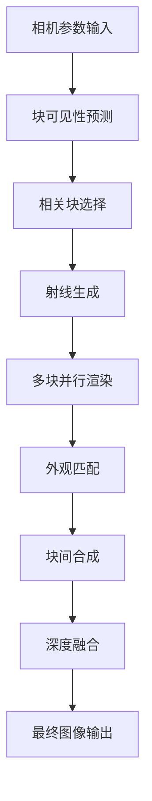

# Block-NeRF 渲染机制详解 - 第一部分：渲染基础

**版本**: 1.0  
**日期**: 2025年7月5日  
**基于论文**: "Block-NeRF: Scalable Large Scene Neural View Synthesis" (CVPR 2022)

## 概述

Block-NeRF 的渲染过程是一个复杂的多阶段流水线，涉及块选择、多块协调渲染、外观匹配、深度合成和最终图像生成。本文档详细介绍 Block-NeRF 的渲染机制，包括核心算法、实现细节和优化策略。

## 目录

1. [渲染架构概述](#渲染架构概述)
2. [核心渲染流程](#核心渲染流程)
3. [块选择机制](#块选择机制)
4. [可见性预测](#可见性预测)
5. [射线生成与采样](#射线生成与采样)
6. [体积渲染基础](#体积渲染基础)

---

## 渲染架构概述

### 整体渲染流水线

Block-NeRF 的渲染过程可以概括为以下流水线：



### 关键组件

#### 1. 块管理器 (Block Manager)
```python
class BlockManager:
    """
    管理多个 Block-NeRF 模型的加载、选择和协调
    """
    
    def __init__(self, config):
        self.blocks = {}  # 存储所有块模型
        self.block_bounds = {}  # 块边界信息
        self.overlap_regions = {}  # 重叠区域信息
        self.visibility_network = None  # 可见性预测网络
        
    def select_relevant_blocks(self, camera_pose, fov):
        """
        基于相机位置和视野选择相关块
        
        Args:
            camera_pose: 相机姿态 [4, 4]
            fov: 视野角度
            
        Returns:
            relevant_blocks: 相关块列表
            visibility_scores: 可见性得分
        """
        # 视锥体计算
        frustum = self.compute_view_frustum(camera_pose, fov)
        
        # 块-视锥体相交测试
        relevant_blocks = []
        visibility_scores = []
        
        for block_id, block_bounds in self.block_bounds.items():
            if self.frustum_aabb_intersection(frustum, block_bounds):
                # 使用可见性网络预测详细可见性
                visibility_score = self.predict_visibility(
                    camera_pose, block_id
                )
                
                if visibility_score > self.visibility_threshold:
                    relevant_blocks.append(block_id)
                    visibility_scores.append(visibility_score)
        
        return relevant_blocks, visibility_scores
```

#### 2. 块合成器 (Block Compositor)
```python
class BlockCompositor:
    """
    处理多个块的渲染结果合成
    """
    
    def __init__(self, blending_method='gaussian'):
        self.blending_method = blending_method
        self.appearance_matcher = AppearanceMatcher()
        
    def composite_blocks(self, block_renderings, block_weights, overlap_masks):
        """
        合成多个块的渲染结果
        
        Args:
            block_renderings: 各块渲染结果 List[Dict]
            block_weights: 块权重 List[Tensor]
            overlap_masks: 重叠区域掩码 List[Tensor]
            
        Returns:
            composite_image: 合成图像
            composite_depth: 合成深度图
        """
        # 外观匹配
        matched_renderings = self.match_appearances(
            block_renderings, overlap_masks
        )
        
        # 权重归一化
        normalized_weights = self.normalize_weights(
            block_weights, overlap_masks
        )
        
        # 加权混合
        composite_image = self.weighted_blend(
            matched_renderings, normalized_weights
        )
        
        return composite_image
```

---

## 核心渲染流程

### 1. 渲染流程概述

Block-NeRF 的核心渲染流程包含以下步骤：

```python
def render_view(self, camera_pose, intrinsics, image_size):
    """
    渲染指定视角的图像
    
    Args:
        camera_pose: 相机外参 [4, 4]
        intrinsics: 相机内参 [3, 3]
        image_size: 图像尺寸 (H, W)
        
    Returns:
        rendered_image: 渲染图像 [H, W, 3]
        depth_map: 深度图 [H, W]
        auxiliary_outputs: 辅助输出
    """
    
    # 步骤 1: 块选择
    relevant_blocks, visibility_scores = self.block_manager.select_relevant_blocks(
        camera_pose, self.config.fov
    )
    
    if not relevant_blocks:
        # 返回空白图像或背景
        return self.render_background(image_size)
    
    # 步骤 2: 射线生成
    rays_o, rays_d, pixel_coords = self.generate_rays(
        camera_pose, intrinsics, image_size
    )
    
    # 步骤 3: 多块并行渲染
    block_renderings = {}
    for block_id in relevant_blocks:
        block_renderings[block_id] = self.render_block(
            block_id, rays_o, rays_d, pixel_coords
        )
    
    # 步骤 4: 块间合成
    final_image, final_depth = self.compositor.composite_blocks(
        block_renderings, visibility_scores
    )
    
    return final_image, final_depth
```

### 2. 详细渲染步骤

#### 步骤 1: 视锥体计算和块选择

```python
def compute_view_frustum(self, camera_pose, intrinsics, near=0.1, far=1000.0):
    """
    计算相机视锥体
    
    Returns:
        frustum_planes: 视锥体平面方程 [6, 4]
    """
    # 提取相机参数
    camera_center = camera_pose[:3, 3]
    camera_rotation = camera_pose[:3, :3]
    
    fx, fy = intrinsics[0, 0], intrinsics[1, 1]
    cx, cy = intrinsics[0, 2], intrinsics[1, 2]
    
    # 计算视锥体顶点
    frustum_corners = self.compute_frustum_corners(
        camera_center, camera_rotation, fx, fy, cx, cy, near, far
    )
    
    # 计算视锥体平面
    frustum_planes = self.compute_frustum_planes(frustum_corners)
    
    return frustum_planes

def frustum_aabb_intersection(self, frustum_planes, aabb):
    """
    视锥体与AABB包围盒相交测试
    
    Args:
        frustum_planes: 视锥体平面 [6, 4]
        aabb: 包围盒 [min_x, min_y, min_z, max_x, max_y, max_z]
        
    Returns:
        intersects: 是否相交
    """
    min_point = aabb[:3]
    max_point = aabb[3:]
    
    for plane in frustum_planes:
        # 对每个平面，找到AABB最远的顶点
        positive_vertex = torch.where(
            plane[:3] >= 0, max_point, min_point
        )
        
        # 如果最远顶点都在平面负侧，则不相交
        if torch.dot(plane[:3], positive_vertex) + plane[3] < 0:
            return False
    
    return True
```

#### 步骤 2: 射线生成

```python
def generate_rays(self, camera_pose, intrinsics, image_size):
    """
    为图像中的每个像素生成射线
    
    Returns:
        rays_o: 射线起点 [H*W, 3]
        rays_d: 射线方向 [H*W, 3]
        pixel_coords: 像素坐标 [H*W, 2]
    """
    H, W = image_size
    
    # 生成像素坐标网格
    i, j = torch.meshgrid(
        torch.arange(W, dtype=torch.float32),
        torch.arange(H, dtype=torch.float32),
        indexing='xy'
    )
    
    # 像素坐标转相机坐标
    fx, fy = intrinsics[0, 0], intrinsics[1, 1]
    cx, cy = intrinsics[0, 2], intrinsics[1, 2]
    
    # 归一化设备坐标
    directions = torch.stack([
        (i - cx) / fx,
        -(j - cy) / fy,  # 注意Y轴方向
        -torch.ones_like(i)
    ], dim=-1)  # [H, W, 3]
    
    # 转换到世界坐标系
    rays_d = torch.sum(
        directions[..., None, :] * camera_pose[:3, :3], dim=-1
    )
    rays_d = F.normalize(rays_d, dim=-1)
    
    # 射线起点（相机中心）
    rays_o = camera_pose[:3, 3].expand(rays_d.shape)
    
    # 重塑为 [H*W, 3]
    rays_o = rays_o.reshape(-1, 3)
    rays_d = rays_d.reshape(-1, 3)
    
    # 像素坐标
    pixel_coords = torch.stack([i, j], dim=-1).reshape(-1, 2)
    
    return rays_o, rays_d, pixel_coords
```

---

## 块选择机制

### 1. 粗粒度块选择

基于几何约束的快速块选择：

```python
def coarse_block_selection(self, camera_pose, fov):
    """
    基于几何约束的粗粒度块选择
    
    Returns:
        candidate_blocks: 候选块列表
    """
    camera_center = camera_pose[:3, 3]
    view_direction = camera_pose[:3, 2]  # 相机Z轴负方向
    
    candidate_blocks = []
    
    for block_id, block_info in self.blocks.items():
        block_center = block_info['center']
        block_radius = block_info['radius']
        
        # 距离检查
        distance = torch.norm(camera_center - block_center)
        if distance > self.max_render_distance:
            continue
            
        # 视角检查
        to_block = F.normalize(block_center - camera_center, dim=-1)
        angle = torch.acos(torch.clamp(
            torch.dot(view_direction, to_block), -1, 1
        ))
        
        if angle < (fov / 2 + block_radius / distance):
            candidate_blocks.append(block_id)
    
    return candidate_blocks
```

### 2. 精细化块选择

使用可见性网络进行精细选择：

```python
class VisibilityNetwork(nn.Module):
    """
    预测块对特定视角的可见性
    """
    
    def __init__(self, hidden_dim=256):
        super().__init__()
        self.encoder = nn.Sequential(
            nn.Linear(9, hidden_dim),  # camera_pose(6) + block_id(3)
            nn.ReLU(),
            nn.Linear(hidden_dim, hidden_dim),
            nn.ReLU(),
            nn.Linear(hidden_dim, hidden_dim),
            nn.ReLU(),
            nn.Linear(hidden_dim, 1),
            nn.Sigmoid()
        )
    
    def forward(self, camera_pose, block_embedding):
        """
        预测块可见性
        
        Args:
            camera_pose: 相机姿态编码 [B, 6]  # 位置3 + 旋转3
            block_embedding: 块嵌入 [B, 3]
            
        Returns:
            visibility: 可见性得分 [B, 1]
        """
        # 合并输入特征
        features = torch.cat([camera_pose, block_embedding], dim=-1)
        visibility = self.encoder(features)
        return visibility

def predict_block_visibility(self, camera_pose, candidate_blocks):
    """
    使用可见性网络预测块可见性
    
    Returns:
        visible_blocks: 可见块列表
        visibility_scores: 可见性得分
    """
    # 编码相机姿态
    camera_pos = camera_pose[:3, 3]
    camera_rot = self.rotation_matrix_to_6d(camera_pose[:3, :3])
    camera_encoding = torch.cat([camera_pos, camera_rot], dim=-1)
    
    visible_blocks = []
    visibility_scores = []
    
    for block_id in candidate_blocks:
        block_embedding = self.get_block_embedding(block_id)
        
        # 预测可见性
        visibility = self.visibility_network(
            camera_encoding.unsqueeze(0),
            block_embedding.unsqueeze(0)
        ).item()
        
        if visibility > self.visibility_threshold:
            visible_blocks.append(block_id)
            visibility_scores.append(visibility)
    
    return visible_blocks, visibility_scores
```

---

## 可见性预测

### 1. 可见性网络架构

```python
class AdvancedVisibilityNetwork(nn.Module):
    """
    高级可见性预测网络，考虑遮挡和距离衰减
    """
    
    def __init__(self, config):
        super().__init__()
        
        # 特征编码器
        self.camera_encoder = nn.Sequential(
            nn.Linear(6, 128),
            nn.ReLU(),
            nn.Linear(128, 128)
        )
        
        self.block_encoder = nn.Sequential(
            nn.Linear(7, 128),  # center(3) + size(3) + id(1)
            nn.ReLU(),
            nn.Linear(128, 128)
        )
        
        # 注意力机制
        self.attention = nn.MultiheadAttention(
            embed_dim=128, num_heads=8, batch_first=True
        )
        
        # 预测器
        self.predictor = nn.Sequential(
            nn.Linear(256, 256),
            nn.ReLU(),
            nn.Dropout(0.1),
            nn.Linear(256, 128),
            nn.ReLU(),
            nn.Linear(128, 1),
            nn.Sigmoid()
        )
    
    def forward(self, camera_features, block_features):
        """
        预测块可见性
        
        Args:
            camera_features: 相机特征 [B, 6]
            block_features: 块特征 [B, N, 7]
            
        Returns:
            visibility: 可见性得分 [B, N]
        """
        batch_size, num_blocks = block_features.shape[:2]
        
        # 编码特征
        camera_encoded = self.camera_encoder(camera_features)  # [B, 128]
        block_encoded = self.block_encoder(block_features)     # [B, N, 128]
        
        # 扩展相机特征用于注意力计算
        camera_expanded = camera_encoded.unsqueeze(1).expand(
            batch_size, num_blocks, -1
        )  # [B, N, 128]
        
        # 注意力机制
        attended_features, _ = self.attention(
            camera_expanded, block_encoded, block_encoded
        )  # [B, N, 128]
        
        # 合并特征
        combined_features = torch.cat([
            camera_expanded, attended_features
        ], dim=-1)  # [B, N, 256]
        
        # 预测可见性
        visibility = self.predictor(combined_features).squeeze(-1)  # [B, N]
        
        return visibility
```

### 2. 遮挡感知

```python
def compute_occlusion_awareness(self, camera_pos, block_centers, block_sizes):
    """
    计算块间遮挡关系
    
    Args:
        camera_pos: 相机位置 [3]
        block_centers: 块中心 [N, 3]
        block_sizes: 块大小 [N, 3]
        
    Returns:
        occlusion_matrix: 遮挡矩阵 [N, N]
    """
    num_blocks = len(block_centers)
    occlusion_matrix = torch.zeros(num_blocks, num_blocks)
    
    for i in range(num_blocks):
        for j in range(num_blocks):
            if i == j:
                continue
                
            # 计算从相机到两个块的射线
            ray_to_i = F.normalize(block_centers[i] - camera_pos, dim=-1)
            ray_to_j = F.normalize(block_centers[j] - camera_pos, dim=-1)
            
            # 距离判断
            dist_i = torch.norm(block_centers[i] - camera_pos)
            dist_j = torch.norm(block_centers[j] - camera_pos)
            
            # 角度判断
            angle = torch.acos(torch.clamp(
                torch.dot(ray_to_i, ray_to_j), -1, 1
            ))
            
            # 如果块j在块i前面且角度很小，可能存在遮挡
            if dist_j < dist_i and angle < self.occlusion_angle_threshold:
                # 进一步检查几何遮挡
                if self.check_geometric_occlusion(
                    camera_pos, block_centers[i], block_centers[j], 
                    block_sizes[i], block_sizes[j]
                ):
                    occlusion_matrix[i, j] = 1.0
    
    return occlusion_matrix
```

---

## 射线生成与采样

### 1. 自适应射线采样

```python
class AdaptiveRaySampler:
    """
    基于重要性的自适应射线采样
    """
    
    def __init__(self, config):
        self.config = config
        self.importance_network = self.build_importance_network()
    
    def sample_rays(self, rays_o, rays_d, image_importance=None):
        """
        自适应采样射线
        
        Args:
            rays_o: 射线起点 [H*W, 3]
            rays_d: 射线方向 [H*W, 3]
            image_importance: 图像重要性图 [H, W]
            
        Returns:
            sampled_rays_o: 采样射线起点 [N, 3]
            sampled_rays_d: 采样射线方向 [N, 3]
            sample_indices: 采样索引 [N]
        """
        H, W = int(rays_o.shape[0] ** 0.5), int(rays_o.shape[0] ** 0.5)
        
        if image_importance is None:
            # 使用网络预测重要性
            image_importance = self.predict_importance(rays_o, rays_d)
        
        # 重要性采样
        importance_flat = image_importance.flatten()
        importance_normalized = importance_flat / importance_flat.sum()
        
        # 多项式采样
        num_samples = min(self.config.max_rays_per_batch, len(rays_o))
        sample_indices = torch.multinomial(
            importance_normalized, num_samples, replacement=False
        )
        
        sampled_rays_o = rays_o[sample_indices]
        sampled_rays_d = rays_d[sample_indices]
        
        return sampled_rays_o, sampled_rays_d, sample_indices
    
    def predict_importance(self, rays_o, rays_d):
        """
        预测射线重要性
        """
        # 简化的重要性预测（基于梯度、边缘等）
        H, W = int(len(rays_o) ** 0.5), int(len(rays_o) ** 0.5)
        
        # 基于位置的重要性（边缘区域更重要）
        x_coords = torch.arange(W).float() / W
        y_coords = torch.arange(H).float() / H
        
        edge_importance = torch.minimum(
            torch.minimum(x_coords, 1 - x_coords),
            torch.minimum(y_coords[:, None], 1 - y_coords[:, None])
        )
        
        # 中心区域也很重要
        center_importance = torch.exp(
            -((x_coords - 0.5) ** 2 + (y_coords[:, None] - 0.5) ** 2) / 0.2
        )
        
        importance = 0.3 * edge_importance + 0.7 * center_importance + 0.1
        
        return importance
```

### 2. 分层采样策略

```python
def hierarchical_sampling(self, rays_o, rays_d, near, far, coarse_samples=64, fine_samples=128):
    """
    分层采样：粗采样 + 精采样
    
    Args:
        rays_o: 射线起点 [N, 3]
        rays_d: 射线方向 [N, 3]
        near, far: 近远平面距离
        coarse_samples: 粗采样点数
        fine_samples: 精采样点数
        
    Returns:
        sample_points: 采样点 [N, total_samples, 3]
        sample_distances: 采样距离 [N, total_samples]
    """
    num_rays = rays_o.shape[0]
    
    # 粗采样：均匀采样
    coarse_t = torch.linspace(near, far, coarse_samples)
    coarse_t = coarse_t.expand(num_rays, coarse_samples)
    
    # 添加随机噪声
    if self.training:
        noise = torch.rand_like(coarse_t) * (far - near) / coarse_samples
        coarse_t = coarse_t + noise
    
    # 计算粗采样点
    coarse_points = rays_o[:, None, :] + coarse_t[:, :, None] * rays_d[:, None, :]
    
    # 粗网络推理得到权重
    with torch.no_grad():
        coarse_outputs = self.coarse_network(coarse_points)
        coarse_weights = self.compute_ray_weights(
            coarse_outputs['density'], coarse_t
        )
    
    # 基于权重的重要性采样
    fine_t = self.importance_sampling(
        coarse_t, coarse_weights, fine_samples
    )
    
    # 合并粗细采样点
    all_t = torch.cat([coarse_t, fine_t], dim=-1)
    all_t, _ = torch.sort(all_t, dim=-1)
    
    # 计算最终采样点
    sample_points = rays_o[:, None, :] + all_t[:, :, None] * rays_d[:, None, :]
    
    return sample_points, all_t

def importance_sampling(self, t_vals, weights, num_samples):
    """
    基于权重的重要性采样
    
    Args:
        t_vals: 粗采样距离值 [N, coarse_samples]
        weights: 粗采样权重 [N, coarse_samples-1]
        num_samples: 精采样点数
        
    Returns:
        fine_t: 精采样距离值 [N, num_samples]
    """
    # 权重归一化
    weights = weights + 1e-5  # 避免数值问题
    pdf = weights / torch.sum(weights, dim=-1, keepdim=True)
    cdf = torch.cumsum(pdf, dim=-1)
    cdf = torch.cat([torch.zeros_like(cdf[..., :1]), cdf], dim=-1)
    
    # 均匀采样CDF
    u = torch.rand(weights.shape[0], num_samples, device=weights.device)
    
    # 逆变换采样
    indices = torch.searchsorted(cdf, u, right=True)
    below = torch.clamp_min(indices - 1, 0)
    above = torch.clamp_max(indices, cdf.shape[-1] - 1)
    
    indices_g = torch.stack([below, above], dim=-1)
    
    matched_shape = [indices_g.shape[0], indices_g.shape[1], cdf.shape[-1]]
    cdf_g = torch.gather(cdf.unsqueeze(1).expand(matched_shape), 2, indices_g)
    bins_g = torch.gather(t_vals.unsqueeze(1).expand(matched_shape), 2, indices_g)
    
    denom = cdf_g[..., 1] - cdf_g[..., 0]
    denom = torch.where(denom < 1e-5, torch.ones_like(denom), denom)
    t = (u - cdf_g[..., 0]) / denom
    fine_t = bins_g[..., 0] + t * (bins_g[..., 1] - bins_g[..., 0])
    
    return fine_t
```

---

## 体积渲染基础

### 1. 经典体积渲染方程

Block-NeRF 使用经典的体积渲染方程：

```python
def volume_rendering(self, densities, colors, distances):
    """
    体积渲染方程实现
    
    Args:
        densities: 密度值 [N, S]
        colors: 颜色值 [N, S, 3]
        distances: 采样距离 [N, S]
        
    Returns:
        rgb: 渲染颜色 [N, 3]
        depth: 渲染深度 [N]
        weights: 采样点权重 [N, S]
    """
    # 计算距离间隔
    dists = distances[..., 1:] - distances[..., :-1]
    dists = torch.cat([
        dists, 
        torch.full_like(dists[..., :1], 1e10)
    ], dim=-1)
    
    # 透明度计算
    alpha = 1.0 - torch.exp(-densities * dists)
    
    # 累积透明度
    transmittance = torch.cumprod(
        torch.cat([
            torch.ones_like(alpha[..., :1]),
            1.0 - alpha[..., :-1]
        ], dim=-1),
        dim=-1
    )
    
    # 权重计算
    weights = alpha * transmittance
    
    # 颜色积分
    rgb = torch.sum(weights[..., None] * colors, dim=-2)
    
    # 深度积分
    depth = torch.sum(weights * distances, dim=-1)
    
    # 累积权重（用于背景合成）
    acc_weights = torch.sum(weights, dim=-1)
    
    return {
        'rgb': rgb,
        'depth': depth,
        'weights': weights,
        'acc_weights': acc_weights
    }
```

### 2. 优化的体积渲染

```python
class OptimizedVolumeRenderer:
    """
    优化的体积渲染器，支持早停和自适应采样
    """
    
    def __init__(self, config):
        self.config = config
        self.early_stop_threshold = config.early_stop_threshold
        self.adaptive_sampling = config.adaptive_sampling
    
    def render_with_early_stopping(self, ray_fn, rays_o, rays_d, near, far):
        """
        带早停的体积渲染
        
        Args:
            ray_fn: 网络前向函数
            rays_o: 射线起点 [N, 3]
            rays_d: 射线方向 [N, 3]
            near, far: 近远平面
            
        Returns:
            渲染结果字典
        """
        num_rays = rays_o.shape[0]
        
        # 初始化累积值
        acc_rgb = torch.zeros(num_rays, 3, device=rays_o.device)
        acc_depth = torch.zeros(num_rays, device=rays_o.device)
        acc_transmittance = torch.ones(num_rays, device=rays_o.device)
        
        # 分段渲染
        current_near = near
        segment_size = (far - near) / self.config.num_segments
        
        for segment_idx in range(self.config.num_segments):
            segment_far = current_near + segment_size
            
            # 当前段采样
            t_vals = torch.linspace(
                current_near, segment_far, 
                self.config.samples_per_segment,
                device=rays_o.device
            )
            t_vals = t_vals.expand(num_rays, -1)
            
            # 计算采样点
            sample_points = rays_o[:, None, :] + t_vals[:, :, None] * rays_d[:, None, :]
            
            # 网络推理
            outputs = ray_fn(sample_points)
            densities = outputs['density']
            colors = outputs['color']
            
            # 当前段渲染
            segment_results = self.volume_rendering(densities, colors, t_vals)
            
            # 累积结果
            segment_weights = segment_results['acc_weights']
            effective_transmittance = acc_transmittance * segment_weights
            
            acc_rgb += acc_transmittance[:, None] * segment_results['rgb']
            acc_depth += acc_transmittance * segment_results['depth']
            acc_transmittance *= (1.0 - segment_weights)
            
            # 早停检查
            if torch.all(acc_transmittance < self.early_stop_threshold):
                break
            
            current_near = segment_far
        
        return {
            'rgb': acc_rgb,
            'depth': acc_depth,
            'transmittance': 1.0 - acc_transmittance
        }
```

---

## 小结

本文档介绍了 Block-NeRF 渲染机制的基础部分，包括：

1. **渲染架构**: 整体流水线和关键组件
2. **核心流程**: 从块选择到最终图像生成的完整过程
3. **块选择**: 粗粒度和精细化的块选择策略
4. **可见性预测**: 使用神经网络预测块可见性
5. **射线采样**: 自适应和分层采样策略
6. **体积渲染**: 经典和优化的体积渲染实现

下一部分将详细介绍外观匹配、块间合成和深度融合等高级渲染技术。

---

**说明**: 这是 Block-NeRF 渲染文档的第一部分。建议结合第二部分（外观匹配与合成）和第三部分（性能优化与实践）一起阅读，以获得完整的渲染机制理解。
