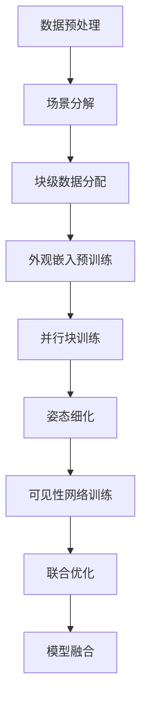

# Block-NeRF 训练机制详解

**版本**: 1.0  
**日期**: 2025年7月5日  
**基于论文**: "Block-NeRF: Scalable Large Scene Neural View Synthesis" (CVPR 2022)

## 概述

Block-NeRF 是一种可扩展的大场景神经视图合成方法，通过将大场景分解为多个独立的 NeRF 块来实现城市级别场景的重建。本文档详细介绍了 Block-NeRF 的训练机制、优化策略和实现细节。

## 目录

1. [训练架构概述](#训练架构概述)
2. [场景分解策略](#场景分解策略)
3. [块级 NeRF 训练](#块级-nerf-训练)
4. [外观嵌入机制](#外观嵌入机制)
5. [姿态细化算法](#姿态细化算法)
6. [可见性网络训练](#可见性网络训练)
7. [损失函数设计](#损失函数设计)
8. [优化策略](#优化策略)

---

## 训练架构概述

### 整体训练流程

Block-NeRF 的训练过程分为以下几个阶段：



### 训练阶段详解

#### 阶段 1: 数据预处理 (数据准备阶段)
- **SfM 重建**: 使用 COLMAP 进行稀疏重建
- **图像标准化**: 调整曝光、白平衡和分辨率
- **相机参数提取**: 内参、外参和畸变参数
- **GPS 坐标对齐**: 将相机坐标与地理坐标系对齐

#### 阶段 2: 场景分解 (Block 划分阶段)
- **空间划分**: 基于地理网格的场景分割
- **重叠区域设计**: 确保块间平滑过渡
- **数据分配**: 将图像和相机参数分配到相应块
- **质量评估**: 确保每个块有足够的观测数据

#### 阶段 3: 外观嵌入预训练
- **光照一致性学习**: 学习场景的光照变化模式
- **环境嵌入**: 建模天气、时间等环境因素
- **曝光补偿**: 处理不同图像的曝光差异

#### 阶段 4: 并行块训练
- **独立 NeRF 训练**: 每个块独立训练各自的 NeRF
- **共享外观嵌入**: 所有块共享外观嵌入网络
- **边界约束**: 确保块边界的一致性

#### 阶段 5: 姿态细化
- **相机姿态优化**: 细化 SfM 得到的相机姿态
- **块间对齐**: 确保相邻块间的几何一致性
- **迭代优化**: 交替优化 NeRF 参数和相机姿态

#### 阶段 6: 可见性网络训练
- **可见性预测**: 训练网络预测块的可见性
- **渲染效率优化**: 减少不必要的块计算
- **动态块选择**: 根据视点动态选择相关块

#### 阶段 7: 联合优化
- **端到端训练**: 联合优化所有组件
- **一致性约束**: 确保块间的视觉一致性
- **正则化**: 防止过拟合和模式崩塌

---

## 场景分解策略

### 空间分割方法

Block-NeRF 使用基于地理网格的分割策略：

```python
class SceneDecomposer:
    """场景分解器 - 负责将大场景分解为可管理的块"""
    
    def __init__(self, config):
        self.block_size = config.block_size  # 块大小 (米)
        self.overlap_ratio = config.overlap_ratio  # 重叠比例
        self.min_images_per_block = config.min_images_per_block  # 每块最少图像数
        
    def decompose_scene(self, cameras, images):
        """分解场景为多个块"""
        # 1. 计算场景边界
        scene_bounds = self.compute_scene_bounds(cameras)
        
        # 2. 创建网格
        grid = self.create_spatial_grid(scene_bounds)
        
        # 3. 分配图像到块
        blocks = self.assign_images_to_blocks(grid, cameras, images)
        
        # 4. 验证块质量
        valid_blocks = self.validate_blocks(blocks)
        
        return valid_blocks
```

### 块大小设计原则

1. **计算资源约束**: 
   - 单块训练时间 < 24小时
   - GPU 内存使用 < 16GB
   - 参数量 < 10M 每块

2. **几何覆盖**: 
   - 每个块至少包含 100+ 张图像
   - 视角覆盖度 > 60%
   - 深度范围变化 < 10:1

3. **重叠设计**:
   - 相邻块重叠 20-30%
   - 重叠区域包含足够的共同观测
   - 确保边界区域的平滑过渡

### 数据分配算法

```python
def assign_images_to_blocks(self, grid, cameras, images):
    """将图像分配到相应的块"""
    blocks = {}
    
    for i, camera in enumerate(cameras):
        # 计算相机位置
        camera_pos = camera.get_position()
        
        # 找到包含此相机的所有块
        containing_blocks = self.find_containing_blocks(camera_pos, grid)
        
        # 为每个块分配图像
        for block_id in containing_blocks:
            if block_id not in blocks:
                blocks[block_id] = Block(block_id)
            
            blocks[block_id].add_image(images[i], camera)
            
    return blocks
```

---

## 块级 NeRF 训练

### 单块训练配置

每个块使用标准的 NeRF 架构，但有以下修改：

```python
class BlockNeRFConfig:
    """单块 NeRF 训练配置"""
    
    # 网络架构
    num_layers = 8              # MLP 层数
    hidden_dim = 256           # 隐藏层维度
    skip_connections = [4]      # 跳跃连接层
    
    # 位置编码
    pos_encoding_levels = 10    # 位置编码级别
    dir_encoding_levels = 4     # 方向编码级别
    
    # 外观嵌入
    appearance_embedding_dim = 32  # 外观嵌入维度
    use_appearance_embedding = True
    
    # 训练参数
    learning_rate = 5e-4        # 初始学习率
    lr_decay_steps = 250000    # 学习率衰减步数
    lr_decay_rate = 0.1        # 学习率衰减率
    
    # 采样策略
    num_samples_coarse = 64     # 粗采样数量
    num_samples_fine = 128      # 细采样数量
    perturb_samples = True      # 采样点扰动
    
    # 正则化
    weight_decay = 1e-6        # 权重衰减
    rgb_loss_weight = 1.0      # RGB 损失权重
    depth_loss_weight = 0.1    # 深度损失权重
```

### 训练数据生成

```python
class BlockDataLoader:
    """块级数据加载器"""
    
    def __init__(self, block, config):
        self.block = block
        self.config = config
        self.images = block.images
        self.cameras = block.cameras
        
    def generate_training_rays(self, batch_size):
        """生成训练用的光线"""
        rays_o, rays_d, rgb_targets = [], [], []
        
        for _ in range(batch_size):
            # 随机选择图像
            img_idx = torch.randint(0, len(self.images), (1,))
            image = self.images[img_idx]
            camera = self.cameras[img_idx]
            
            # 随机选择像素
            pixel_coords = self.sample_random_pixels(image.shape[:2])
            
            # 生成光线
            rays_o_batch, rays_d_batch = camera.generate_rays(pixel_coords)
            rgb_batch = image[pixel_coords[:, 0], pixel_coords[:, 1]]
            
            rays_o.append(rays_o_batch)
            rays_d.append(rays_d_batch)
            rgb_targets.append(rgb_batch)
            
        return torch.cat(rays_o), torch.cat(rays_d), torch.cat(rgb_targets)
```

### 边界一致性约束

为确保相邻块间的一致性，在重叠区域添加特殊约束：

```python
def boundary_consistency_loss(block_a, block_b, overlap_region):
    """计算边界一致性损失"""
    # 在重叠区域采样光线
    rays_o, rays_d = sample_rays_in_overlap(overlap_region)
    
    # 两个块的渲染结果
    rgb_a, depth_a = block_a.render(rays_o, rays_d)
    rgb_b, depth_b = block_b.render(rays_o, rays_d)
    
    # 计算一致性损失
    rgb_consistency = F.mse_loss(rgb_a, rgb_b)
    depth_consistency = F.l1_loss(depth_a, depth_b)
    
    return rgb_consistency + 0.1 * depth_consistency
```

---

## 外观嵌入机制

### 外观变化建模

Block-NeRF 使用外观嵌入来处理以下变化：

1. **光照条件**: 太阳位置、云层遮挡
2. **天气状况**: 晴天、阴天、雨天
3. **时间变化**: 早晨、中午、傍晚
4. **季节变化**: 植被颜色、雪覆盖
5. **相机差异**: 不同设备的色彩响应

### 外观嵌入网络

```python
class AppearanceEmbedding(nn.Module):
    """外观嵌入网络"""
    
    def __init__(self, config):
        super().__init__()
        self.embedding_dim = config.appearance_embedding_dim
        self.num_images = config.num_training_images
        
        # 图像级外观嵌入
        self.image_embeddings = nn.Embedding(
            self.num_images, self.embedding_dim
        )
        
        # 全局外观变换
        self.appearance_mlp = nn.Sequential(
            nn.Linear(self.embedding_dim, 128),
            nn.ReLU(),
            nn.Linear(128, 128),
            nn.ReLU(),
            nn.Linear(128, 3)  # RGB 调制
        )
        
    def forward(self, image_indices, features):
        """前向传播"""
        # 获取图像嵌入
        embeddings = self.image_embeddings(image_indices)
        
        # 计算外观调制
        appearance_modulation = self.appearance_mlp(embeddings)
        
        # 应用到特征
        modulated_features = features + appearance_modulation
        
        return modulated_features
```

### 外观嵌入训练策略

```python
class AppearanceTrainer:
    """外观嵌入训练器"""
    
    def train_appearance_embedding(self, blocks):
        """训练外观嵌入"""
        optimizer = torch.optim.Adam(
            self.appearance_embedding.parameters(), 
            lr=1e-3
        )
        
        for epoch in range(self.config.appearance_epochs):
            total_loss = 0
            
            for block in blocks:
                # 采样训练数据
                rays_o, rays_d, rgb_targets, img_indices = block.sample_rays()
                
                # 渲染
                rgb_pred = self.render_with_appearance(
                    rays_o, rays_d, img_indices, block
                )
                
                # 计算损失
                loss = F.mse_loss(rgb_pred, rgb_targets)
                
                # 反向传播
                optimizer.zero_grad()
                loss.backward()
                optimizer.step()
                
                total_loss += loss.item()
            
            print(f"外观训练 Epoch {epoch}: Loss = {total_loss:.6f}")
```

---

## 姿态细化算法

### 问题分析

SfM 重建得到的相机姿态往往存在以下问题：

1. **累积误差**: 长序列重建的漂移
2. **尺度歧义**: 绝对尺度的不确定性
3. **坐标系对齐**: 与真实世界坐标的偏差
4. **局部不一致**: 相邻图像间的细微误差

### 姿态细化网络

```python
class PoseRefinementNetwork(nn.Module):
    """姿态细化网络"""
    
    def __init__(self, config):
        super().__init__()
        
        # 特征提取网络
        self.feature_extractor = self.build_feature_extractor()
        
        # 姿态回归网络
        self.pose_regressor = nn.Sequential(
            nn.Linear(512, 256),
            nn.ReLU(),
            nn.Dropout(0.1),
            nn.Linear(256, 128),
            nn.ReLU(),
            nn.Linear(128, 6)  # [tx, ty, tz, rx, ry, rz]
        )
        
    def forward(self, image, initial_pose):
        """预测姿态修正量"""
        # 提取图像特征
        features = self.feature_extractor(image)
        
        # 回归姿态修正
        pose_delta = self.pose_regressor(features)
        
        # 应用修正
        refined_pose = self.apply_pose_delta(initial_pose, pose_delta)
        
        return refined_pose
```

### 姿态优化目标

```python
def pose_refinement_loss(refined_poses, images, nerf_model):
    """姿态细化损失函数"""
    total_loss = 0
    
    for i, (pose, image) in enumerate(zip(refined_poses, images)):
        # 使用细化后的姿态渲染
        rendered = nerf_model.render_image(pose)
        
        # 光度一致性损失
        photometric_loss = F.mse_loss(rendered, image)
        
        # 几何一致性损失 (深度一致性)
        depth_rendered = nerf_model.render_depth(pose)
        depth_gt = get_depth_from_stereo(image, pose)  # 从立体视觉获取
        geometric_loss = F.l1_loss(depth_rendered, depth_gt)
        
        # 正则化项 (限制姿态变化幅度)
        pose_reg = torch.norm(pose - initial_poses[i])
        
        total_loss += photometric_loss + 0.1 * geometric_loss + 0.01 * pose_reg
    
    return total_loss
```

### 迭代优化流程

```python
def iterative_pose_refinement(blocks, max_iterations=10):
    """迭代姿态细化"""
    
    for iteration in range(max_iterations):
        print(f"姿态细化迭代 {iteration + 1}/{max_iterations}")
        
        # 第一阶段: 固定 NeRF，优化姿态
        for block in blocks:
            block.freeze_nerf()
            block.optimize_poses()
        
        # 第二阶段: 固定姿态，优化 NeRF
        for block in blocks:
            block.freeze_poses()
            block.optimize_nerf()
        
        # 评估收敛性
        pose_change = compute_pose_change()
        if pose_change < convergence_threshold:
            print(f"姿态细化在第 {iteration + 1} 次迭代后收敛")
            break
```

---

## 可见性网络训练

### 可见性预测目标

可见性网络的目标是预测给定视点下哪些块是可见的，从而：

1. **提高渲染效率**: 只计算可见块
2. **减少内存使用**: 只加载必要的模型
3. **支持实时渲染**: 快速块选择

### 网络架构

```python
class VisibilityNetwork(nn.Module):
    """可见性预测网络"""
    
    def __init__(self, config):
        super().__init__()
        self.num_blocks = config.num_blocks
        
        # 输入: 相机姿态 + 块中心位置
        input_dim = 6 + 3  # pose (6) + block_center (3)
        
        self.visibility_net = nn.Sequential(
            nn.Linear(input_dim, 256),
            nn.ReLU(),
            nn.Linear(256, 512),
            nn.ReLU(),
            nn.Dropout(0.1),
            nn.Linear(512, 256),
            nn.ReLU(),
            nn.Linear(256, 1),
            nn.Sigmoid()  # 可见性概率
        )
        
    def forward(self, camera_pose, block_centers):
        """预测块可见性"""
        batch_size = camera_pose.shape[0]
        num_blocks = block_centers.shape[0]
        
        # 扩展维度进行批量计算
        poses_expanded = camera_pose.unsqueeze(1).expand(-1, num_blocks, -1)
        centers_expanded = block_centers.unsqueeze(0).expand(batch_size, -1, -1)
        
        # 拼接输入
        inputs = torch.cat([poses_expanded, centers_expanded], dim=-1)
        
        # 预测可见性
        visibility_scores = self.visibility_net(inputs.view(-1, 9))
        visibility_scores = visibility_scores.view(batch_size, num_blocks)
        
        return visibility_scores
```

### 训练数据生成

```python
class VisibilityDataGenerator:
    """可见性训练数据生成器"""
    
    def generate_visibility_labels(self, blocks, test_poses):
        """生成可见性标签"""
        labels = []
        
        for pose in test_poses:
            visibility_label = []
            
            for block in blocks:
                # 渲染块以检查可见性
                rendered = block.render_from_pose(pose)
                
                # 计算渲染质量指标
                visibility_score = self.compute_visibility_score(rendered)
                
                # 二值化标签
                is_visible = visibility_score > self.visibility_threshold
                visibility_label.append(float(is_visible))
            
            labels.append(visibility_label)
        
        return torch.tensor(labels)
    
    def compute_visibility_score(self, rendered_image):
        """计算可见性分数"""
        # 基于渲染图像的质量指标
        non_zero_pixels = (rendered_image.sum(dim=-1) > 0).float().mean()
        average_intensity = rendered_image.mean()
        
        return non_zero_pixels * average_intensity
```

### 可见性损失函数

```python
def visibility_loss(predicted_visibility, ground_truth_visibility):
    """可见性网络损失函数"""
    # 二进制交叉熵损失
    bce_loss = F.binary_cross_entropy(predicted_visibility, ground_truth_visibility)
    
    # 稀疏性正则化 (鼓励选择较少的块)
    sparsity_reg = 0.01 * predicted_visibility.mean()
    
    # 平滑性正则化 (相邻视点的可见性应该相似)
    smoothness_reg = compute_temporal_smoothness(predicted_visibility)
    
    return bce_loss + sparsity_reg + 0.1 * smoothness_reg
```

---

此文档第一部分到此结束。接下来我将创建第二部分，包含损失函数设计、优化策略等内容。
