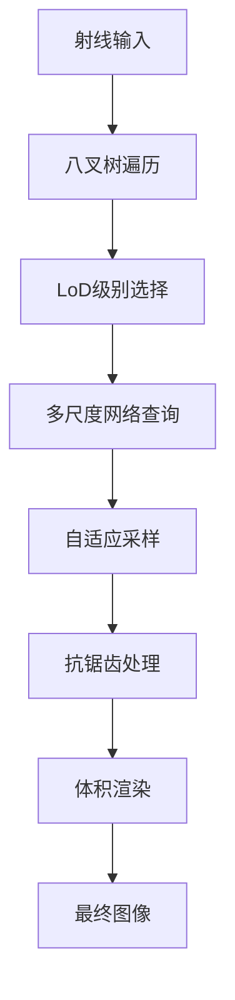

# Inf-NeRF 渲染机制详解 - 第一部分：渲染基础

**版本**: 1.0  
**日期**: 2025年7月5日  
**基于论文**: "InfNeRF: Towards Infinite Scale NeRF Rendering with O(log n) Space Complexity" (SIGGRAPH Asia 2024)

## 概述

Inf-NeRF 是一种能够处理无限尺度场景的神经辐射场方法，通过基于八叉树的细节级别 (LoD) 结构实现了 O(log n) 的空间复杂度。本文档详细介绍 Inf-NeRF 的渲染机制，包括核心算法、八叉树结构、多尺度渲染和内存优化策略。

## 目录

1. [渲染架构概述](#渲染架构概述)
2. [八叉树结构设计](#八叉树结构设计)
3. [细节级别管理](#细节级别管理)
4. [多尺度神经网络](#多尺度神经网络)
5. [自适应采样策略](#自适应采样策略)
6. [抗锯齿渲染](#抗锯齿渲染)

---

## 渲染架构概述

### 整体渲染流水线

Inf-NeRF 的渲染流水线设计用于处理无限尺度场景：



### 核心组件架构

```python
class InfNeRFRenderer:
    """
    Inf-NeRF 渲染器的主要实现
    """
    
    def __init__(self, config: InfNeRFConfig):
        self.config = config
        self.octree_root = None
        self.level_cache = {}
        self.memory_manager = MemoryManager(config.max_memory_gb)
        
    def render_rays(self, rays_o, rays_d, camera_distance=None):
        """
        渲染射线的主要接口
        
        Args:
            rays_o: 射线起点 [N, 3]
            rays_d: 射线方向 [N, 3]
            camera_distance: 相机距离（用于LoD选择）
            
        Returns:
            rgb: 渲染颜色 [N, 3]
            depth: 深度值 [N]
            extras: 额外信息字典
        """
        # 步骤1: 计算射线包围盒
        ray_aabb = self._compute_ray_aabb(rays_o, rays_d)
        
        # 步骤2: 八叉树遍历找到相关节点
        intersecting_nodes = self._octree_traversal(ray_aabb)
        
        # 步骤3: 为每条射线选择合适的LoD级别
        lod_levels = self._select_lod_levels(rays_o, rays_d, camera_distance)
        
        # 步骤4: 自适应采样
        sample_points, sample_distances = self._adaptive_sampling(
            rays_o, rays_d, lod_levels, intersecting_nodes
        )
        
        # 步骤5: 多尺度网络查询
        densities, colors = self._multi_scale_query(
            sample_points, rays_d, lod_levels, intersecting_nodes
        )
        
        # 步骤6: 抗锯齿处理
        if self.config.perturb_radius:
            densities, colors = self._apply_anti_aliasing(
                densities, colors, sample_points, lod_levels
            )
        
        # 步骤7: 体积渲染
        rgb, depth, weights = self._volume_rendering(
            densities, colors, sample_distances
        )
        
        return rgb, depth, {'weights': weights, 'lod_levels': lod_levels}
    
    def _octree_traversal(self, ray_aabb):
        """
        八叉树遍历找到与射线相交的节点
        """
        intersecting_nodes = []
        
        def traverse_node(node, aabb):
            if node.is_pruned:
                return
            
            # 检查节点AABB与射线AABB是否相交
            if self._aabb_intersect(node.get_aabb(), aabb):
                intersecting_nodes.append(node)
                
                # 递归遍历子节点
                if not node.is_leaf:
                    for child in node.children:
                        if child is not None:
                            traverse_node(child, aabb)
        
        traverse_node(self.octree_root, ray_aabb)
        return intersecting_nodes
```

### 渲染流程详解

#### 1. 射线预处理

```python
def _compute_ray_aabb(self, rays_o, rays_d):
    """
    计算射线束的包围盒
    
    Args:
        rays_o: 射线起点 [N, 3]
        rays_d: 射线方向 [N, 3]
        
    Returns:
        aabb: 包围盒 [min_xyz, max_xyz]
    """
    # 计算射线在场景边界内的进入和退出点
    scene_min = -self.config.scene_bound
    scene_max = self.config.scene_bound
    
    # 对每条射线计算与场景边界的交点
    t_min = (scene_min - rays_o) / (rays_d + 1e-8)
    t_max = (scene_max - rays_o) / (rays_d + 1e-8)
    
    # 确保t_min < t_max
    t_min, t_max = torch.min(t_min, t_max), torch.max(t_min, t_max)
    
    # 计算射线束的整体包围盒
    t_near = torch.max(t_min, dim=-1)[0]
    t_far = torch.min(t_max, dim=-1)[0]
    
    # 计算进入和退出点
    entry_points = rays_o + t_near.unsqueeze(-1) * rays_d
    exit_points = rays_o + t_far.unsqueeze(-1) * rays_d
    
    # 包围盒
    aabb_min = torch.min(entry_points, exit_points)
    aabb_max = torch.max(entry_points, exit_points)
    
    return torch.stack([aabb_min.min(0)[0], aabb_max.max(0)[0]], dim=0)
```

#### 2. LoD级别选择

```python
def _select_lod_levels(self, rays_o, rays_d, camera_distance):
    """
    为每条射线选择合适的细节级别
    
    Args:
        rays_o: 射线起点 [N, 3]
        rays_d: 射线方向 [N, 3]
        camera_distance: 相机距离 [N] 或 None
        
    Returns:
        lod_levels: 每条射线的LoD级别 [N]
    """
    num_rays = rays_o.shape[0]
    
    if camera_distance is None:
        # 使用射线起点的距离作为近似
        camera_distance = torch.norm(rays_o, dim=-1)
    
    # 基于距离的LoD选择
    # 距离越远，使用越粗糙的LoD（级别越低）
    max_distance = self.config.scene_bound * 2
    distance_ratio = torch.clamp(camera_distance / max_distance, 0.0, 1.0)
    
    # 反向映射：距离近用高LoD，距离远用低LoD
    base_levels = (1.0 - distance_ratio) * self.config.max_depth
    
    # 添加像素足迹考虑
    pixel_footprint = self._compute_pixel_footprint(rays_o, rays_d)
    footprint_levels = torch.log2(pixel_footprint / self.config.min_gsd + 1e-8)
    
    # 组合距离和足迹信息
    combined_levels = torch.maximum(base_levels, footprint_levels)
    
    # 量化到整数级别
    lod_levels = torch.clamp(
        torch.round(combined_levels).long(),
        min=self.config.min_depth,
        max=self.config.max_depth
    )
    
    return lod_levels

def _compute_pixel_footprint(self, rays_o, rays_d):
    """
    计算像素足迹大小
    
    Args:
        rays_o: 射线起点 [N, 3]
        rays_d: 射线方向 [N, 3]
        
    Returns:
        footprint: 像素足迹大小 [N]
    """
    # 简化的像素足迹计算
    # 基于射线方向的角度变化率
    
    # 计算相邻射线的角度差异
    if len(rays_d) > 1:
        # 计算相邻射线方向的点积
        dot_products = torch.sum(rays_d[:-1] * rays_d[1:], dim=-1)
        angles = torch.acos(torch.clamp(dot_products, -1.0, 1.0))
        
        # 使用中位数角度作为像素足迹
        median_angle = torch.median(angles)
        footprint = torch.full_like(rays_o[:, 0], median_angle.item())
    else:
        # 单射线情况：使用默认足迹
        footprint = torch.full_like(rays_o[:, 0], self.config.min_gsd)
    
    return footprint
```

---

## 八叉树结构设计

### 1. 八叉树节点实现

```python
class OctreeNode:
    """
    八叉树节点，代表空间中的一个立方体区域
    """
    
    def __init__(self, center, size, level, config, parent=None):
        self.center = np.array(center)
        self.size = size
        self.level = level
        self.config = config
        self.parent = parent
        self.children = [None] * 8
        self.is_leaf = True
        
        # 计算地面采样距离 (GSD)
        self.gsd = size / config.grid_size
        
        # 初始化该节点的NeRF
        self.nerf = LoDAwareNeRF(config, level)
        
        # AABB边界
        half_size = size / 2
        self.bounds_min = self.center - half_size
        self.bounds_max = self.center + half_size
        
        # 稀疏点（用于剪枝）
        self.sparse_points = []
        self.is_pruned = False
        
        # 内存管理
        self.last_access_time = 0
        self.access_count = 0
    
    def get_child_index(self, point):
        """
        获取包含指定点的子节点索引
        
        Args:
            point: 3D点坐标 [3]
            
        Returns:
            child_index: 子节点索引 (0-7)
        """
        index = 0
        if point[0] >= self.center[0]:
            index |= 1
        if point[1] >= self.center[1]:
            index |= 2
        if point[2] >= self.center[2]:
            index |= 4
        return index
    
    def subdivide(self):
        """
        将节点细分为8个子节点
        """
        if not self.is_leaf:
            return
        
        self.is_leaf = False
        child_size = self.size / 2
        child_level = self.level + 1
        
        # 创建8个子节点
        offsets = [
            [-1, -1, -1], [1, -1, -1], [-1, 1, -1], [1, 1, -1],
            [-1, -1, 1], [1, -1, 1], [-1, 1, 1], [1, 1, 1]
        ]
        
        for i, offset in enumerate(offsets):
            child_center = self.center + np.array(offset) * child_size / 2
            self.children[i] = OctreeNode(
                center=child_center,
                size=child_size,
                level=child_level,
                config=self.config,
                parent=self
            )
    
    def should_subdivide(self, sparse_points):
        """
        判断是否应该细分此节点
        
        Args:
            sparse_points: 稀疏点集合
            
        Returns:
            should_subdivide: 是否应该细分
        """
        if self.level >= self.config.max_depth:
            return False
        
        # 检查节点内的稀疏点数量
        points_in_node = 0
        for point in sparse_points:
            if self.contains_point(point):
                points_in_node += 1
        
        return points_in_node > self.config.sparse_point_threshold
    
    def contains_point(self, point):
        """
        检查点是否在此节点内
        """
        return (np.all(point >= self.bounds_min) and 
                np.all(point < self.bounds_max))
    
    def get_memory_usage(self):
        """
        获取节点的内存使用量
        """
        param_count = sum(p.numel() for p in self.nerf.parameters())
        return param_count * 4  # float32 = 4 bytes
```

### 2. 八叉树管理器

```python
class OctreeManager:
    """
    八叉树管理器，负责构建、维护和查询八叉树
    """
    
    def __init__(self, config: InfNeRFConfig):
        self.config = config
        self.root = None
        self.all_nodes = []
        self.active_nodes = set()
        self.pruned_nodes = set()
        
    def build_octree(self, sparse_points, scene_bounds):
        """
        基于稀疏点构建八叉树
        
        Args:
            sparse_points: 稀疏点集合 [N, 3]
            scene_bounds: 场景边界 [min_xyz, max_xyz]
        """
        # 初始化根节点
        scene_center = (scene_bounds[0] + scene_bounds[1]) / 2
        scene_size = np.max(scene_bounds[1] - scene_bounds[0])
        
        self.root = OctreeNode(
            center=scene_center,
            size=scene_size,
            level=0,
            config=self.config
        )
        
        self.all_nodes = [self.root]
        
        # 递归构建八叉树
        self._build_recursive(self.root, sparse_points, 0)
        
        # 初始化活跃节点集合
        self.active_nodes = set(self.all_nodes)
    
    def _build_recursive(self, node, sparse_points, current_depth):
        """
        递归构建八叉树
        """
        if current_depth >= self.config.max_depth:
            return
        
        # 检查是否应该细分
        if node.should_subdivide(sparse_points):
            node.subdivide()
            self.all_nodes.extend(node.children)
            
            # 递归处理子节点
            for child in node.children:
                if child is not None:
                    self._build_recursive(child, sparse_points, current_depth + 1)
    
    def query_nodes(self, point, max_level=None):
        """
        查询包含指定点的节点
        
        Args:
            point: 查询点 [3]
            max_level: 最大查询级别
            
        Returns:
            nodes: 包含该点的节点列表（按级别排序）
        """
        nodes = []
        current_node = self.root
        
        while current_node is not None:
            if current_node.contains_point(point):
                nodes.append(current_node)
                
                if (max_level is not None and 
                    current_node.level >= max_level):
                    break
                
                if current_node.is_leaf:
                    break
                
                # 找到包含该点的子节点
                child_idx = current_node.get_child_index(point)
                current_node = current_node.children[child_idx]
            else:
                break
        
        return nodes
    
    def get_nodes_at_level(self, level):
        """
        获取指定级别的所有节点
        """
        return [node for node in self.all_nodes if node.level == level]
    
    def prune_nodes(self, density_threshold=1e-4):
        """
        剪枝低密度节点
        
        Args:
            density_threshold: 密度阈值
        """
        pruned_count = 0
        
        for node in self.all_nodes:
            if node.is_pruned:
                continue
            
            # 计算节点的平均密度
            avg_density = self._compute_node_density(node)
            
            if avg_density < density_threshold:
                node.is_pruned = True
                self.pruned_nodes.add(node)
                self.active_nodes.discard(node)
                pruned_count += 1
        
        print(f"Pruned {pruned_count} nodes")
        return pruned_count
    
    def _compute_node_density(self, node):
        """
        计算节点的平均密度
        """
        # 在节点内采样点并计算密度
        num_samples = 64
        sample_points = self._sample_points_in_node(node, num_samples)
        
        with torch.no_grad():
            densities = node.nerf.get_density(
                torch.tensor(sample_points, dtype=torch.float32)
            )
        
        return torch.mean(densities).item()
    
    def _sample_points_in_node(self, node, num_samples):
        """
        在节点内均匀采样点
        """
        # 在节点的AABB内均匀采样
        samples = np.random.uniform(
            low=node.bounds_min,
            high=node.bounds_max,
            size=(num_samples, 3)
        )
        return samples
```

---

## 细节级别管理

### 1. 地面采样距离 (GSD) 计算

```python
class GSDCalculator:
    """
    地面采样距离计算器
    """
    
    def __init__(self, config: InfNeRFConfig):
        self.config = config
        
    def compute_gsd(self, level, base_size):
        """
        计算指定级别的地面采样距离
        
        Args:
            level: 八叉树级别
            base_size: 基础尺寸
            
        Returns:
            gsd: 地面采样距离
        """
        # GSD = 节点尺寸 / 网格分辨率
        node_size = base_size / (2 ** level)
        gsd = node_size / self.config.grid_size
        
        # 限制GSD范围
        gsd = np.clip(gsd, self.config.min_gsd, self.config.max_gsd)
        
        return gsd
    
    def compute_adaptive_gsd(self, camera_distance, viewing_angle):
        """
        基于相机距离和视角计算自适应GSD
        
        Args:
            camera_distance: 相机距离
            viewing_angle: 视角
            
        Returns:
            adaptive_gsd: 自适应GSD
        """
        # 基于距离的GSD调整
        distance_factor = np.sqrt(camera_distance / self.config.scene_bound)
        
        # 基于视角的GSD调整
        angle_factor = np.cos(viewing_angle) + 0.1  # 避免除零
        
        # 组合因子
        adaptive_gsd = (self.config.min_gsd * distance_factor) / angle_factor
        
        return np.clip(adaptive_gsd, self.config.min_gsd, self.config.max_gsd)
```

### 2. 级别选择策略

```python
class LevelSelector:
    """
    细节级别选择器
    """
    
    def __init__(self, config: InfNeRFConfig):
        self.config = config
        self.gsd_calculator = GSDCalculator(config)
        
    def select_level_for_pixel(self, pixel_footprint, camera_distance):
        """
        为像素选择合适的细节级别
        
        Args:
            pixel_footprint: 像素足迹大小
            camera_distance: 相机距离
            
        Returns:
            level: 选择的细节级别
        """
        # 计算目标GSD
        target_gsd = pixel_footprint
        
        # 基于GSD选择级别
        level = 0
        current_gsd = self.gsd_calculator.compute_gsd(level, self.config.scene_bound)
        
        while (current_gsd > target_gsd and 
               level < self.config.max_depth):
            level += 1
            current_gsd = self.gsd_calculator.compute_gsd(level, self.config.scene_bound)
        
        return level
    
    def select_level_for_ray(self, ray_o, ray_d, camera_params):
        """
        为射线选择合适的细节级别
        
        Args:
            ray_o: 射线起点
            ray_d: 射线方向
            camera_params: 相机参数
            
        Returns:
            level: 选择的细节级别
        """
        # 计算射线与场景的交点距离
        intersection_distance = self._compute_intersection_distance(ray_o, ray_d)
        
        # 计算像素足迹
        pixel_footprint = self._compute_pixel_footprint(
            ray_o, ray_d, intersection_distance, camera_params
        )
        
        # 选择级别
        level = self.select_level_for_pixel(pixel_footprint, intersection_distance)
        
        return level
    
    def _compute_intersection_distance(self, ray_o, ray_d):
        """
        计算射线与场景边界的交点距离
        """
        # 场景边界
        scene_min = -self.config.scene_bound
        scene_max = self.config.scene_bound
        
        # 计算与各个面的交点
        t_min = (scene_min - ray_o) / (ray_d + 1e-8)
        t_max = (scene_max - ray_o) / (ray_d + 1e-8)
        
        # 获取有效的交点距离
        t_min, t_max = np.minimum(t_min, t_max), np.maximum(t_min, t_max)
        t_near = np.max(t_min)
        t_far = np.min(t_max)
        
        # 返回中点距离
        return (t_near + t_far) / 2
    
    def _compute_pixel_footprint(self, ray_o, ray_d, distance, camera_params):
        """
        计算像素足迹大小
        """
        # 简化的像素足迹计算
        focal_length = camera_params.get('focal_length', 1000)
        pixel_size = camera_params.get('pixel_size', 1.0)
        
        # 足迹大小 = 距离 * 像素大小 / 焦距
        footprint = distance * pixel_size / focal_length
        
        return footprint
```

---

## 小结

本文档介绍了 Inf-NeRF 渲染机制的基础部分，包括：

1. **渲染架构**: 无限尺度场景的渲染流水线设计
2. **八叉树结构**: 分层空间划分和节点管理
3. **细节级别管理**: GSD计算和级别选择策略
4. **多尺度查询**: 基于LoD的高效空间查询

Inf-NeRF 通过八叉树结构实现了对无限尺度场景的高效渲染，其核心思想是根据观察距离和像素足迹动态选择合适的细节级别，从而在保证渲染质量的同时大幅降低内存消耗。

下一部分将详细介绍多尺度神经网络、自适应采样和抗锯齿技术。

---

**说明**: 这是 Inf-NeRF 渲染文档的第一部分。建议与第二部分（多尺度网络与采样）和第三部分（优化与实现）结合阅读。
