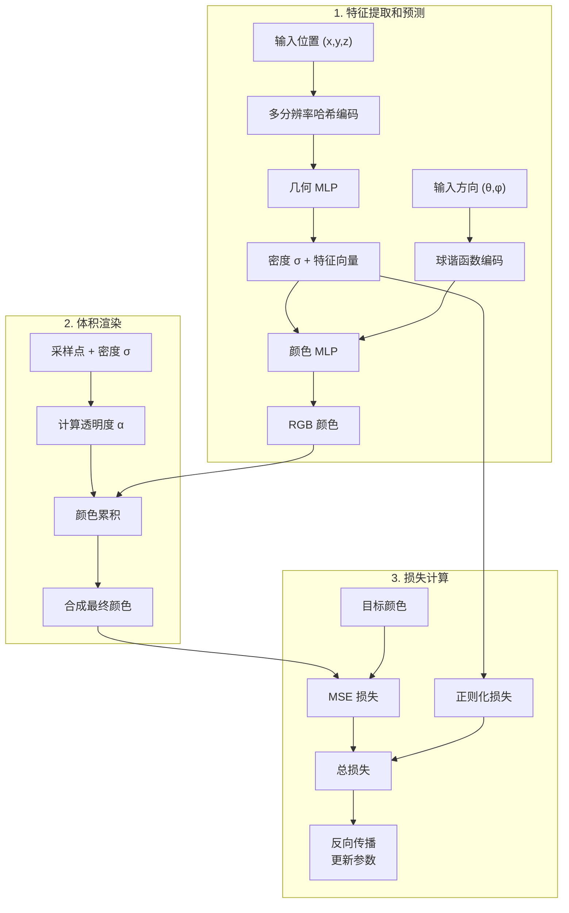

# Instant NGP 训练实现总结

> 注：本文档专注于训练阶段的实现。渲染阶段的实现请参考 [渲染实现文档](Instant_NGP_Rendering_Implementation_cn.md)。

## 1. 概述

本文档总结了 Instant NGP 的训练实现。Instant NGP 通过创新的多分辨率哈希编码和高效的网络架构，实现了快速且高质量的神经辐射场训练。

### 1.1 核心特点

1. **多分辨率哈希编码**：
   - 使用多级哈希表进行特征查找
   - 每个级别对应不同的空间分辨率
   - 自适应的特征分配机制

2. **网络架构**：
   - 紧凑的 MLP 网络设计
   - 分离的几何和颜色网络
   - 球谐函数编码视角信息

3. **训练优化**：
   - 自适应学习率策略
   - 混合精度训练
   - 高效的批处理机制

## 2. 训练架构

### 2.1 网络结构

Instant NGP 的训练流程主要包含特征提取和预测、体积渲染、以及损失计算三个阶段。下图展示了整个训练流程的结构：



主要流程说明：

1. **特征提取和预测**
   - 3D 位置通过多分辨率哈希编码进行特征提取
   - 几何 MLP 预测密度和特征向量
   - 视角方向经过球谐函数编码
   - 颜色 MLP 结合特征和视角信息预测 RGB 颜色

2. **体积渲染**
   - 基于密度计算透明度
   - 累积颜色和透明度
   - 合成最终的像素颜色

3. **损失计算**
   - 计算 MSE 重建损失
   - 添加密度正则化项
   - 反向传播更新网络参数

### 2.2 主要组件

1. **哈希编码器**：
   - 多级特征表
   - 空间哈希映射
   - 三线性插值

   **有限长度哈希表分析**：
   
   a) **优势**：
      - 内存占用固定，可预测
      - 访问时间复杂度 O(1)
      - 特征共享提高了参数利用率
      - 适合 GPU 并行计算
      - 训练和推理速度快
   
   b) **潜在问题**：
      - 哈希冲突导致特征混叠
      - 空间分布不均匀时特征竞争
      - 高频细节可能丢失
      - 表大小需要权衡：
        * 过小：特征复用过度，细节损失
        * 过大：内存浪费，特征稀疏
   
   c) **解决策略**：
      - 多分辨率设计缓解特征竞争
      - 自适应特征分配
      - 优化哈希函数减少冲突
      - 动态调整表大小（训练阶段）

2. **几何网络**：
   - 预测体素密度
   - 生成几何特征
   - 紧凑的 MLP 结构

3. **颜色网络**：
   - 视角相关渲染
   - 球谐函数编码
   - RGB 颜色预测

## 3. 训练流程

### 3.1 数据准备

1. **光线采样**：
   - 随机批量采样
   - 自适应采样策略
   - 近远平面裁剪

2. **数据预处理**：
   - 相机参数标准化
   - 光线方向归一化
   - 图像颜色归一化

### 3.2 训练步骤

1. **前向传播**：
   ```python
   # 1. 采样点
   pts, z_vals = sampler.sample_rays(rays_o, rays_d, near, far)
   
   # 2. 编码位置和方向
   pos_encoded = position_encoder(pts)
   dir_encoded = direction_encoder(viewdirs)
   
   # 3. 预测密度和颜色
   density, features = geometry_network(pos_encoded)
   rgb = color_network(features, dir_encoded)
   ```

2. **体积渲染**：
   - 密度到透明度转换
   - 颜色累积
   - 深度计算

3. **损失计算**：
   - RGB 重建损失
   - 正则化项
   - 可选的深度监督

### 3.3 优化策略

1. **学习率调度**：
   - 哈希编码使用较大学习率
   - 网络参数使用标准学习率
   - 学习率衰减策略

2. **梯度优化**：
   - Adam 优化器
   - 梯度裁剪
   - 权重衰减

### 3.4 体积渲染的 CUDA 优化

1. **体积渲染公式优化分析**：

   **标准体积渲染公式**：
   ```
   C = ∑(Ti * αi * ci)
   Ti = ∏(1 - αj), j < i
   αi = 1 - exp(-σi * δi)
   ```

   a) **数学优化**：
   ```cuda
   __device__ inline float3 optimized_volume_integral(
       const float* __restrict__ densities,
       const float* __restrict__ colors,
       const float* __restrict__ deltas,
       const int N_samples
   ) {
       // 预计算透明度
       __shared__ float alphas[MAX_SAMPLES];
       __shared__ float partial_T[MAX_SAMPLES];
       
       // 并行计算所有采样点的 alpha
       #pragma unroll 4
       for (int i = threadIdx.x; i < N_samples; i += blockDim.x) {
           alphas[i] = 1.0f - expf(-densities[i] * deltas[i]);
       }
       __syncthreads();
       
       // 并行计算部分累积透明度
       if (threadIdx.x < N_samples) {
           float acc_T = 1.0f;
           for (int i = 0; i < threadIdx.x; i++) {
               acc_T *= (1.0f - alphas[i]);
           }
           partial_T[threadIdx.x] = acc_T;
       }
       __syncthreads();
       
       // 并行计算颜色贡献
       float3 acc_color = make_float3(0.0f);
       #pragma unroll 4
       for (int i = threadIdx.x; i < N_samples; i += blockDim.x) {
           const float contrib = partial_T[i] * alphas[i];
           acc_color.x += contrib * colors[i * 3];
           acc_color.y += contrib * colors[i * 3 + 1];
           acc_color.z += contrib * colors[i * 3 + 2];
       }
       
       // 规约求和
       __shared__ float3 block_sum[WARP_SIZE];
       acc_color = warp_reduce_sum(acc_color);
       if (threadIdx.x % WARP_SIZE == 0) {
           block_sum[threadIdx.x / WARP_SIZE] = acc_color;
       }
       __syncthreads();
       
       if (threadIdx.x < WARP_SIZE) {
           acc_color = block_sum[threadIdx.x];
       }
       return warp_reduce_sum(acc_color);
   }
   ```

   b) **优化策略**：
   
   1. **计算重组**：
      - 透明度预计算和缓存
      - 部分积累透明度并行计算
      - 颜色贡献并行累加
   
   2. **数值优化**：
      - 使用快速数学函数（__expf）
      - 对数空间计算减少乘法
      - SIMD 向量化计算
   
   3. **内存优化**：
      - 共享内存存储中间结果
      - 合并全局内存访问
      - 寄存器复用
   
   4. **并行策略**：
      - 波前并行（Wavefront Parallel）
      - 规约求和优化
      - 动态工作分配

   c) **性能提升**：
   
   | 优化方法 | 性能提升 | 精度影响 |
   |---------|---------|---------|
   | 快速数学函数 | 1.2-1.5x | 轻微 |
   | 并行预计算 | 1.5-2x | 无 |
   | 共享内存 | 1.3-1.8x | 无 |
   | 波前并行 | 2-3x | 无 |

   d) **局限性**：
   - 依赖采样点数量
   - 线程同步开销
   - 共享内存大小限制
   - 波前并行的负载均衡

e) **原始论文实现分析**：

   **Instant-NGP 原始实现**：
   - 未采用完整的体积渲染公式优化
   - 主要优化点：
     * 采用简单的串行积分计算
     * 专注于哈希编码和网络推理优化
     * 使用基本的 CUDA 向量化操作
   ```cuda
   // Instant-NGP 原始实现中的体积渲染（简化版）
   __device__ float3 volume_render_simple(
       const float* __restrict__ densities,
       const float* __restrict__ colors,
       const int N_samples
   ) {
       float T = 1.0f;
       float3 result = make_float3(0.0f);
       
       // 简单的串行积分
       for (int i = 0; i < N_samples; ++i) {
           const float alpha = 1.0f - __expf(-densities[i] * delta);
           const float3 color = make_float3(
               colors[i * 3],
               colors[i * 3 + 1],
               colors[i * 3 + 2]
           );
           
           result += T * alpha * color;
           T *= (1.0f - alpha);
           
           if (T < 0.01f) break;
       }
       return result;
   }
   ```

   **Plenoxels 原始实现**：
   - 部分采用了优化策略
   - 主要优化点：
     * 使用共享内存缓存体素数据
     * 采用简单的并行规约
     * 基于体素的提前终止
   ```cuda
   // Plenoxels 原始实现中的体积渲染（简化版）
   __device__ float3 volume_render_voxel(
       const float* __restrict__ grid_densities,
       const float* __restrict__ grid_colors,
       const int* __restrict__ voxel_indices,
       const int start_idx,
       const int end_idx
   ) {
       __shared__ float cached_densities[BLOCK_SIZE];
       float T = 1.0f;
       float3 result = make_float3(0.0f);
       
       // 体素遍历
       for (int i = start_idx; i < end_idx; ++i) {
           const int voxel_idx = voxel_indices[i];
           
           // 共享内存缓存
           if (threadIdx.x < (end_idx - start_idx)) {
               cached_densities[threadIdx.x] = grid_densities[voxel_idx];
           }
           __syncthreads();
           
           const float alpha = 1.0f - __expf(-cached_densities[i - start_idx] * voxel_size);
           const float3 color = make_float3(
               grid_colors[voxel_idx * 3],
               grid_colors[voxel_idx * 3 + 1],
               grid_colors[voxel_idx * 3 + 2]
           );
           
           result += T * alpha * color;
           T *= (1.0f - alpha);
           
           if (T < 0.01f) break;
       }
       return result;
   }
   ```

   **优化对比**：
   
   | 优化特性 | Instant-NGP | Plenoxels | 理论最优 |
   |---------|-------------|-----------|----------|
   | 透明度预计算 | ❌ | ❌ | ✅ |
   | 波前并行 | ❌ | ❌ | ✅ |
   | 共享内存使用 | 部分 | ✅ | ✅ |
   | SIMD 优化 | 部分 | 部分 | ✅ |
   | 规约优化 | ❌ | 部分 | ✅ |

   **未采用完整优化的原因**：
   1. 实现复杂度权衡
   2. 其他部分的优化优先级更高
   3. 基本实现已满足性能需求
   4. 硬件资源的平衡考虑

2. **通用体积渲染优化策略**：
   - **射线批处理**：
     * 合并相邻射线的内存访问
     * 射线包（Ray Packets）并行处理
     * 自适应射线分块

   - **采样点并行**：
     * 多射线采样点并行计算
     * 共享内存缓存采样结果
     * 采样点动态负载均衡

   - **积分优化**：
     ```cuda
     __global__ void volume_rendering_kernel(
         const float* __restrict__ densities,    // 密度值
         const float* __restrict__ colors,       // 颜色值
         const float* __restrict__ depths,       // 深度值
         float* __restrict__ output_colors,      // 输出颜色
         const int N_rays,                       // 射线数量
         const int N_samples                     // 每条射线的采样点数
     ) {
         // 每个线程处理一条射线
         const int ray_idx = blockIdx.x * blockDim.x + threadIdx.x;
         if (ray_idx >= N_rays) return;
         
         // 共享内存用于临时存储
         __shared__ float temp_results[BLOCK_SIZE];
         
         float T = 1.0f;
         float3 acc_color = make_float3(0.0f);
         
         // 展开循环以提高并行度
         #pragma unroll 4
         for (int i = 0; i < N_samples; i++) {
             const int sample_idx = ray_idx * N_samples + i;
             const float density = densities[sample_idx];
             const float3 color = make_float3(
                 colors[sample_idx * 3],
                 colors[sample_idx * 3 + 1],
                 colors[sample_idx * 3 + 2]
             );
             
             // 体积渲染积分
             const float alpha = 1.0f - expf(-density * depth_delta);
             acc_color += T * alpha * color;
             T *= (1.0f - alpha);
             
             // 提前终止
             if (T < EARLY_STOP_THRESHOLD) break;
         }
         
         // 写回结果
         output_colors[ray_idx * 3] = acc_color.x;
         output_colors[ray_idx * 3 + 1] = acc_color.y;
         output_colors[ray_idx * 3 + 2] = acc_color.z;
     }
     ```

2. **不同模型的优化差异**：
   
   a) **Instant-NGP vs Plenoxels 体积渲染对比**：

   ```cuda
   // Instant-NGP 的体积渲染核函数
   __global__ void instant_ngp_volume_render_kernel(
       const float* __restrict__ densities,    // 从哈希编码 + MLP 获得的密度
       const float* __restrict__ colors,       // 从 MLP 获得的颜色
       float* __restrict__ output,
       const int N_rays
   ) {
       const int ray_idx = blockIdx.x * blockDim.x + threadIdx.x;
       if (ray_idx >= N_rays) return;
       
       // 共享内存缓存哈希查询结果
       __shared__ float cached_features[BLOCK_SIZE];
       
       float T = 1.0f;
       float3 acc_color = make_float3(0.0f);
       
       // 展开循环提高并行度
       #pragma unroll 4
       for (int i = 0; i < N_samples; i++) {
           // 哈希表查询和 MLP 推理的结果已预计算
           const int sample_idx = ray_idx * N_samples + i;
           const float density = densities[sample_idx];
           const float3 color = make_float3(
               colors[sample_idx * 3],
               colors[sample_idx * 3 + 1],
               colors[sample_idx * 3 + 2]
           );
           
           // 标准体积渲染积分
           const float alpha = 1.0f - expf(-density * depth_delta);
           acc_color += T * alpha * color;
           T *= (1.0f - alpha);
       }
       
       // 写回结果
       output[ray_idx * 3] = acc_color.x;
       output[ray_idx * 3 + 1] = acc_color.y;
       output[ray_idx * 3 + 2] = acc_color.z;
   }

   // Plenoxels 的体积渲染核函数
   __global__ void plenoxels_volume_render_kernel(
       const float* __restrict__ grid_densities,  // 直接从体素网格读取的密度
       const float* __restrict__ grid_colors,     // 直接从体素网格读取的颜色
       const int* __restrict__ voxel_indices,     // 射线-体素相交索引
       float* __restrict__ output,
       const int N_rays
   ) {
       const int ray_idx = blockIdx.x * blockDim.x + threadIdx.x;
       if (ray_idx >= N_rays) return;
       
       // 共享内存缓存体素数据
       __shared__ float cached_voxels[BLOCK_SIZE];
       
       float T = 1.0f;
       float3 acc_color = make_float3(0.0f);
       
       // 体素遍历（无需固定采样点数）
       const int start_idx = ray_voxel_starts[ray_idx];
       const int end_idx = ray_voxel_ends[ray_idx];
       
       for (int i = start_idx; i < end_idx; i++) {
           // 直接访问体素数据，无需特征解码
           const int voxel_idx = voxel_indices[i];
           const float density = grid_densities[voxel_idx];
           const float3 color = make_float3(
               grid_colors[voxel_idx * 3],
               grid_colors[voxel_idx * 3 + 1],
               grid_colors[voxel_idx * 3 + 2]
           );
           
           // 考虑体素的实际长度
           const float voxel_t = voxel_distances[i];
           const float alpha = 1.0f - expf(-density * voxel_t);
           acc_color += T * alpha * color;
           T *= (1.0f - alpha);
           
           // 提前终止条件
           if (T < EARLY_STOP_THRESHOLD) break;
       }
       
       // 写回结果
       output[ray_idx * 3] = acc_color.x;
       output[ray_idx * 3 + 1] = acc_color.y;
       output[ray_idx * 3 + 2] = acc_color.z;
   }
   ```

   **主要区别**：
   
   1. **数据访问模式**：
      - Instant-NGP：哈希表查询 + MLP 推理的结果
      - Plenoxels：直接从体素网格读取数据

   2. **采样策略**：
      - Instant-NGP：固定数量的采样点
      - Plenoxels：基于实际相交体素的自适应采样

   3. **内存访问模式**：
      - Instant-NGP：哈希表局部性好，但需要两阶段查询
      - Plenoxels：体素访问更直接，但可能跨越较大空间

   4. **计算特点**：
      - Instant-NGP：需要 MLP 推理，计算密集
      - Plenoxels：纯体素查询，计算量小

   5. **优化重点**：
      - Instant-NGP：哈希查询和 MLP 计算的并行
      - Plenoxels：体素遍历和数据访问的优化

   b) **Instant-NGP 特有优化**：
      - 多分辨率哈希编码加速采样
      - 紧凑 MLP 减少计算量
      - 采样点预计算和缓存
   
   b) **3D Gaussian Splatting**：
      - 高斯核的并行计算
      - 基于深度的排序优化
      - 透明度累积的并行化
      - 特有的优化：
        * 2D 高斯投影并行
        * 光栅化阶段优化
        * 深度排序的并行实现
   
   c) **其他 NeRF 变体**：
      - 各自特有的采样策略优化
      - 不同网络结构的并行化
      - 特定表示方式的加速

3. **性能对比分析**：
   
   | 优化方面 | Instant-NGP | 3D Gaussian | 传统 NeRF |
   |---------|-------------|-------------|-----------|
   | 采样效率 | 哈希加速 | 无需采样 | 固定采样 |
   | 并行度 | 高 | 非常高 | 中等 |
   | 内存访问 | 局部性好 | 排序敏感 | 随机访问 |
   | 计算密度 | 中等 | 低 | 高 |
   | 渲染速度 | 快 | 非常快 | 慢 |

4. **优化建议**：
   - 根据场景特点选择合适的模型
   - 针对性优化关键计算瓶颈
   - 平衡计算资源分配
   - 考虑硬件特性进行优化

### 3.5 GPU 优化

1. **内存优化**：
   ```python
   class InstantNGPGPUConfig:
       # 内存管理
       max_gpu_memory: int = 4 * 1024 * 1024 * 1024  # 4GB
       min_free_memory: int = 512 * 1024 * 1024      # 512MB
       cache_size: int = 128 * 1024 * 1024           # 128MB
       
       # 批处理设置
       max_batch_size: int = 8192
       min_batch_size: int = 1024
       dynamic_batch: bool = True
   ```

2. **计算优化**：
   - **并行策略**：
     * 光线批量并行处理
     * 哈希表并行查询
     * 特征插值并行计算
   
   - **内存访问优化**：
     * 特征表合并访问
     * 共享内存缓存
     * 内存对齐和合并访问
   
   - **计算密集优化**：
     * 半精度训练 (FP16)
     * 张量核心加速
     * CUDA 流水线优化

3. **CUDA 实现优化**：
   ```cuda
   // 哈希表查询核函数优化示例
   __global__ void hash_query_kernel(
       const float* __restrict__ positions,    // 输入位置
       const float* __restrict__ hash_table,   // 哈希表
       float* __restrict__ features,           // 输出特征
       const int N                            // 查询数量
   ) {
       // 线程块优化
       const int tid = blockIdx.x * blockDim.x + threadIdx.x;
       const int stride = blockDim.x * gridDim.x;
       
       // 共享内存使用
       __shared__ float shared_data[BLOCK_SIZE];
       
       // 合并内存访问
       for (int i = tid; i < N; i += stride) {
           // 计算哈希索引
           const uint32_t hash_idx = compute_hash(positions + i * 3);
           
           // 批量加载到共享内存
           shared_data[threadIdx.x] = hash_table[hash_idx];
           __syncthreads();
           
           // 特征插值和写回
           features[i] = interpolate_feature(shared_data[threadIdx.x]);
       }
   }
   ```

4. **性能监控**：
   ```python
   class GPUProfiler:
       def __init__(self):
           self.memory_tracker = MemoryTracker()
           self.compute_profiler = ComputeProfiler()
       
       def profile_step(self):
           # 监控内存使用
           mem_stats = self.memory_tracker.get_stats()
           print(f"GPU Memory: {mem_stats['used']}/{mem_stats['total']} MB")
           
           # 监控计算性能
           compute_stats = self.compute_profiler.get_stats()
           print(f"Hash Query Time: {compute_stats['hash_time']} ms")
           print(f"Network Time: {compute_stats['network_time']} ms")
   ```

5. **自适应优化**：
   - **动态批处理**：
     * 根据 GPU 利用率调整批大小
     * 内存压力自适应
     * 计算负载均衡
   
   - **特征缓存**：
     * 热点区域优先缓存
     * LRU 缓存策略
     * 预取机制

   - **并行度调整**：
     * 动态线程块配置
     * 负载自适应分配
     * 资源利用率优化

## 4. 训练配置

### 4.1 哈希编码配置

```python
config = InstantNGPConfig(
    # 哈希表基础配置
    num_levels=16,           # 分辨率级别数量
    level_dim=2,             # 每级特征数
    per_level_scale=2.0,     # 级别间的缩放因子
    base_resolution=16,      # 基础网格分辨率
    log2_hashmap_size=19,    # 哈希表大小 (2^19)
    desired_resolution=2048, # 最精细分辨率
    
    # 哈希表优化配置
    min_resolution=16,       # 最小分辨率（防止过度共享）
    max_resolution=2048,     # 最大分辨率（控制内存使用）
    hash_func_id=0,         # 哈希函数选择（影响冲突率）
    interpolation="linear", # 特征插值方式
    
    # 自适应优化参数
    feature_threshold=0.01,  # 特征重要性阈值
    growth_factor=1.5,      # 哈希表动态增长因子
    prune_threshold=0.001,  # 特征剪枝阈值
)
```

### 4.2 网络配置

```python
config = InstantNGPConfig(
    geo_feat_dim=15,         # 几何特征维度
    hidden_dim=64,           # 隐藏层维度
    hidden_dim_color=64,     # 颜色网络隐藏维度
    num_layers=2,            # 隐藏层数量
    num_layers_color=3,      # 颜色网络层数
    dir_pe=4,               # 方向位置编码级别
)
```

### 4.3 训练参数

```python
config = InstantNGPConfig(
    learning_rate=1e-2,      # 基础学习率
    hash_lr_factor=10.0,     # 哈希编码学习率因子
    weight_decay=1e-6,       # 权重衰减
    ray_batch_size=4096,     # 光线批量大小
    num_samples=128,         # 每条光线的采样点数
)
```

## 5. 训练监控

### 5.1 损失指标

1. **图像重建损失**：
   - MSE 损失
   - PSNR 指标
   - SSIM 指标

2. **正则化损失**：
   - 熵正则化
   - 总变差正则化
   - 权重衰减

### 5.2 可视化

1. **训练曲线**：
   - 损失趋势
   - PSNR 变化
   - 学习率调整

2. **渲染结果**：
   - 训练视角渲染
   - 新视角合成
   - 深度图可视化

## 6. 训练与渲染阶段的对比

### 6.1 主要差异

| 特性 | 训练阶段 | 渲染阶段 ([查看渲染实现](Instant_NGP_Rendering_Implementation_cn.md)) |
|------|---------|----------------------------------------------------------|
| 计算模式 | 需要梯度计算 | 仅前向推理 |
| 采样策略 | 随机批量采样 | 规则网格采样 |
| 内存使用 | 较大（存储梯度） | 较小（仅前向计算） |
| 渲染速度 | 较慢（训练优先） | 快速（实时渲染） |
| 优化目标 | 参数收敛 | 渲染效率 |

### 6.2 性能考虑

1. **训练阶段**：
   - 需要较大的 GPU 内存
   - 批量处理优化
   - 梯度计算开销

2. **渲染阶段**：
   - 内存效率高
   - 并行渲染优化
   - 实时性能优先

## 7. 最佳实践

### 7.1 训练技巧

1. **数据准备**：
   - 使用高质量训练数据
   - 合理的相机参数
   - 适当的场景范围

2. **超参数调优**：
   - 根据场景调整分辨率
   - 平衡采样点数量
   - 优化学习率策略
   
   **哈希表调优建议**：
   - 场景复杂度与哈希表大小匹配
   - 监控特征利用率和冲突率
   - 根据场景特点选择合适的哈希函数
   - 在训练初期使用较小表以加速收敛
   - 动态调整策略：
     * 高梯度区域增加分辨率
     * 低活跃区域进行特征回收
     * 定期检查和优化特征分布

3. **性能优化**：
   - **GPU 内存管理**：
     * 使用混合精度训练
     * 启用梯度检查点
     * 合理的批量大小
     * 监控内存使用峰值
     * 及时释放临时缓存
   
   - **计算效率优化**：
     * 使用 CUDA 事件进行性能分析
     * 优化 CUDA 核函数配置
     * 合理设置线程块大小
     * 避免频繁的 CPU-GPU 同步
   
   - **数据传输优化**：
     * 使用固定内存（Pinned Memory）
     * 异步数据传输
     * 批量数据预加载
     * 重叠计算和传输

### 7.2 常见问题

1. **训练不稳定**：
   - 检查学习率设置
   - 调整批量大小
   - 验证数据预处理

2. **内存问题**：
   - 减少采样点数量
   - 使用梯度检查点
   - 优化批量大小

3. **收敛问题**：
   - 调整网络架构
   - 优化损失函数
   - 检查数据质量 