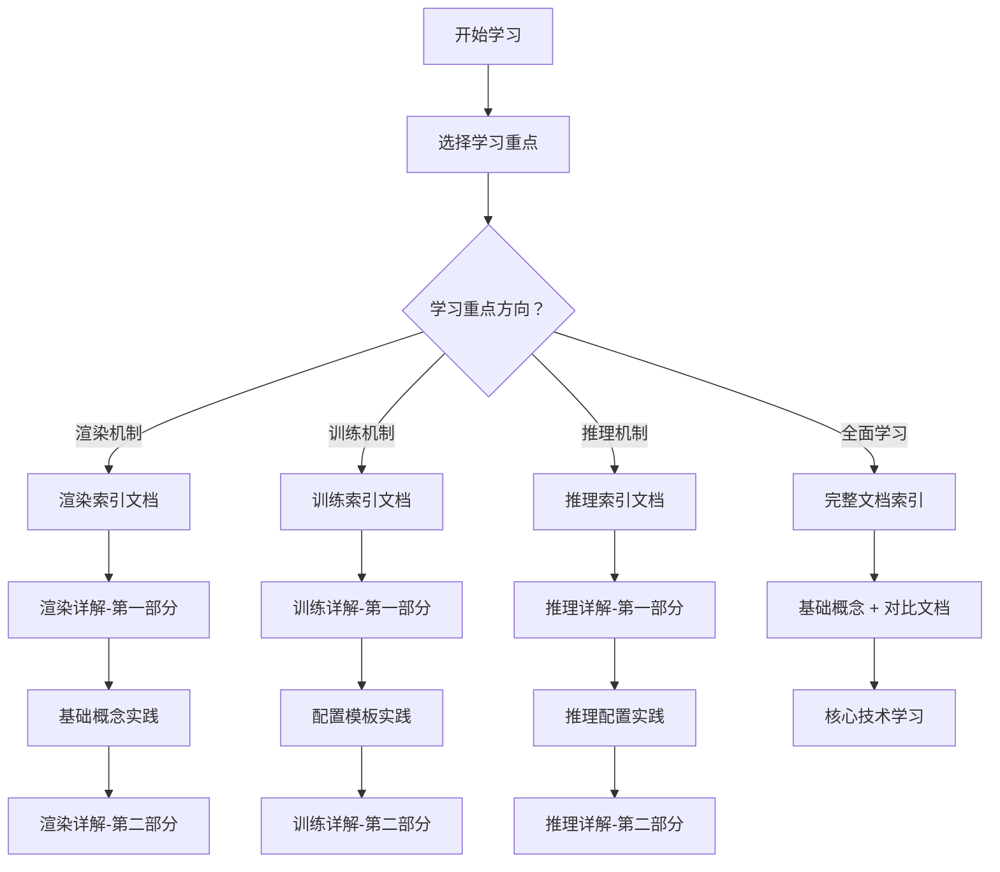

# SVRaster 完整技术文档索引

## 🎯 文档概述

SVRaster（Sparse Voxel Rasterization）是一种先进的稀疏体素渲染技术，本文档集提供了从基础概念到高级应用的完整技术指南。文档采用模块化设计，用户可以根据需求选择性学习。

## 📚 文档结构总览

### 🎨 渲染机制文档系列

**核心主题**：稀疏体素表示、体积渲染、CUDA 优化、性能调优

1. **[渲染机制文档索引](./RENDERING_INDEX_cn.md)** 🗂️
   - 渲染文档导航与学习路径
   - 技术概念速查表
   - 实用工具和资源

2. **[渲染机制详解 - 第一部分](./RENDERING_DETAILS_PART1_cn.md)** 🏗️
   - 稀疏体素数据结构设计
   - 八叉树与 Morton 编码实现
   - 体素光栅化核心算法

3. **[渲染机制详解 - 第二部分](./RENDERING_DETAILS_PART2_cn.md)** ⚡
   - 体积渲染积分与光线追踪
   - CUDA 并行优化技术
   - 遮挡剔除与动态负载均衡

4. **[渲染机制详解 - 第三部分](./RENDERING_DETAILS_PART3_cn.md)** 🚀
   - 高级渲染优化技术
   - 球谐函数与视角相关渲染
   - 性能分析与调试工具

### 🎓 训练机制文档系列

**核心主题**：自适应细分、渐进式训练、损失函数设计、性能监控

5. **[训练机制文档索引](./TRAINING_INDEX_cn.md)** 🗂️
   - 训练文档导航与学习路径
   - 核心概念一览表
   - 实用工具和资源

6. **[训练机制详解 - 第一部分](./TRAINING_DETAILS_PART1_cn.md)** 🏗️
   - 基础训练架构设计
   - 配置系统与参数管理
   - 优化器与学习率调度

7. **[训练机制详解 - 第二部分](./TRAINING_DETAILS_PART2_cn.md)** 🌳
   - 自适应体素细分机制
   - 智能剪枝策略
   - 渐进式训练与多尺度优化

8. **[训练机制详解 - 第三部分](./TRAINING_DETAILS_PART3_cn.md)** 🎯
   - 多重损失函数设计
   - 正则化技术与性能监控
   - 训练故障诊断与调优

### � 推理机制文档系列

**核心主题**：实时推理、性能优化、批量处理、质量评估

9. **[推理机制文档索引](./INFERENCE_INDEX_cn.md)** 🗂️ **新增**
   - 推理文档导航与学习路径
   - 推理技术概念速查表
   - 实用工具和资源

10. **[推理机制详解 - 第一部分](./INFERENCE_DETAILS_PART1_cn.md)** 🏗️ **新增**
    - 推理架构与模式管理
    - 模型加载与优化策略
    - 内存管理与缓存机制

11. **[推理机制详解 - 第二部分](./INFERENCE_DETAILS_PART2_cn.md)** ⚡ **新增**
    - 推理渲染管线设计
    - 光栅化优化技术
    - 空间加速结构与时间一致性

12. **[推理机制详解 - 第三部分](./INFERENCE_DETAILS_PART3_cn.md)** 🚀 **新增**
    - 高级推理优化技术
    - 多视角推理与批量处理
    - 质量评估与实际应用场景

### 📊 技术分析文档系列

**核心主题**：架构分析、实现对比、开发指导、最佳实践

20. **[文档与源代码对应分析](./DOCUMENTATION_VS_SOURCE_ANALYSIS_cn.md)** 🔍
    - 文档设计理念 vs 实际实现差异
    - 模块化设计与性能优化的权衡
    - 如何正确理解和使用文档与源代码
    - 开发者和研究者的使用建议

21. **[渲染器架构设计说明](./RENDERER_DESIGN_cn.md)** 🎨 **新增**
    - 独立渲染器的设计理念和优势
    - 与训练器的职责分离原则
    - 部署友好的架构设计
    - 丰富的渲染功能特性

22. **[API 参考文档](./API_REFERENCE_cn.md)** 📋 **新增**
    - 完整的 SVRaster 模块 API 参考
    - 所有公共类和方法的详细说明
    - 自动生成的函数签名和文档字符串
    - 模块路径和使用指南

### 🛠️ 实用指南文档

**核心主题**：配置模板、使用示例、最佳实践

13. **[训练配置模板与实例](./TRAINING_CONFIG_TEMPLATES_cn.md)** ⚙️
    - 完整配置模板集合
    - Python API 使用示例
    - 常见问题解决方案

### 📖 实现细节文档

**核心主题**：代码实现、算法分析、技术细节

14. **[训练与推理渲染机制对比](./TRAINING_VS_INFERENCE_RENDERING_cn.md)** ⭐ **重要**
    - 训练时与推理时的关键差异
    - 不同模式下的优化策略  
    - 性能对比与最佳实践
    - 模式切换与内存管理

15. **[SVRaster 光栅化实现详解](./SVRaster_Rasterization_Implementation_cn.md)** 💻
    - 光栅化算法底层实现
    - CUDA 核心函数分析
    - 性能优化技巧

16. **[SVRaster 训练实现详解](./SVRaster_Training_Implementation_cn.md)** 💻
    - 训练算法底层实现
    - 核心训练代码分析
    - 优化策略详解

## 🚀 学习路径推荐

### 👋 新手入门路径（推荐时间：3-5 天）

#### 第一阶段：基础概念（1-2 天）
1. 阅读相关索引文档，了解整体架构
2. ⭐ **重点学习**：[训练与推理渲染机制对比](./TRAINING_VS_INFERENCE_RENDERING_cn.md)
3. 📖 **推荐阅读**：[文档与源代码对应分析](./DOCUMENTATION_VS_SOURCE_ANALYSIS_cn.md) - 理解文档与实现的关系
4. 选择主要学习方向（渲染/训练/推理）
5. 学习基础概念并运行简单示例

#### 第二阶段：核心技术（2-3 天）  
1. 深入学习选定方向的核心算法
2. 理解自适应技术和优化策略
3. 实践中级配置和技术

#### 第三阶段：高级应用（额外时间）
1. 掌握高级优化技术
2. 学习性能调优和故障诊断
3. 开发定制化解决方案

### 🔬 研究人员路径（推荐时间：1-2 周）

**目标**：深入理解算法原理，进行技术创新

1. **理论基础**（2-3 天）
   - 完整阅读渲染机制文档系列
   - 重点关注算法设计与数学原理
   - 理解稀疏体素与体积渲染理论

2. **实现分析**（3-4 天）
   - 📊 **重点学习**：[文档与源代码对应分析](./DOCUMENTATION_VS_SOURCE_ANALYSIS_cn.md)
   - 深入研究实现细节文档
   - 分析核心算法代码
   - 理解 CUDA 优化技术

3. **训练机制**（2-3 天）
   - 学习自适应训练策略
   - 理解损失函数设计
   - 掌握性能优化技术

4. **创新实践**（3-5 天）
   - 基于理解进行算法改进
   - 实验新的优化策略
   - 开发定制化功能

### 💼 应用开发者路径（推荐时间：3-7 天）

**目标**：快速部署和应用 SVRaster 技术

#### 🎯 选择应用方向：
- **实时应用开发**：VR/AR、游戏、实时可视化 → 重点学习推理机制
- **研究与训练**：模型训练、算法研究 → 重点学习训练机制  
- **生产部署**：大规模应用部署 → 综合学习所有机制

1. **快速入门**（1 天）
   - 根据应用方向选择相应的索引文档
   - 运行基础配置示例
   - 熟悉基本操作流程

2. **配置优化**（1-2 天）
   - 根据硬件条件选择配置
   - 调整参数以满足性能需求
   - 解决常见配置问题

3. **生产部署**（2-3 天）
   - 学习高性能配置
   - 掌握监控和调试技术
   - 实现稳定的生产级部署

4. **维护优化**（1-2 天）
   - 学习故障诊断方法
   - 掌握性能调优技巧
   - 建立维护流程

### 🚀 推理专家路径（推荐时间：1 周）

**目标**：掌握高性能实时推理技术

1. **推理基础理解**（1-2 天）
   - 学习 [推理机制文档索引](./INFERENCE_INDEX_cn.md)
   - 理解推理与训练的本质差异
   - 掌握推理架构设计

2. **推理优化技术**（2-3 天）
   - 深入学习推理渲染管线
   - 掌握多级缓存和性能优化
   - 实现批量推理系统

3. **高级应用开发**（2-3 天）
   - 多视角推理策略
   - 质量评估与自适应控制
   - 实际应用场景实现

### ⚡ 性能优化专家路径（推荐时间：1-2 周）

**目标**：最大化 SVRaster 性能表现

1. **性能分析**（2-3 天）
   - 学习渲染优化技术
   - 理解 CUDA 并行计算原理
   - 掌握性能监控工具

2. **内存优化**（2-3 天）
   - 学习稀疏数据结构优化
   - 理解内存管理策略
   - 掌握内存效率配置

3. **计算优化**（2-3 天）
   - 深入 CUDA 优化技术
   - 学习动态负载均衡
   - 实现自定义优化策略

4. **系统集成**（2-3 天）
   - 多 GPU 并行训练
   - 分布式计算优化
   - 生产环境部署优化

## 📋 核心技术概念速查

### 🎨 渲染技术

| 技术 | 说明 | 优势 | 应用场景 |
|------|------|------|----------|
| **稀疏体素表示** | 使用稀疏数据结构存储体素 | 内存高效、计算优化 | 大场景渲染 |
| **八叉树结构** | 分层体素组织方式 | 快速空间查询 | 多尺度渲染 |
| **Morton 编码** | 空间数据线性化编码 | 内存访问局部性 | 并行计算 |
| **体素光栅化** | 体素到屏幕像素的映射 | 直接渲染、高效 | 实时渲染 |
| **体积渲染** | 体积数据的渲染技术 | 高质量、物理准确 | 科学可视化 |
| **球谐函数** | 球面函数的基函数表示 | 视角相关渲染 | 真实感渲染 |

### 🎓 训练技术

| 技术 | 说明 | 优势 | 应用场景 |
|------|------|------|----------|
| **自适应细分** | 根据误差动态细分体素 | 质量与效率平衡 | 智能训练 |
| **剪枝策略** | 移除不重要的体素 | 减少计算量 | 模型压缩 |
| **渐进式训练** | 从粗到细的训练策略 | 稳定收敛 | 多尺度学习 |
| **多重损失** | 结合多种损失函数 | 全面优化 | 高质量训练 |
| **正则化** | 防止过拟合的技术 | 提升泛化能力 | 模型稳定 |
| **性能监控** | 实时监控训练状态 | 及时调整策略 | 训练调优 |

### 🚀 推理技术

| 技术 | 说明 | 优势 | 应用场景 |
|------|------|------|----------|
| **JIT 编译** | 即时编译优化 | 运行时优化 | 性能提升 |
| **模型量化** | 降低模型精度减少计算 | 内存节省、加速 | 移动端部署 |
| **多级缓存** | 分层数据缓存策略 | 减少重复计算 | 高性能推理 |
| **批量推理** | 并行处理多个请求 | 吞吐量提升 | 服务端部署 |
| **视角插值** | 基于邻近视角的插值 | 减少计算量 | 实时交互 |
| **质量评估** | 自动评估推理质量 | 质量保证 | 自适应渲染 |
| **时间一致性** | 保证帧间连续性 | 流畅体验 | 视频渲染 |

### ⚡ 性能优化

| 优化类型 | 技术要点 | 效果 | 适用阶段 |
|----------|----------|------|----------|
| **内存优化** | 稀疏表示、缓存策略 | 减少内存占用 | 训练+推理 |
| **计算优化** | CUDA 并行、JIT 编译 | 加速计算 | 训练+推理 |
| **I/O 优化** | 数据预加载、异步处理 | 减少等待时间 | 训练+推理 |
| **网络优化** | 模型压缩、量化 | 减少传输开销 | 推理部署 |
| **显存优化** | 动态分配、内存池 | 提高显存利用率 | 训练+推理 |

| 技术概念 | 核心作用 | 主要文档章节 |
|----------|----------|--------------|
| **稀疏体素** | 存储空间高效表示 | 渲染详解-第一部分 |
| **八叉树结构** | 层次化空间索引 | 渲染详解-第一部分 |
| **Morton 编码** | 空间位置编码 | 渲染详解-第一部分 |
| **体积渲染** | 透明物体渲染 | 渲染详解-第二部分 |
| **CUDA 优化** | GPU 并行加速 | 渲染详解-第二部分 |
| **球谐函数** | 视角相关渲染 | 渲染详解-第三部分 |

### 🎓 训练技术

| 技术概念 | 核心作用 | 主要文档章节 |
|----------|----------|--------------|
| **自适应细分** | 动态分辨率调整 | 训练详解-第二部分 |
| **智能剪枝** | 无效体素移除 | 训练详解-第二部分 |
| **渐进式训练** | 多阶段质量提升 | 训练详解-第二部分 |
| **多重损失** | 全面质量优化 | 训练详解-第三部分 |
| **正则化** | 模型泛化能力 | 训练详解-第三部分 |
| **性能监控** | 训练状态追踪 | 训练详解-第三部分 |

## 🔧 实用工具索引

### 配置工具
- **[基础训练配置](./TRAINING_CONFIG_TEMPLATES_cn.md#基础训练配置)** - 快速开始
- **[高性能配置](./TRAINING_CONFIG_TEMPLATES_cn.md#高性能训练配置)** - 最佳性能
- **[内存优化配置](./TRAINING_CONFIG_TEMPLATES_cn.md#内存优化配置)** - 资源受限环境

### 代码示例
- **[Python API 示例](./TRAINING_CONFIG_TEMPLATES_cn.md#python-api-使用示例)** - 编程接口
- **[PyTorch 示例](./TRAINING_CONFIG_TEMPLATES_cn.md#pytorch-训练示例)** - 完整训练框架
- **[命令行示例](./TRAINING_CONFIG_TEMPLATES_cn.md#命令行训练示例)** - 脚本执行

### 调试工具
- **[性能分析](./RENDERING_DETAILS_PART3_cn.md#性能分析工具)** - 渲染性能
- **[内存监控](./TRAINING_DETAILS_PART3_cn.md#内存监控工具)** - 内存使用
- **[训练调试](./TRAINING_DETAILS_PART3_cn.md#训练故障诊断)** - 训练问题

## ❓ 常见问题快速导航

### 🚨 紧急问题

| 问题类型 | 快速解决方案 | 详细文档 |
|----------|--------------|----------|
| **训练推理差异不明** | [训练推理对比文档](./TRAINING_VS_INFERENCE_RENDERING_cn.md) | ⭐ 核心概念 |
| **GPU 内存不足** | [内存优化配置](./TRAINING_CONFIG_TEMPLATES_cn.md#内存优化配置) | 训练详解-第一部分 |
| **训练不收敛** | [损失函数调优](./TRAINING_CONFIG_TEMPLATES_cn.md#训练不收敛) | 训练详解-第三部分 |
| **渲染质量差** | [质量优化配置](./TRAINING_CONFIG_TEMPLATES_cn.md#渲染质量不理想) | 渲染详解-第三部分 |
| **训练速度慢** | [性能优化配置](./TRAINING_CONFIG_TEMPLATES_cn.md#训练速度慢) | 训练详解-第二部分 |

### 🔍 技术问题

| 问题领域 | 相关文档 | 关键章节 |
|----------|----------|----------|
| **稀疏体素原理** | 渲染详解-第一部分 | 1-2 节 |
| **CUDA 优化** | 渲染详解-第二部分 | 2-3 节 |
| **自适应训练** | 训练详解-第二部分 | 1-3 节 |
| **损失函数设计** | 训练详解-第三部分 | 1-2 节 |

## 📈 性能基准参考

### 硬件建议

| 使用场景 | GPU | CPU | 内存 | 存储 |
|----------|-----|-----|------|------|
| **学习实验** | GTX 1080+ | 4 核心+ | 16GB+ | 100GB+ |
| **研究开发** | RTX 3080+ | 8 核心+ | 32GB+ | 500GB+ |
| **生产部署** | RTX 4090+ | 16 核心+ | 64GB+ | 1TB+ |

### 性能预期

| 配置类型 | 训练时间 | 内存使用 | 渲染质量 |
|----------|----------|----------|----------|
| **基础配置** | 2-4 小时 | 6-12GB | 良好 |
| **高性能配置** | 4-8 小时 | 12-24GB | 优秀 |
| **生产级配置** | 1-2 小时 | 24GB+ | 极佳 |

## 🎯 下一步行动

### 新用户
1. 选择合适的学习路径
2. 阅读相关索引文档
3. 运行基础配置示例
4. 根据需要深入学习

### 有经验用户
1. 直接查阅相关技术章节
2. 参考配置模板和最佳实践
3. 根据需求定制化开发
4. 贡献改进和优化

### 技术贡献者
1. 深入研究实现细节
2. 识别优化机会
3. 开发新功能特性
4. 完善文档和示例

---

**🔗 重要提醒**：本文档系统采用模块化设计，建议根据实际需求选择性阅读。所有文档都提供了丰富的代码示例和实践指导，欢迎在学习过程中进行实际操作验证。

**📞 支持渠道**：如需技术支持或有改进建议，请通过 GitHub Issues 或项目讨论区联系我们。
