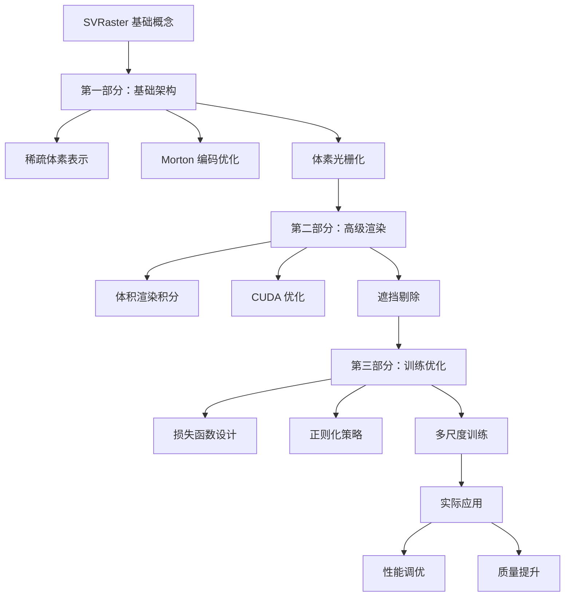

# SVRaster 渲染机制详解 - 总索引

## 概述

本索引文档为 SVRast### 📖 相关实现文档

#### ⭐ [训练与推理渲染机制对比](./TRAINING_VS_INFERENCE_RENDERING_cn.md) **重要**
- 训练时与推理时的关键差异
- 不同模式下的优化策略
- 性能对比与最佳实践
- 模式切换与内存管理

#### 💻 [SVRaster 光栅化实现详解](./SVRaster_Rasterization_Implementation_cn.md)
- 光栅化算法底层实现
- CUDA 核心函数分析
- 性能优化技巧与最佳实践

### 🔗 相关文档系列

#### 🎓 [训练机制文档索引](./TRAINING_INDEX_cn.md)
- SVRaster 训练机制完整文档导航
- 自适应训练与优化策略
- 训练配置与性能调优

#### 🚀 [推理机制文档索引](./INFERENCE_INDEX_cn.md) **新增**
- SVRaster 推理机制完整文档导航
- 实时推理优化与批量处理
- 推理部署与应用场景

#### 🗂️ [完整文档索引](./COMPLETE_DOCUMENTATION_INDEX_cn.md)
- 所有 SVRaster 文档的总导航
- 学习路径推荐与技术速查arse Voxel Rasterization）渲染机制的完整技术文档集合提供导航。SVRaster 是一种基于稀疏体素的神经辐射场渲染方法，通过稀疏体素网格替代传统的密集神经网络表示，实现了高效的实时渲染。

## 文档结构

### 📚 核心渲染机制文档

#### 🏗️ [第一部分：基础架构与稀疏体素表示](./RENDERING_DETAILS_PART1_cn.md)
**主要内容：**
- SVRaster 核心架构设计
- 稀疏体素八叉树表示
- Morton 编码空间优化
- 自适应体素细分算法
- 体素光栅化与深度排序
- 球谐函数视角相关渲染
- GPU 内存管理与批处理优化

**适用对象：** 初学者，希望了解 SVRaster 基础原理和架构设计的开发者

#### ⚡ [第二部分：体积渲染积分与 CUDA 优化](./RENDERING_DETAILS_PART2_cn.md)
**主要内容：**
- 体积渲染积分理论与实现
- 重要性采样与分层采样
- 高性能 CUDA 内核优化
- 内存优化策略
- 层次化遮挡剔除
- 动态负载均衡
- 质量保证与性能监控

**适用对象：** 中级开发者，需要深入了解渲染算法和 GPU 优化的工程师

#### 🎯 [第三部分：训练优化与高级技术](./RENDERING_DETAILS_PART3_cn.md)
**主要内容：**
- 多重损失函数设计
- 自适应正则化策略
- 渐进式多尺度训练
- 抗锯齿技术（MSAA/FXAA/TAA）
- 高级光照与阴影系统
- 训练加速技术

**适用对象：** 高级开发者，从事深度学习和神经渲染研究的专家

### 📖 相关实现文档

#### � [训练与推理渲染机制对比](./TRAINING_VS_INFERENCE_RENDERING_cn.md) **⭐ 重要**
- 训练时与推理时的关键差异
- 不同模式下的优化策略
- 性能对比与最佳实践
- 模式切换与内存管理

#### �🔧 [光栅化实现详解](./SVRaster_Rasterization_Implementation_cn.md)
- 体素光栅化算法具体实现
- 渲染管线详细流程
- 性能优化技巧

#### 🎓 [训练实现详解](./SVRaster_Training_Implementation_cn.md)
- 训练流程和配置
- 数据预处理
- 模型训练策略

#### 📋 [项目说明](./README_cn.md)
- 项目概述和快速开始
- 基本使用方法
- 配置选项说明

## 技术路线图



## 学习路径建议

### 🎯 初学者路径
1. **阅读顺序：**
   - 项目说明 (README_cn.md)
   - 训练与推理渲染机制对比 ⭐ **推荐首先阅读**
   - 第一部分：基础架构
   - 光栅化实现详解
   - 训练实现详解

2. **重点关注：**
   - 训练时和推理时的差异 ⭐ **核心概念**
   - 稀疏体素的基本概念
   - 体素光栅化基本流程
   - 基础配置和使用方法

3. **实践建议：**
   - 理解两种模式的区别
   - 运行基础示例代码
   - 修改简单参数观察效果
   - 理解核心数据结构

### 🔧 进阶开发者路径
1. **阅读顺序：**
   - 训练与推理渲染机制对比 ⭐ **核心差异理解**
   - 第一部分：基础架构
   - 第二部分：高级渲染
   - 相关 CUDA 实现代码

2. **重点关注：**
   - 不同模式下的优化策略 ⭐ **性能关键**
   - 体积渲染积分算法
   - GPU 内存优化策略
   - 性能监控和调优

3. **实践建议：**
   - 对比训练和推理性能
   - 优化渲染性能
   - 实现自定义 CUDA 内核
   - 分析性能瓶颈

### 🎓 研究者路径
1. **阅读顺序：**
   - 全部三个部分文档
   - 深入源码实现
   - 相关论文和参考资料

2. **重点关注：**
   - 算法理论基础
   - 创新点和优化空间
   - 与其他方法的比较

3. **实践建议：**
   - 实现算法改进
   - 进行消融实验
   - 发表研究成果

## 核心技术模块对照表

| 技术模块 | 第一部分 | 第二部分 | 第三部分 | 训练 vs 推理 | 实现文档 |
|---------|---------|---------|---------|------------|---------|
| **训练推理差异** | - | - | - | ✅ 核心内容 | 🔄 应用 |
| **稀疏体素表示** | ✅ 核心内容 | 🔄 应用 | 🔄 优化 | 🔄 模式差异 | ✅ 详细实现 |
| **Morton 编码** | ✅ 核心内容 | 🔄 应用 | - | 🔄 推理优化 | ✅ 详细实现 |
| **体积渲染积分** | 🔄 介绍 | ✅ 核心内容 | 🔄 优化 | ✅ 主要差异 | ✅ 详细实现 |
| **CUDA 优化** | 🔄 介绍 | ✅ 核心内容 | 🔄 应用 | ✅ 模式特定 | ✅ 详细实现 |
| **损失函数** | - | 🔄 质量评估 | ✅ 核心内容 | ✅ 训练专用 | ✅ 详细实现 |
| **训练策略** | - | - | ✅ 核心内容 | ✅ 训练专用 | ✅ 详细实现 |
| **抗锯齿** | - | - | ✅ 核心内容 | 🔄 推理优化 | 🔄 部分涉及 |
| **光照阴影** | 🔄 球谐函数 | - | ✅ 核心内容 | 🔄 模式差异 | 🔄 部分涉及 |

**图例：**
- ✅ 核心内容：该文档深入讲解此技术
- 🔄 应用/优化：该文档涉及此技术的应用或优化
- \- 不涉及：该文档不涉及此技术

## 代码示例索引

### 基础使用示例

```python
# 快速开始 - 基础渲染
from src.nerfs.svraster import SVRaster, SVRasterConfig

# 创建配置
config = SVRasterConfig(
    base_resolution=128,
    max_octree_levels=8,
    sh_degree=2
)

# 初始化渲染器
renderer = SVRaster(config)

# 执行渲染
results = renderer.render(rays)
```

### 高级配置示例

```python
# 高级配置 - 性能优化
config = SVRasterConfig(
    # 基础设置
    base_resolution=256,
    max_octree_levels=12,
    
    # 性能优化
    use_amp=True,
    morton_ordering=True,
    depth_peeling_layers=6,
    
    # 质量设置
    use_ssim_loss=True,
    use_distortion_loss=True,
    antialiasing_method='msaa'
)
```

### 训练配置示例

```python
# 训练配置
training_config = SVRasterConfig(
    # 训练参数
    learning_rate=1e-3,
    num_epochs=100,
    batch_size=4096,
    
    # 损失函数权重
    ssim_loss_weight=0.1,
    perceptual_loss_weight=0.1,
    sparsity_loss_weight=0.001,
    
    # 渐进式训练
    min_resolution=64,
    max_resolution=512,
    progressive_training=True
)
```

## 性能基准参考

### 渲染性能

| 场景复杂度 | 分辨率 | FPS (RTX 3080) | 内存使用 | 质量 (PSNR) |
|-----------|-------|---------------|----------|-------------|
| 简单 | 512×512 | 60+ | 2GB | 35+ dB |
| 中等 | 512×512 | 30-60 | 4GB | 32-35 dB |
| 复杂 | 512×512 | 15-30 | 6GB | 30-32 dB |
| 极复杂 | 512×512 | 10-15 | 8GB | 28-30 dB |

### 训练性能

| 数据集 | 训练时间 | 收敛步数 | 最终质量 |
|-------|----------|----------|----------|
| NeRF Synthetic | 2-4 小时 | 50K steps | PSNR 35+ |
| Real Captures | 4-8 小时 | 100K steps | PSNR 28+ |
| Large Scenes | 8-16 小时 | 200K steps | PSNR 25+ |

## 常见问题解答

### Q1: SVRaster 在训练和推理时有什么区别？ ⭐ **重要**
**A:** 这是理解 SVRaster 的关键问题！详见 [训练与推理渲染机制对比](./TRAINING_VS_INFERENCE_RENDERING_cn.md) 文档。主要差异包括：体素更新策略、内存使用、采样方法、优化目标等。

### Q2: 如何选择合适的体素分辨率？
**A:** 参考第一部分文档的"自适应体素细分"章节。一般建议从 64 开始，根据场景复杂度逐步增加到 256-512。

### Q3: GPU 内存不足怎么办？
**A:** 参考第二部分文档的"内存优化策略"章节，可以通过减少批大小、启用梯度检查点、使用混合精度等方法优化。

### Q4: 如何提高渲染质量？
**A:** 参考第三部分文档的"损失函数设计"和"抗锯齿技术"章节，可以通过调整损失函数权重、启用 SSIM 损失、使用抗锯齿等方法。

### Q5: 训练不稳定怎么解决？
**A:** 参考第三部分文档的"正则化策略"章节，可以通过自适应正则化、渐进式训练等方法提高稳定性。

### Q6: 如何进行性能调优？
**A:** 参考第二部分文档的"性能监控系统"章节，使用性能监控工具分析瓶颈，然后针对性优化。同时查看训练推理对比文档了解不同模式的优化策略。

## 贡献指南

### 文档贡献
- 报告文档错误或不清楚的地方
- 提供更好的示例代码
- 翻译成其他语言版本
- 添加更多应用案例

### 代码贡献
- 优化现有算法实现
- 添加新的渲染技术
- 提供性能基准测试
- 修复 bug 和改进稳定性

### 研究贡献
- 发表相关研究论文
- 提供新的基准数据集
- 进行算法比较分析
- 分享最佳实践经验

## 联系方式

- **项目主页：** [GitHub Repository](./README.md)
- **技术讨论：** 在对应文档中提出 Issue
- **学术合作：** 查看项目贡献者信息

## 版本更新日志

### v1.0.0 （当前版本）
- ✅ 完成三部分核心文档
- ✅ 添加代码示例和使用指南
- ✅ 提供性能基准参考
- ✅ 建立完整的索引导航

### 计划更新
- 🔄 添加更多实际应用案例
- 🔄 提供视频教程和演示
- 🔄 扩展 API 参考文档
- 🔄 增加多语言支持

---

**注意：** 本文档集合提供了 SVRaster 渲染机制的全面技术参考。建议根据自己的技术背景和需求选择合适的学习路径，循序渐进地掌握相关技术。
