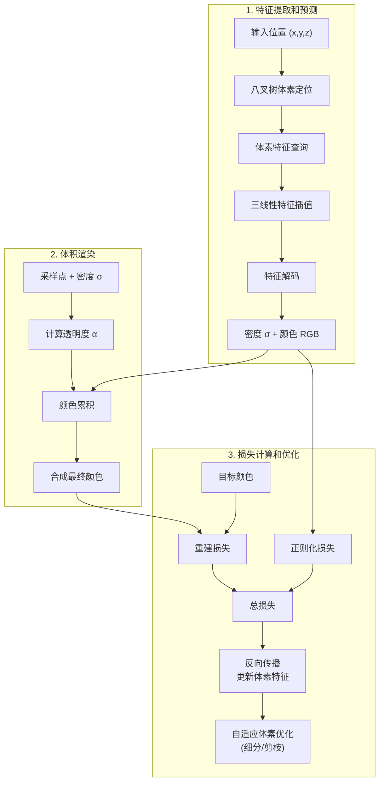

# SVRaster 训练实现机制详解

## 1. 训练配置

### 1.1 基础训练配置
```python
@dataclass
class SVRasterTrainerConfig:
    """SVRaster 训练器配置"""
    
    # 训练参数
    num_epochs: int = 100
    batch_size: int = 1
    learning_rate: float = 1e-3
    weight_decay: float = 1e-4
    
    # 优化器设置
    optimizer_type: str = "adam"
    scheduler_type: str = "cosine"
    
    # 损失权重
    rgb_loss_weight: float = 1.0
    depth_loss_weight: float = 0.1
    opacity_reg_weight: float = 0.01
    
    # 自适应细分
    enable_subdivision: bool = True
    subdivision_start_epoch: int = 10
    subdivision_interval: int = 5
    subdivision_threshold: float = 0.01
    max_subdivision_level: int = 12
    
    # 剪枝
    enable_pruning: bool = True
    pruning_start_epoch: int = 20
    pruning_interval: int = 10
    pruning_threshold: float = 0.001
    
    # 验证和日志
    val_interval: int = 5
    log_interval: int = 100
    save_interval: int = 1000
```

### 1.2 高级训练配置
```python
@dataclass
class SVRasterAdvancedConfig:
    """SVRaster 高级训练配置"""
    
    # 模型配置
    model_config: SVRasterConfig = None
    
    # 优化器参数
    learning_rate: float = 1e-3
    weight_decay: float = 1e-4
    optimizer_type: str = "adamw"
    betas: Tuple[float, float] = (0.9, 0.999)
    eps: float = 1e-8
    
    # 学习率调度器
    scheduler_type: str = "cosine"
    warmup_steps: int = 1000
    min_lr_ratio: float = 0.01
    
    # 梯度控制
    gradient_clip_val: float = 1.0
    gradient_clip_norm_type: float = 2.0
    
    # 指数移动平均
    use_ema: bool = True
    ema_decay: float = 0.999
    ema_update_interval: int = 1
    
    # 混合精度训练
    use_amp: bool = True
    amp_loss_scale: str = "dynamic"
```

## 2. 训练组件

### 2.1 体素结构

SVRaster 采用纯体素化方法，不使用神经网络，而是直接通过八叉树体素网格存储和插值特征。整个训练流程可以分为三个主要阶段：特征提取和预测、体积渲染、以及损失计算和优化。下图展示了整个训练流程的结构：



SVRaster 的训练流程主要包含以下几个关键步骤：

1. **特征提取和预测**
   - 输入 3D 位置通过八叉树进行体素定位
   - 查询相邻体素的特征
   - 使用三线性插值计算采样点的特征
   - 直接从特征解码得到密度和颜色值

2. **体积渲染**
   - 基于密度计算透明度
   - 累积颜色和透明度
   - 合成最终的像素颜色

3. **损失计算和优化**
   - 计算重建损失（RGB、深度等）
   - 计算正则化损失（稀疏性、平滑度等）
   - 反向传播直接更新体素特征
   - 执行自适应体素优化（细分高梯度区域，剪枝低密度区域）

### 2.2 损失函数

#### 2.2.1 图像重建损失
```python
class SVRasterReconstructionLoss(nn.Module):
    """SVRaster 图像重建损失
    
    包含多个组件：
    1. RGB 损失：基础的像素级重建损失
    2. 深度损失：3D 几何一致性损失
    3. 不透明度损失：体积密度正则化
    """
    
    def __init__(self, config):
        super().__init__()
        self.config = config
        
        # 初始化 SSIM 损失
        if config.use_ssim_loss:
            self.ssim_loss = SSIM(
                data_range=1.0,
                size_average=True,
                channel=3
            )
    
    def compute_rgb_loss(self, pred_rgb, target_rgb):
        """计算 RGB 重建损失"""
        if self.config.rgb_loss_type == "l1":
            return F.l1_loss(pred_rgb, target_rgb)
        elif self.config.rgb_loss_type == "l2":
            return F.mse_loss(pred_rgb, target_rgb)
        
    def compute_depth_loss(self, pred_depth, target_depth, mask=None):
        """计算深度损失"""
        if mask is not None:
            pred_depth = pred_depth[mask]
            target_depth = target_depth[mask]
        return F.l1_loss(pred_depth, target_depth)
    
    def compute_opacity_loss(self, opacity):
        """计算不透明度正则化损失"""
        return torch.mean(opacity * (1 - opacity))
    
    def forward(self, outputs, targets):
        """计算总的重建损失"""
        loss_dict = {}
        
        # RGB 损失
        rgb_loss = self.compute_rgb_loss(
            outputs['rgb'],
            targets['rgb']
        )
        loss_dict['rgb_loss'] = rgb_loss * self.config.rgb_loss_weight
        
        # 深度损失
        if 'depth' in outputs and 'depth' in targets:
            depth_loss = self.compute_depth_loss(
                outputs['depth'],
                targets['depth'],
                targets.get('depth_mask', None)
            )
            loss_dict['depth_loss'] = depth_loss * self.config.depth_loss_weight
        
        # 不透明度损失
        if 'opacity' in outputs:
            opacity_loss = self.compute_opacity_loss(outputs['opacity'])
            loss_dict['opacity_loss'] = opacity_loss * self.config.opacity_loss_weight
        
        # 总损失
        total_loss = sum(loss_dict.values())
        loss_dict['total_loss'] = total_loss
        
        return loss_dict
```

#### 2.2.2 正则化损失
```python
class SVRasterRegularizationLoss(nn.Module):
    """SVRaster 正则化损失
    
    包含：
    1. 稀疏性正则化：鼓励稀疏的体素表示
    2. 平滑度正则化：确保特征的连续性
    3. 八叉树正则化：优化树结构
    """
    
    def compute_sparsity_loss(self, voxel_grid):
        """计算稀疏性正则化损失"""
        features = voxel_grid.get_features()
        return torch.mean(torch.abs(features))
    
    def compute_smoothness_loss(self, voxel_grid):
        """计算平滑度损失"""
        features = voxel_grid.get_features()
        
        # 计算相邻体素差异
        diff_x = torch.abs(features[1:, :, :] - features[:-1, :, :])
        diff_y = torch.abs(features[:, 1:, :] - features[:, :-1, :])
        diff_z = torch.abs(features[:, :, 1:] - features[:, :, :-1])
        
        return torch.mean(diff_x) + torch.mean(diff_y) + torch.mean(diff_z)
    
    def compute_octree_loss(self, voxel_grid):
        """计算八叉树结构正则化损失"""
        # 计算每个层级的体素数量
        level_counts = voxel_grid.octree.get_level_statistics()
        
        # 鼓励更多使用高层级（更粗糙）的体素
        weighted_sum = sum(
            count * (level + 1)
            for level, count in enumerate(level_counts)
        )
        
        return weighted_sum / sum(level_counts)
    
    def forward(self, model):
        """计算总的正则化损失"""
        voxel_grid = model.voxel_grid
        
        # 计算各项正则化损失
        sparsity_loss = self.compute_sparsity_loss(voxel_grid)
        smoothness_loss = self.compute_smoothness_loss(voxel_grid)
        octree_loss = self.compute_octree_loss(voxel_grid)
        
        # 组合损失
        loss_dict = {
            'sparsity_loss': sparsity_loss * self.config.sparsity_weight,
            'smoothness_loss': smoothness_loss * self.config.smoothness_weight,
            'octree_loss': octree_loss * self.config.octree_weight
        }
        
        # 总正则化损失
        total_reg_loss = sum(loss_dict.values())
        loss_dict['total_reg_loss'] = total_reg_loss
        
        return loss_dict
```

#### 2.2.3 总损失计算
```python
class SVRasterTotalLoss(nn.Module):
    """SVRaster 总损失计算"""
    
    def __init__(self, config):
        super().__init__()
        self.config = config
        
        # 初始化损失组件
        self.reconstruction_loss = SVRasterReconstructionLoss(config)
        self.regularization_loss = SVRasterRegularizationLoss(config)
    
    def forward(self, outputs, targets, model):
        """计算总损失"""
        # 重建损失
        recon_losses = self.reconstruction_loss(outputs, targets)
        
        # 正则化损失
        reg_losses = self.regularization_loss(model)
        
        # 计算总损失
        total_loss = (
            recon_losses['total_loss'] +
            reg_losses['total_reg_loss']
        )
        
        # 收集所有损失项
        loss_dict = {
            'total_loss': total_loss,
            **recon_losses,
            **reg_losses
        }
        
        return loss_dict
```

### 2.3 模型结构

#### 2.3.1 稀疏体素网格
```python
class SparseVoxelGrid(nn.Module):
    """SVRaster 稀疏体素网格
    
    特点：
    1. 八叉树结构：支持多分辨率表示
    2. 稀疏存储：仅存储非空体素
    3. 自适应分辨率：支持动态细分
    """
    
    def __init__(self, config):
        super().__init__()
        self.config = config
        
        # 初始化八叉树结构
        self.octree = Octree(
            max_level=config.max_octree_level,
            base_resolution=config.base_resolution
        )
        
        # 体素特征
        self.voxel_features = nn.ParameterDict({
            'density': nn.Parameter(torch.zeros(0, config.density_feature_dim)),
            'appearance': nn.Parameter(torch.zeros(0, config.appearance_feature_dim))
        })
        
        # 体素索引映射
        self.voxel_indices = {}  # 全局索引到特征索引的映射
```

#### 2.3.2 体积渲染器
```python
class SVRasterRenderer(nn.Module):
    """SVRaster 渲染器
    
    特点：
    1. 高效光线追踪
    2. 体积渲染积分
    3. 自适应采样
    4. GPU 加速渲染
    """
    
    def __init__(self, config):
        super().__init__()
        self.config = config
        
        # 渲染网络
        self.density_net = self._build_density_net()
        self.color_net = self._build_color_net()
```

#### 2.3.3 特征编码器
```python
class SVRasterFeatureEncoder(nn.Module):
    """SVRaster 特征编码器
    
    用于：
    1. 位置编码
    2. 方向编码
    3. 特征变换
    """
    
    def __init__(self, config):
        super().__init__()
        self.config = config
        
        # 位置编码
        if config.use_position_encoding:
            self.position_encoder = PositionalEncoding(
                num_frequencies=config.num_position_freqs
            )
        
        # 方向编码
        if config.use_direction_encoding:
            self.direction_encoder = SphericalEncoding(
                num_frequencies=config.num_direction_freqs
            )
```

### 2.4 数据集实现

#### 2.4.1 数据加载器
```python
class SVRasterDataset(Dataset):
    """SVRaster 数据集"""
    
    def __init__(self, config, split="train"):
        self.config = config
        self.split = split
        
        # 加载数据
        self._load_data()
        
        # 预处理
        self._preprocess_data()
        
        # 设置采样器
        self._setup_sampler()
    
    def _load_data(self):
        """加载原始数据"""
        if self.config.dataset_type == "colmap":
            self._load_colmap_data()
        elif self.config.dataset_type == "blender":
            self._load_blender_data()
    
    def _preprocess_data(self):
        """数据预处理"""
        # 图像预处理
        self._process_images()
        
        # 相机参数处理
        self._process_cameras()
        
        # 光线生成
        self._generate_rays()
    
    def _setup_sampler(self):
        """设置采样器"""
        if self.split == "train":
            self.sampler = RandomRaySampler(
                self.all_rays,
                self.config.batch_size
            )
        else:
            self.sampler = SequentialRaySampler(
                self.all_rays
            )
```

## 3. 训练流程

### 3.1 前向传播

#### 3.1.1 光线追踪与体素采样
```python
def forward_pass(self, ray_origins, ray_directions):
    """SVRaster 前向传播过程
    
    主要步骤：
    1. 光线-体素相交检测
    2. 采样点生成
    3. 体素特征查询
    4. 体积渲染积分
    
    Args:
        ray_origins: 光线起点 [B, N, 3]
        ray_directions: 光线方向 [B, N, 3]
    """
    # 1. 光线-体素相交检测
    intersections = self.octree.ray_intersect(
        ray_origins, ray_directions,
        self.config.near_plane,
        self.config.far_plane
    )
    
    # 2. 生成采样点
    sample_points = self.sampler.generate_samples(
        ray_origins,
        ray_directions,
        intersections,
        self.config.num_samples
    )
    
    # 3. 查询体素特征
    features = self.query_features_at_points(sample_points)
    
    # 4. 体积渲染
    render_output = self.volume_rendering(
        features,
        sample_points,
        ray_directions
    )
    
    return {
        'rgb': render_output['rgb'],
        'depth': render_output['depth'],
        'opacity': render_output['opacity'],
        'weights': render_output['weights'],
        'sample_points': sample_points,
        'features': features
    }
```

#### 3.1.2 八叉树光线相交
```python
def ray_intersect(self, ray_origins, ray_directions, near, far):
    """八叉树加速的光线-体素相交检测
    
    使用八叉树结构进行高效的空间遍历和相交测试
    
    Args:
        ray_origins: 光线起点 [B, N, 3]
        ray_directions: 光线方向 [B, N, 3]
        near: 近平面距离
        far: 远平面距离
    """
    # 1. 计算光线与包围盒的相交
    t_min, t_max = self.compute_aabb_intersection(
        ray_origins, ray_directions, near, far
    )
    
    # 2. 初始化遍历状态
    ray_states = self.init_ray_states(
        ray_origins,
        ray_directions,
        t_min,
        t_max
    )
    
    # 3. 八叉树遍历
    intersection_points = []
    while not self.all_rays_terminated(ray_states):
        # 更新当前节点
        current_nodes = self.update_ray_nodes(ray_states)
        
        # 检查叶子节点
        leaf_intersections = self.process_leaf_nodes(
            current_nodes,
            ray_states
        )
        
        intersection_points.append(leaf_intersections)
        
        # 更新光线状态
        ray_states = self.advance_rays(ray_states)
    
    return self.post_process_intersections(intersection_points)
```

#### 3.1.3 体素特征查询
```python
def query_features_at_points(self, points):
    """在给定位置查询体素特征
    
    包括：
    1. 定位包含点的体素
    2. 提取体素特征
    3. 三线性插值
    
    Args:
        points: 查询点坐标 [B, N, S, 3]
    """
    # 1. 找到包含查询点的体素
    voxel_indices = self.octree.locate_voxels(points)
    
    # 2. 获取体素特征
    voxel_features = self.get_voxel_features(voxel_indices)
    
    # 3. 计算插值权重
    weights = self.compute_interpolation_weights(
        points,
        voxel_indices
    )
    
    # 4. 特征插值
    interpolated_features = self.trilinear_interpolate(
        voxel_features,
        weights
    )
    
    return interpolated_features
```

#### 3.1.4 体积渲染
```python
def volume_rendering(self, features, sample_points, ray_directions):
    """执行体积渲染积分
    
    Args:
        features: 采样点特征 [B, N, S, F]
        sample_points: 采样点坐标 [B, N, S, 3]
        ray_directions: 光线方向 [B, N, 3]
    """
    # 1. 预测密度和颜色
    densities = self.density_net(features)  # [B, N, S, 1]
    colors = self.color_net(
        features,
        ray_directions[..., None, :]  # 扩展视角维度
    )  # [B, N, S, 3]
    
    # 2. 计算采样点间距
    deltas = self.compute_deltas(sample_points)  # [B, N, S]
    
    # 3. 计算 alpha 值
    alphas = 1.0 - torch.exp(-densities * deltas[..., None])
    
    # 4. 计算权重
    weights = alphas * torch.cumprod(
        torch.cat([
            torch.ones_like(alphas[..., :1]),
            1.0 - alphas + 1e-10
        ], dim=-2),
        dim=-2
    )[..., :-1]
    
    # 5. 合成颜色和深度
    rgb = torch.sum(weights * colors, dim=-2)  # 沿采样点维度积分
    depth = torch.sum(weights * sample_points[..., 2], dim=-2)
    opacity = torch.sum(weights, dim=-2)
    
    return {
        'rgb': rgb,
        'depth': depth,
        'opacity': opacity,
        'weights': weights,
        'densities': densities
    }
```

### 3.2 反向传播

#### 3.2.1 梯度计算与优化
```python
def backward_pass(self, loss_dict):
    """SVRaster 反向传播过程
    
    主要步骤：
    1. 损失计算
    2. 梯度计算
    3. 梯度处理
    4. 参数更新
    5. 自适应优化
    
    Args:
        loss_dict: 包含各种损失项的字典
    """
    # 1. 计算总损失
    total_loss = sum([
        loss * weight
        for loss, weight in loss_dict.items()
    ])
    
    # 2. 反向传播
    total_loss.backward()
    
    # 3. 梯度处理
    if self.config.gradient_clip_val > 0:
        torch.nn.utils.clip_grad_norm_(
            self.parameters(),
            self.config.gradient_clip_val
        )
    
    # 4. 参数更新
    self.optimizer.step()
    self.optimizer.zero_grad()
    
    # 5. 自适应优化
    if self.training_step % self.config.adaptation_interval == 0:
        self._perform_adaptive_optimization()
```

#### 3.2.2 自适应优化
```python
def _perform_adaptive_optimization(self):
    """执行自适应优化
    
    包括：
    1. 体素重要性评估
    2. 自适应细分
    3. 体素剪枝
    4. 特征压缩
    """
    # 1. 计算体素重要性
    importance_scores = self._compute_voxel_importance()
    
    # 2. 自适应细分
    if self.config.enable_subdivision:
        subdivision_mask = importance_scores > self.config.subdivision_threshold
        self._perform_subdivision(subdivision_mask)
    
    # 3. 体素剪枝
    if self.config.enable_pruning:
        pruning_mask = importance_scores < self.config.pruning_threshold
        self._perform_pruning(pruning_mask)
    
    # 4. 特征压缩
    if self.config.enable_feature_compression:
        self._compress_features()
```

#### 3.2.3 体素重要性计算
```python
def _compute_voxel_importance(self):
    """计算体素重要性得分
    
    基于以下因素：
    1. 梯度大小
    2. 采样频率
    3. 渲染贡献度
    4. 特征方差
    """
    # 1. 计算梯度得分
    gradient_scores = self._compute_gradient_scores()
    
    # 2. 计算采样频率得分
    sampling_scores = self._compute_sampling_scores()
    
    # 3. 计算渲染贡献度得分
    rendering_scores = self._compute_rendering_scores()
    
    # 4. 计算特征方差得分
    variance_scores = self._compute_variance_scores()
    
    # 5. 组合得分
    importance_scores = (
        gradient_scores * self.config.gradient_weight +
        sampling_scores * self.config.sampling_weight +
        rendering_scores * self.config.rendering_weight +
        variance_scores * self.config.variance_weight
    )
    
    return importance_scores
```

#### 3.2.4 参数更新策略
```python
def _update_parameters(self):
    """参数更新策略
    
    包括：
    1. 基础参数更新
    2. 动量更新
    3. 学习率调整
    4. EMA 更新
    """
    # 1. 基础参数更新
    self.optimizer.step()
    
    # 2. 动量更新
    if self.config.use_momentum:
        self._update_momentum()
    
    # 3. 学习率调整
    if self.scheduler is not None:
        self.scheduler.step()
    
    # 4. EMA 更新
    if self.config.use_ema:
        self._update_ema()
    
    # 清空梯度
    self.optimizer.zero_grad()
```

### 3.3 训练监控
- 损失跟踪
- 质量指标监控
- 资源使用监控
- 可视化工具

## 4. 优化策略

### 4.1 体素优化
- 自适应体素细分
- 稀疏性优化
- 特征压缩

### 4.2 训练加速
```python
class SVRasterGPUOptimizer:
    """SVRaster GPU 训练加速器
    
    特点：
    1. CUDA 自定义算子
    2. 混合精度训练
    3. 并行化优化
    4. 显存管理
    """
    
    def __init__(self, config):
        self.config = config
        self.device = torch.device('cuda')
        
        # 初始化 CUDA 扩展
        try:
            import svraster_cuda
            self.cuda_enabled = True
            self.cuda_module = svraster_cuda
        except ImportError:
            print("CUDA extensions not available, falling back to CPU implementation")
            self.cuda_enabled = False
    
    def setup_mixed_precision(self):
        """配置混合精度训练"""
        self.scaler = torch.amp.GradScaler(device_type='cuda')
        self.autocast = lambda: torch.amp.autocast(device_type='cuda')
    
    def optimize_memory(self):
        """显存优化策略"""
        # 启用显存缓存
        torch.cuda.empty_cache()
        
        # 设置显存分配器
        torch.cuda.set_per_process_memory_fraction(0.95)
        torch.cuda.set_device(self.device)
```

```python
class SVRasterGPUTrainer(nn.Module):
    """GPU 加速的 SVRaster 训练器"""
    
    def __init__(self, config):
        super().__init__()
        self.config = config
        self.gpu_optimizer = SVRasterGPUOptimizer(config)
        
        # 启用 CUDA 图优化
        self.static_graph = None
        if config.use_cuda_graph:
            self.setup_cuda_graph()
    
    def setup_cuda_graph(self):
        """设置 CUDA 图"""
        # 创建静态计算图
        s = torch.cuda.Stream()
        s.wait_stream(torch.cuda.current_stream())
        with torch.cuda.stream(s):
            # 记录静态图
            self.static_graph = torch.cuda.CUDAGraph()
            with torch.cuda.graph(self.static_graph):
                self.forward_static()
        torch.cuda.current_stream().wait_stream(s)
    
    @torch.amp.autocast(device_type='cuda')
    def forward_static(self):
        """静态图前向传播"""
        pass  # 实际实现根据模型结构定义
```

### 4.4 GPU 优化
```python
class SVRasterGPUOptimizations:
    """SVRaster GPU 优化策略
    
    包括：
    1. CUDA 核心优化
    2. 显存管理
    3. 并行计算
    4. 通信优化
    """
    
    def __init__(self, config):
        self.config = config
        
        # CUDA 流管理
        self.streams = [torch.cuda.Stream() for _ in range(4)]
        self.events = [torch.cuda.Event(enable_timing=True) for _ in range(4)]
        
        # 显存管理器
        self.memory_manager = GPUMemoryManager()
        
        # 特征缓存
        self.feature_cache = {}
    
    def optimize_kernel_launch(self):
        """优化 CUDA 核心启动"""
        # 设置最优线程块大小
        self.block_size = 256
        self.grid_size = (self.n_rays + self.block_size - 1) // self.block_size
        
        # 启用 CUDA 图
        if self.config.use_cuda_graph:
            self.capture_cuda_graph()
    
    def manage_memory(self):
        """管理 GPU 显存"""
        # 显存池化
        self.memory_pool = torch.cuda.CachingAllocator()
        
        # 特征缓存策略
        self.cache_features()
        
        # 显存碎片整理
        self.defrag_memory()
    
    def optimize_parallel_compute(self):
        """优化并行计算"""
        # 多流并行
        for i, stream in enumerate(self.streams):
            with torch.cuda.stream(stream):
                self.process_batch(i)
        
        # 同步多流
        torch.cuda.synchronize()
    
    def optimize_communication(self):
        """优化 GPU 通信"""
        # 重叠计算与通信
        with torch.cuda.stream(self.streams[0]):
            # 计算当前批次
            self.compute_current_batch()
        
        with torch.cuda.stream(self.streams[1]):
            # 预取下一批次数据
            self.prefetch_next_batch()
```

## 5. 训练调度

### 5.1 学习率调度
- 预热策略
- 衰减策略
- 循环学习率

### 5.2 训练阶段
- 预训练阶段
- 精调阶段
- 后处理阶段

## 6. 训练与渲染阶段的渲染机制对比

### 6.1 渲染机制差异

| 特性     | 训练阶段                   | 渲染阶段 ([查看渲染实现](SVRaster_Rasterization_Implementation_cn.md)) |
| -------- | -------------------------- | ---------------------------------------------------------------------- |
| 渲染方式 | 体积渲染                   | 光栅化渲染                                                             |
| 主要目标 | 优化体素特征和网络参数     | 高效生成高质量图像                                                     |
| 渲染速度 | 较慢（需要梯度计算）       | 非常快（>60 FPS）                                                      |
| 内存使用 | 较大（需要存储梯度）       | 较小（仅前向计算）                                                     |
| 采样策略 | 固定采样点数               | 自适应采样                                                             |
| 排序方式 | Morton码为主，光线方向为辅 | Morton码为主，光线方向为辅                                             |
| GPU 使用 | 训练和渲染并行             | 专注于渲染加速                                                         |

### 6.2 实现差异

1. **渲染算法**:
   - 训练: 使用体积渲染，支持梯度反向传播
   - 渲染: 使用光栅化渲染，专注于速度和效率

2. **采样策略**:
   - 训练: 固定数量采样点，保证训练稳定性
   - 渲染: 自适应采样，根据视角和体素大小动态调整

3. **内存管理**:
   - 训练: 需要存储中间特征和梯度
   - 渲染: 使用预计算特征，内存效率更高

4. **排序策略**:
   - 训练和渲染: 都使用混合排序策略
     - 主要使用 Morton 码保持空间局部性
     - 次要使用光线方向的点积（深度）作为微调（权重 1e-6）
     - 通过这种方式同时保证空间一致性和视角依赖的渲染顺序

5. **并行策略**:
   - 训练: 需要同步更新，并行度受限
   - 渲染: 可以完全并行，利用 CUDA 流优化

### 6.3 性能考虑

1. **计算资源分配**:
   - 训练: 在渲染和参数更新之间平衡
   - 渲染: 所有资源用于加速渲染

2. **内存效率**:
   - 训练: 需要更多显存用于梯度
   - 渲染: 可以使用更激进的内存优化

3. **批处理策略**:
   - 训练: 小批量，确保训练稳定
   - 渲染: 大批量，提高吞吐量

### 6.4 应用场景

1. **训练阶段**:
   - 场景重建和优化
   - 特征学习
   - 质量优先于速度

2. **渲染阶段**:
   - 实时渲染和可视化
   - 交互式应用
   - 速度优先于精确度

## 7. 验证与评估

### 7.1 验证指标
- PSNR 计算
- SSIM 评估
- LPIPS 度量

### 7.2 验证策略
- 定期验证
- 最佳模型保存
- 早停策略

## 8. 训练技巧

### 8.1 收敛优化
- 梯度裁剪
- 权重衰减
- 批归一化

### 8.2 稳定性提升
- 数值稳定性
- 梯度爆炸处理
- NaN 检测与处理

## 9. 实验追踪

### 9.1 日志记录
- 训练损失
- 验证指标
- 资源使用

### 9.2 可视化
- TensorBoard 集成
- 训练过程可视化
- 渲染结果展示

## 10. 模型导出与部署

### 10.1 模型保存
- 检查点保存
- 模型导出
- 版本控制

### 10.2 部署优化
- 模型压缩
- 推理优化
- 部署配置

## 11. 常见问题与解决方案

### 11.1 训练问题
- 收敛不稳定
- 过拟合处理
- 显存溢出

### 11.2 优化建议
- 参数调优指南
- 性能优化建议
- 调试策略

### 2.1 网络结构

```
1. 特征提取和预测:
输入位置 (x,y,z) → 八叉树体素定位 → 体素特征查询 → 特征插值 → 密度网络 → 密度 σ + 特征向量
                                                                    ↘
输入方向 (θ,φ) → 方向编码 ----------------------------------------→ 颜色网络 → RGB 颜色

2. 体积渲染:
采样点 + 密度 σ → 计算透明度 α → 颜色累积
RGB 颜色      ↗          ↓
                    合成最终颜色

3. 损失计算和优化:
合成颜色 → 重建损失 ← 目标颜色
   ↓
密度 σ  → 正则化损失
   ↓         ↓
   → 总损失 → 反向传播
              ↓
        自适应体素优化
        (细分/剪枝)
```

#### 2.1.1 稀疏体素网格
```python
class SparseVoxelGrid(nn.Module):
    """SVRaster 稀疏体素网格
    
    特点：
    1. 八叉树结构：支持多分辨率表示
    2. 稀疏存储：仅存储非空体素
    3. 自适应分辨率：支持动态细分
    """
    
    def __init__(self, config):
        super().__init__()
        self.config = config
        
        # 初始化八叉树结构
        self.octree = Octree(
            max_level=config.max_octree_level,
            base_resolution=config.base_resolution
        )
        
        # 体素特征
        self.voxel_features = nn.ParameterDict({
            'density': nn.Parameter(torch.zeros(0, config.density_feature_dim)),
            'appearance': nn.Parameter(torch.zeros(0, config.appearance_feature_dim))
        })
        
        # 体素索引映射
        self.voxel_indices = {}  # 全局索引到特征索引的映射
```

#### 2.1.2 体积渲染器
```python
class SVRasterRenderer(nn.Module):
    """SVRaster 渲染器
    
    特点：
    1. 高效光线追踪
    2. 体积渲染积分
    3. 自适应采样
    4. GPU 加速渲染
    """
    
    def __init__(self, config):
        super().__init__()
        self.config = config
        
        # 渲染网络
        self.density_net = self._build_density_net()
        self.color_net = self._build_color_net()
```

#### 2.1.3 特征编码器
```python
class SVRasterFeatureEncoder(nn.Module):
    """SVRaster 特征编码器
    
    用于：
    1. 位置编码
    2. 方向编码
    3. 特征变换
    """
    
    def __init__(self, config):
        super().__init__()
        self.config = config
        
        # 位置编码
        if config.use_position_encoding:
            self.position_encoder = PositionalEncoding(
                num_frequencies=config.num_position_freqs
            )
        
        # 方向编码
        if config.use_direction_encoding:
            self.direction_encoder = SphericalEncoding(
                num_frequencies=config.num_direction_freqs
            )
```

```python
class SVRasterReconstructionLoss(nn.Module):
    """SVRaster 图像重建损失
    
    包含多个组件：
    1. RGB 损失：基础的像素级重建损失
    2. 深度损失：3D 几何一致性损失
    3. 不透明度损失：体积密度正则化
    """
    
    def __init__(self, config):
        super().__init__()
        self.config = config
        
        # 初始化 SSIM 损失
        if config.use_ssim_loss:
            self.ssim_loss = SSIM(
                data_range=1.0,
                size_average=True,
                channel=3
            )
    
    def compute_rgb_loss(self, pred_rgb, target_rgb):
        """计算 RGB 重建损失"""
        if self.config.rgb_loss_type == "l1":
            return F.l1_loss(pred_rgb, target_rgb)
        elif self.config.rgb_loss_type == "l2":
            return F.mse_loss(pred_rgb, target_rgb)
        
    def compute_depth_loss(self, pred_depth, target_depth, mask=None):
        """计算深度损失"""
        if mask is not None:
            pred_depth = pred_depth[mask]
            target_depth = target_depth[mask]
        return F.l1_loss(pred_depth, target_depth)
    
    def compute_opacity_loss(self, opacity):
        """计算不透明度正则化损失"""
        return torch.mean(opacity * (1 - opacity))
    
    def forward(self, outputs, targets):
        """计算总的重建损失"""
        loss_dict = {}
        
        # RGB 损失
        rgb_loss = self.compute_rgb_loss(
            outputs['rgb'],
            targets['rgb']
        )
        loss_dict['rgb_loss'] = rgb_loss * self.config.rgb_loss_weight
        
        # 深度损失
        if 'depth' in outputs and 'depth' in targets:
            depth_loss = self.compute_depth_loss(
                outputs['depth'],
                targets['depth'],
                targets.get('depth_mask', None)
            )
            loss_dict['depth_loss'] = depth_loss * self.config.depth_loss_weight
        
        # 不透明度损失
        if 'opacity' in outputs:
            opacity_loss = self.compute_opacity_loss(outputs['opacity'])
            loss_dict['opacity_loss'] = opacity_loss * self.config.opacity_loss_weight
        
        # 总损失
        total_loss = sum(loss_dict.values())
        loss_dict['total_loss'] = total_loss
        
        return loss_dict
```

```python
class SVRasterRegularizationLoss(nn.Module):
    """SVRaster 正则化损失
    
    包含：
    1. 稀疏性正则化：鼓励稀疏的体素表示
    2. 平滑度正则化：确保特征的连续性
    3. 八叉树正则化：优化树结构
    """
    
    def compute_sparsity_loss(self, voxel_grid):
        """计算稀疏性正则化损失"""
        features = voxel_grid.get_features()
        return torch.mean(torch.abs(features))
    
    def compute_smoothness_loss(self, voxel_grid):
        """计算平滑度损失"""
        features = voxel_grid.get_features()
        
        # 计算相邻体素差异
        diff_x = torch.abs(features[1:, :, :] - features[:-1, :, :])
        diff_y = torch.abs(features[:, 1:, :] - features[:, :-1, :])
        diff_z = torch.abs(features[:, :, 1:] - features[:, :, :-1])
        
        return torch.mean(diff_x) + torch.mean(diff_y) + torch.mean(diff_z)
    
    def compute_octree_loss(self, voxel_grid):
        """计算八叉树结构正则化损失"""
        # 计算每个层级的体素数量
        level_counts = voxel_grid.octree.get_level_statistics()
        
        # 鼓励更多使用高层级（更粗糙）的体素
        weighted_sum = sum(
            count * (level + 1)
            for level, count in enumerate(level_counts)
        )
        
        return weighted_sum / sum(level_counts)
    
    def forward(self, model):
        """计算总的正则化损失"""
        voxel_grid = model.voxel_grid
        
        # 计算各项正则化损失
        sparsity_loss = self.compute_sparsity_loss(voxel_grid)
        smoothness_loss = self.compute_smoothness_loss(voxel_grid)
        octree_loss = self.compute_octree_loss(voxel_grid)
        
        # 组合损失
        loss_dict = {
            'sparsity_loss': sparsity_loss * self.config.sparsity_weight,
            'smoothness_loss': smoothness_loss * self.config.smoothness_weight,
            'octree_loss': octree_loss * self.config.octree_weight
        }
        
        # 总正则化损失
        total_reg_loss = sum(loss_dict.values())
        loss_dict['total_reg_loss'] = total_reg_loss
        
        return loss_dict
```

```python
class SVRasterTotalLoss(nn.Module):
    """SVRaster 总损失计算"""
    
    def __init__(self, config):
        super().__init__()
        self.config = config
        
        # 初始化损失组件
        self.reconstruction_loss = SVRasterReconstructionLoss(config)
        self.regularization_loss = SVRasterRegularizationLoss(config)
    
    def forward(self, outputs, targets, model):
        """计算总损失"""
        # 重建损失
        recon_losses = self.reconstruction_loss(outputs, targets)
        
        # 正则化损失
        reg_losses = self.regularization_loss(model)
        
        # 计算总损失
        total_loss = (
            recon_losses['total_loss'] +
            reg_losses['total_reg_loss']
        )
        
        # 收集所有损失项
        loss_dict = {
            'total_loss': total_loss,
            **recon_losses,
            **reg_losses
        }
        
        return loss_dict
```

```python
class SVRasterReconstructionLoss(nn.Module):
    """SVRaster 图像重建损失
    
    包含多个组件：
    1. RGB 损失：基础的像素级重建损失
    2. 深度损失：3D 几何一致性损失
    3. 不透明度损失：体积密度正则化
    """
    
    def __init__(self, config):
        super().__init__()
        self.config = config
        
        # 初始化 SSIM 损失
        if config.use_ssim_loss:
            self.ssim_loss = SSIM(
                data_range=1.0,
                size_average=True,
                channel=3
            )
    
    def compute_rgb_loss(self, pred_rgb, target_rgb):
        """计算 RGB 重建损失"""
        if self.config.rgb_loss_type == "l1":
            return F.l1_loss(pred_rgb, target_rgb)
        elif self.config.rgb_loss_type == "l2":
            return F.mse_loss(pred_rgb, target_rgb)
        
    def compute_depth_loss(self, pred_depth, target_depth, mask=None):
        """计算深度损失"""
        if mask is not None:
            pred_depth = pred_depth[mask]
            target_depth = target_depth[mask]
        return F.l1_loss(pred_depth, target_depth)
    
    def compute_opacity_loss(self, opacity):
        """计算不透明度正则化损失"""
        return torch.mean(opacity * (1 - opacity))
    
    def forward(self, outputs, targets):
        """计算总的重建损失"""
        loss_dict = {}
        
        # RGB 损失
        rgb_loss = self.compute_rgb_loss(
            outputs['rgb'],
            targets['rgb']
        )
        loss_dict['rgb_loss'] = rgb_loss * self.config.rgb_loss_weight
        
        # 深度损失
        if 'depth' in outputs and 'depth' in targets:
            depth_loss = self.compute_depth_loss(
                outputs['depth'],
                targets['depth'],
                targets.get('depth_mask', None)
            )
            loss_dict['depth_loss'] = depth_loss * self.config.depth_loss_weight
        
        # 不透明度损失
        if 'opacity' in outputs:
            opacity_loss = self.compute_opacity_loss(outputs['opacity'])
            loss_dict['opacity_loss'] = opacity_loss * self.config.opacity_loss_weight
        
        # 总损失
        total_loss = sum(loss_dict.values())
        loss_dict['total_loss'] = total_loss
        
        return loss_dict
```

```python
class SVRasterRegularizationLoss(nn.Module):
    """SVRaster 正则化损失
    
    包含：
    1. 稀疏性正则化：鼓励稀疏的体素表示
    2. 平滑度正则化：确保特征的连续性
    3. 八叉树正则化：优化树结构
    """
    
    def compute_sparsity_loss(self, voxel_grid):
        """计算稀疏性正则化损失"""
        features = voxel_grid.get_features()
        return torch.mean(torch.abs(features))
    
    def compute_smoothness_loss(self, voxel_grid):
        """计算平滑度损失"""
        features = voxel_grid.get_features()
        
        # 计算相邻体素差异
        diff_x = torch.abs(features[1:, :, :] - features[:-1, :, :])
        diff_y = torch.abs(features[:, 1:, :] - features[:, :-1, :])
        diff_z = torch.abs(features[:, :, 1:] - features[:, :, :-1])
        
        return torch.mean(diff_x) + torch.mean(diff_y) + torch.mean(diff_z)
    
    def compute_octree_loss(self, voxel_grid):
        """计算八叉树结构正则化损失"""
        # 计算每个层级的体素数量
        level_counts = voxel_grid.octree.get_level_statistics()
        
        # 鼓励更多使用高层级（更粗糙）的体素
        weighted_sum = sum(
            count * (level + 1)
            for level, count in enumerate(level_counts)
        )
        
        return weighted_sum / sum(level_counts)
    
    def forward(self, model):
        """计算总的正则化损失"""
        voxel_grid = model.voxel_grid
        
        # 计算各项正则化损失
        sparsity_loss = self.compute_sparsity_loss(voxel_grid)
        smoothness_loss = self.compute_smoothness_loss(voxel_grid)
        octree_loss = self.compute_octree_loss(voxel_grid)
        
        # 组合损失
        loss_dict = {
            'sparsity_loss': sparsity_loss * self.config.sparsity_weight,
            'smoothness_loss': smoothness_loss * self.config.smoothness_weight,
            'octree_loss': octree_loss * self.config.octree_weight
        }
        
        # 总正则化损失
        total_reg_loss = sum(loss_dict.values())
        loss_dict['total_reg_loss'] = total_reg_loss
        
        return loss_dict
```

```python
class SVRasterTotalLoss(nn.Module):
    """SVRaster 总损失计算"""
    
    def __init__(self, config):
        super().__init__()
        self.config = config
        
        # 初始化损失组件
        self.reconstruction_loss = SVRasterReconstructionLoss(config)
        self.regularization_loss = SVRasterRegularizationLoss(config)
    
    def forward(self, outputs, targets, model):
        """计算总损失"""
        # 重建损失
        recon_losses = self.reconstruction_loss(outputs, targets)
        
        # 正则化损失
        reg_losses = self.regularization_loss(model)
        
        # 计算总损失
        total_loss = (
            recon_losses['total_loss'] +
            reg_losses['total_reg_loss']
        )
        
        # 收集所有损失项
        loss_dict = {
            'total_loss': total_loss,
            **recon_losses,
            **reg_losses
        }
        
        return loss_dict
```

```python
class SVRasterReconstructionLoss(nn.Module):
    """SVRaster 图像重建损失
    
    包含多个组件：
    1. RGB 损失：基础的像素级重建损失
    2. 深度损失：3D 几何一致性损失
    3. 不透明度损失：体积密度正则化
    """
    
    def __init__(self, config):
        super().__init__()
        self.config = config
        
        # 初始化 SSIM 损失
        if config.use_ssim_loss:
            self.ssim_loss = SSIM(
                data_range=1.0,
                size_average=True,
                channel=3
            )
    
    def compute_rgb_loss(self, pred_rgb, target_rgb):
        """计算 RGB 重建损失"""
        if self.config.rgb_loss_type == "l1":
            return F.l1_loss(pred_rgb, target_rgb)
        elif self.config.rgb_loss_type == "l2":
            return F.mse_loss(pred_rgb, target_rgb)
        
    def compute_depth_loss(self, pred_depth, target_depth, mask=None):
        """计算深度损失"""
        if mask is not None:
            pred_depth = pred_depth[mask]
            target_depth = target_depth[mask]
        return F.l1_loss(pred_depth, target_depth)
    
    def compute_opacity_loss(self, opacity):
        """计算不透明度正则化损失"""
        return torch.mean(opacity * (1 - opacity))
    
    def forward(self, outputs, targets):
        """计算总的重建损失"""
        loss_dict = {}
        
        # RGB 损失
        rgb_loss = self.compute_rgb_loss(
            outputs['rgb'],
            targets['rgb']
        )
        loss_dict['rgb_loss'] = rgb_loss * self.config.rgb_loss_weight
        
        # 深度损失
        if 'depth' in outputs and 'depth' in targets:
            depth_loss = self.compute_depth_loss(
                outputs['depth'],
                targets['depth'],
                targets.get('depth_mask', None)
            )
            loss_dict['depth_loss'] = depth_loss * self.config.depth_loss_weight
        
        # 不透明度损失
        if 'opacity' in outputs:
            opacity_loss = self.compute_opacity_loss(outputs['opacity'])
            loss_dict['opacity_loss'] = opacity_loss * self.config.opacity_loss_weight
        
        # 总损失
        total_loss = sum(loss_dict.values())
        loss_dict['total_loss'] = total_loss
        
        return loss_dict
```

```python
class SVRasterRegularizationLoss(nn.Module):
    """SVRaster 正则化损失
    
    包含：
    1. 稀疏性正则化：鼓励稀疏的体素表示
    2. 平滑度正则化：确保特征的连续性
    3. 八叉树正则化：优化树结构
    """
    
    def compute_sparsity_loss(self, voxel_grid):
        """计算稀疏性正则化损失"""
        features = voxel_grid.get_features()
        return torch.mean(torch.abs(features))
    
    def compute_smoothness_loss(self, voxel_grid):
        """计算平滑度损失"""
        features = voxel_grid.get_features()
        
        # 计算相邻体素差异
        diff_x = torch.abs(features[1:, :, :] - features[:-1, :, :])
        diff_y = torch.abs(features[:, 1:, :] - features[:, :-1, :])
        diff_z = torch.abs(features[:, :, 1:] - features[:, :, :-1])
        
        return torch.mean(diff_x) + torch.mean(diff_y) + torch.mean(diff_z)
    
    def compute_octree_loss(self, voxel_grid):
        """计算八叉树结构正则化损失"""
        # 计算每个层级的体素数量
        level_counts = voxel_grid.octree.get_level_statistics()
        
        # 鼓励更多使用高层级（更粗糙）的体素
        weighted_sum = sum(
            count * (level + 1)
            for level, count in enumerate(level_counts)
        )
        
        return weighted_sum / sum(level_counts)
    
    def forward(self, model):
        """计算总的正则化损失"""
        voxel_grid = model.voxel_grid
        
        # 计算各项正则化损失
        sparsity_loss = self.compute_sparsity_loss(voxel_grid)
        smoothness_loss = self.compute_smoothness_loss(voxel_grid)
        octree_loss = self.compute_octree_loss(voxel_grid)
        
        # 组合损失
        loss_dict = {
            'sparsity_loss': sparsity_loss * self.config.sparsity_weight,
            'smoothness_loss': smoothness_loss * self.config.smoothness_weight,
            'octree_loss': octree_loss * self.config.octree_weight
        }
        
        # 总正则化损失
        total_reg_loss = sum(loss_dict.values())
        loss_dict['total_reg_loss'] = total_reg_loss
        
        return loss_dict
```

```python
class SVRasterTotalLoss(nn.Module):
    """SVRaster 总损失计算"""
    
    def __init__(self, config):
        super().__init__()
        self.config = config
        
        # 初始化损失组件
        self.reconstruction_loss = SVRasterReconstructionLoss(config)
        self.regularization_loss = SVRasterRegularizationLoss(config)
    
    def forward(self, outputs, targets, model):
        """计算总损失"""
        # 重建损失
        recon_losses = self.reconstruction_loss(outputs, targets)
        
        # 正则化损失
        reg_losses = self.regularization_loss(model)
        
        # 计算总损失
        total_loss = (
            recon_losses['total_loss'] +
            reg_losses['total_reg_loss']
        )
        
        # 收集所有损失项
        loss_dict = {
            'total_loss': total_loss,
            **recon_losses,
            **reg_losses
        }
        
        return loss_dict
```

```python
class SVRasterReconstructionLoss(nn.Module):
    """SVRaster 图像重建损失
    
    包含多个组件：
    1. RGB 损失：基础的像素级重建损失
    2. 深度损失：3D 几何一致性损失
    3. 不透明度损失：体积密度正则化
    """
    
    def __init__(self, config):
        super().__init__()
        self.config = config
        
        # 初始化 SSIM 损失
        if config.use_ssim_loss:
            self.ssim_loss = SSIM(
                data_range=1.0,
                size_average=True,
                channel=3
            )
    
    def compute_rgb_loss(self, pred_rgb, target_rgb):
        """计算 RGB 重建损失"""
        if self.config.rgb_loss_type == "l1":
            return F.l1_loss(pred_rgb, target_rgb)
        elif self.config.rgb_loss_type == "l2":
            return F.mse_loss(pred_rgb, target_rgb)
        
    def compute_depth_loss(self, pred_depth, target_depth, mask=None):
        """计算深度损失"""
        if mask is not None:
            pred_depth = pred_depth[mask]
            target_depth = target_depth[mask]
        return F.l1_loss(pred_depth, target_depth)
    
    def compute_opacity_loss(self, opacity):
        """计算不透明度正则化损失"""
        return torch.mean(opacity * (1 - opacity))
    
    def forward(self, outputs, targets):
        """计算总的重建损失"""
        loss_dict = {}
        
        # RGB 损失
        rgb_loss = self.compute_rgb_loss(
            outputs['rgb'],
            targets['rgb']
        )
        loss_dict['rgb_loss'] = rgb_loss * self.config.rgb_loss_weight
        
        # 深度损失
        if 'depth' in outputs and 'depth' in targets:
            depth_loss = self.compute_depth_loss(
                outputs['depth'],
                targets['depth'],
                targets.get('depth_mask', None)
            )
            loss_dict['depth_loss'] = depth_loss * self.config.depth_loss_weight
        
        # 不透明度损失
        if 'opacity' in outputs:
            opacity_loss = self.compute_opacity_loss(outputs['opacity'])
            loss_dict['opacity_loss'] = opacity_loss * self.config.opacity_loss_weight
        
        # 总损失
        total_loss = sum(loss_dict.values())
        loss_dict['total_loss'] = total_loss
        
        return loss_dict
```

```python
class SVRasterRegularizationLoss(nn.Module):
    """SVRaster 正则化损失
    
    包含：
    1. 稀疏性正则化：鼓励稀疏的体素表示
    2. 平滑度正则化：确保特征的连续性
    3. 八叉树正则化：优化树结构
    """
    
    def compute_sparsity_loss(self, voxel_grid):
        """计算稀疏性正则化损失"""
        features = voxel_grid.get_features()
        return torch.mean(torch.abs(features))
    
    def compute_smoothness_loss(self, voxel_grid):
        """计算平滑度损失"""
        features = voxel_grid.get_features()
        
        # 计算相邻体素差异
        diff_x = torch.abs(features[1:, :, :] - features[:-1, :, :])
        diff_y = torch.abs(features[:, 1:, :] - features[:, :-1, :])
        diff_z = torch.abs(features[:, :, 1:] - features[:, :, :-1])
        
        return torch.mean(diff_x) + torch.mean(diff_y) + torch.mean(diff_z)
    
    def compute_octree_loss(self, voxel_grid):
        """计算八叉树结构正则化损失"""
        # 计算每个层级的体素数量
        level_counts = voxel_grid.octree.get_level_statistics()
        
        # 鼓励更多使用高层级（更粗糙）的体素
        weighted_sum = sum(
            count * (level + 1)
            for level, count in enumerate(level_counts)
        )
        
        return weighted_sum / sum(level_counts)
    
    def forward(self, model):
        """计算总的正则化损失"""
        voxel_grid = model.voxel_grid
        
        # 计算各项正则化损失
        sparsity_loss = self.compute_sparsity_loss(voxel_grid)
        smoothness_loss = self.compute_smoothness_loss(voxel_grid)
        octree_loss = self.compute_octree_loss(voxel_grid)
        
        # 组合损失
        loss_dict = {
            'sparsity_loss': sparsity_loss * self.config.sparsity_weight,
            'smoothness_loss': smoothness_loss * self.config.smoothness_weight,
            'octree_loss': octree_loss * self.config.octree_weight
        }
        
        # 总正则化损失
        total_reg_loss = sum(loss_dict.values())
        loss_dict['total_reg_loss'] = total_reg_loss
        
        return loss_dict
```

```python
class SVRasterTotalLoss(nn.Module):
    """SVRaster 总损失计算"""
    
    def __init__(self, config):
        super().__init__()
        self.config = config
        
        # 初始化损失组件
        self.reconstruction_loss = SVRasterReconstructionLoss(config)
        self.regularization_loss = SVRasterRegularizationLoss(config)
    
    def forward(self, outputs, targets, model):
        """计算总损失"""
        # 重建损失
        recon_losses = self.reconstruction_loss(outputs, targets)
        
        # 正则化损失
        reg_losses = self.regularization_loss(model)
        
        # 计算总损失
        total_loss = (
            recon_losses['total_loss'] +
            reg_losses['total_reg_loss']
        )
        
        # 收集所有损失项
        loss_dict = {
            'total_loss': total_loss,
            **recon_losses,
            **reg_losses
        }
        
        return loss_dict
```

```python
class SVRasterReconstructionLoss(nn.Module):
    """SVRaster 图像重建损失
    
    包含多个组件：
    1. RGB 损失：基础的像素级重建损失
    2. 深度损失：3D 几何一致性损失
    3. 不透明度损失：体积密度正则化
    """
    
    def __init__(self, config):
        super().__init__()
        self.config = config
        
        # 初始化 SSIM 损失
        if config.use_ssim_loss:
            self.ssim_loss = SSIM(
                data_range=1.0,
                size_average=True,
                channel=3
            )
    
    def compute_rgb_loss(self, pred_rgb, target_rgb):
        """计算 RGB 重建损失"""
        if self.config.rgb_loss_type == "l1":
            return F.l1_loss(pred_rgb, target_rgb)
        elif self.config.rgb_loss_type == "l2":
            return F.mse_loss(pred_rgb, target_rgb)
        
    def compute_depth_loss(self, pred_depth, target_depth, mask=None):
        """计算深度损失"""
        if mask is not None:
            pred_depth = pred_depth[mask]
            target_depth = target_depth[mask]
        return F.l1_loss(pred_depth, target_depth)
    
    def compute_opacity_loss(self, opacity):
        """计算不透明度正则化损失"""
        return torch.mean(opacity * (1 - opacity))
    
    def forward(self, outputs, targets):
        """计算总的重建损失"""
        loss_dict = {}
        
        # RGB 损失
        rgb_loss = self.compute_rgb_loss(
            outputs['rgb'],
            targets['rgb']
        )
        loss_dict['rgb_loss'] = rgb_loss * self.config.rgb_loss_weight
        
        # 深度损失
        if 'depth' in outputs and 'depth' in targets:
            depth_loss = self.compute_depth_loss(
                outputs['depth'],
                targets['depth'],
                targets.get('depth_mask', None)
            )
            loss_dict['depth_loss'] = depth_loss * self.config.depth_loss_weight
        
        # 不透明度损失
        if 'opacity' in outputs:
            opacity_loss = self.compute_opacity_loss(outputs['opacity'])
            loss_dict['opacity_loss'] = opacity_loss * self.config.opacity_loss_weight
        
        # 总损失
        total_loss = sum(loss_dict.values())
        loss_dict['total_loss'] = total_loss
        
        return loss_dict
```

```python
class SVRasterRegularizationLoss(nn.Module):
    """SVRaster 正则化损失
    
    包含：
    1. 稀疏性正则化：鼓励稀疏的体素表示
    2. 平滑度正则化：确保特征的连续性
    3. 八叉树正则化：优化树结构
    """
    
    def compute_sparsity_loss(self, voxel_grid):
        """计算稀疏性正则化损失"""
        features = voxel_grid.get_features()
        return torch.mean(torch.abs(features))
    
    def compute_smoothness_loss(self, voxel_grid):
        """计算平滑度损失"""
        features = voxel_grid.get_features()
        
        # 计算相邻体素差异
        diff_x = torch.abs(features[1:, :, :] - features[:-1, :, :])
        diff_y = torch.abs(features[:, 1:, :] - features[:, :-1, :])
        diff_z = torch.abs(features[:, :, 1:] - features[:, :, :-1])
        
        return torch.mean(diff_x) + torch.mean(diff_y) + torch.mean(diff_z)
    
    def compute_octree_loss(self, voxel_grid):
        """计算八叉树结构正则化损失"""
        # 计算每个层级的体素数量
        level_counts = voxel_grid.octree.get_level_statistics()
        
        # 鼓励更多使用高层级（更粗糙）的体素
        weighted_sum = sum(
            count * (level + 1)
            for level, count in enumerate(level_counts)
        )
        
        return weighted_sum / sum(level_counts)
    
    def forward(self, model):
        """计算总的正则化损失"""
        voxel_grid = model.voxel_grid
        
        # 计算各项正则化损失
        sparsity_loss = self.compute_sparsity_loss(voxel_grid)
        smoothness_loss = self.compute_smoothness_loss(voxel_grid)
        octree_loss = self.compute_octree_loss(voxel_grid)
        
        # 组合损失
        loss_dict = {
            'sparsity_loss': sparsity_loss * self.config.sparsity_weight,
            'smoothness_loss': smoothness_loss * self.config.smoothness_weight,
            'octree_loss': octree_loss * self.config.octree_weight
        }
        
        # 总正则化损失
        total_reg_loss = sum(loss_dict.values())
        loss_dict['total_reg_loss'] = total_reg_loss
        
        return loss_dict
```

```python
class SVRasterTotalLoss(nn.Module):
    """SVRaster 总损失计算"""
    
    def __init__(self, config):
        super().__init__()
        self.config = config
        
        # 初始化损失组件
        self.reconstruction_loss = SVRasterReconstructionLoss(config)
        self.regularization_loss = SVRasterRegularizationLoss(config)
    
    def forward(self, outputs, targets, model):
        """计算总损失"""
        # 重建损失
        recon_losses = self.reconstruction_loss(outputs, targets)
        
        # 正则化损失
        reg_losses = self.regularization_loss(model)
        
        # 计算总损失
        total_loss = (
            recon_losses['total_loss'] +
            reg_losses['total_reg_loss']
        )
        
        # 收集所有损失项
        loss_dict = {
            'total_loss': total_loss,
            **recon_losses,
            **reg_losses
        }
        
        return loss_dict
```

```python
class SVRasterReconstructionLoss(nn.Module):
    """SVRaster 图像重建损失
    
    包含多个组件：
    1. RGB 损失：基础的像素级重建损失
    2. 深度损失：3D 几何一致性损失
    3. 不透明度损失：体积密度正则化
    """
    
    def __init__(self, config):
        super().__init__()
        self.config = config
        
        # 初始化 SSIM 损失
        if config.use_ssim_loss:
            self.ssim_loss = SSIM(
                data_range=1.0,
                size_average=True,
                channel=3
            )
    
    def compute_rgb_loss(self, pred_rgb, target_rgb):
        """计算 RGB 重建损失"""
        if self.config.rgb_loss_type == "l1":
            return F.l1_loss(pred_rgb, target_rgb)
        elif self.config.rgb_loss_type == "l2":
            return F.mse_loss(pred_rgb, target_rgb)
        
    def compute_depth_loss(self, pred_depth, target_depth, mask=None):
        """计算深度损失"""
        if mask is not None:
            pred_depth = pred_depth[mask]
            target_depth = target_depth[mask]
        return F.l1_loss(pred_depth, target_depth)
    
    def compute_opacity_loss(self, opacity):
        """计算不透明度正则化损失"""
        return torch.mean(opacity * (1 - opacity))
    
    def forward(self, outputs, targets):
        """计算总的重建损失"""
        loss_dict = {}
        
        # RGB 损失
        rgb_loss = self.compute_rgb_loss(
            outputs['rgb'],
            targets['rgb']
        )
        loss_dict['rgb_loss'] = rgb_loss * self.config.rgb_loss_weight
        
        # 深度损失
        if 'depth' in outputs and 'depth' in targets:
            depth_loss = self.compute_depth_loss(
                outputs['depth'],
                targets['depth'],
                targets.get('depth_mask', None)
            )
            loss_dict['depth_loss'] = depth_loss * self.config.depth_loss_weight
        
        # 不透明度损失
        if 'opacity' in outputs:
            opacity_loss = self.compute_opacity_loss(outputs['opacity'])
            loss_dict['opacity_loss'] = opacity_loss * self.config.opacity_loss_weight
        
        # 总损失
        total_loss = sum(loss_dict.values())
        loss_dict['total_loss'] = total_loss
        
        return loss_dict
```

```python
class SVRasterRegularizationLoss(nn.Module):
    """SVRaster 正则化损失
    
    包含：
    1. 稀疏性正则化：鼓励稀疏的体素表示
    2. 平滑度正则化：确保特征的连续性
    3. 八叉树正则化：优化树结构
    """
    
    def compute_sparsity_loss(self, voxel_grid):
        """计算稀疏性正则化损失"""
        features = voxel_grid.get_features()
        return torch.mean(torch.abs(features))
    
    def compute_smoothness_loss(self, voxel_grid):
        """计算平滑度损失"""
        features = voxel_grid.get_features()
        
        # 计算相邻体素差异
        diff_x = torch.abs(features[1:, :, :] - features[:-1, :, :])
        diff_y = torch.abs(features[:, 1:, :] - features[:, :-1, :])
        diff_z = torch.abs(features[:, :, 1:] - features[:, :, :-1])
        
        return torch.mean(diff_x) + torch.mean(diff_y) + torch.mean(diff_z)
    
    def compute_octree_loss(self, voxel_grid):
        """计算八叉树结构正则化损失"""
        # 计算每个层级的体素数量
        level_counts = voxel_grid.octree.get_level_statistics()
        
        # 鼓励更多使用高层级（更粗糙）的体素
        weighted_sum = sum(
            count * (level + 1)
            for level, count in enumerate(level_counts)
        )
        
        return weighted_sum / sum(level_counts)
    
    def forward(self, model):
        """计算总的正则化损失"""
        voxel_grid = model.voxel_grid
        
        # 计算各项正则化损失
        sparsity_loss = self.compute_sparsity_loss(voxel_grid)
        smoothness_loss = self.compute_smoothness_loss(voxel_grid)
        octree_loss = self.compute_octree_loss(voxel_grid)
        
        # 组合损失
        loss_dict = {
            'sparsity_loss': sparsity_loss * self.config.sparsity_weight,
            'smoothness_loss': smoothness_loss * self.config.smoothness_weight,
            'octree_loss': octree_loss * self.config.octree_weight
        }
        
        # 总正则化损失
        total_reg_loss = sum(loss_dict.values())
        loss_dict['total_reg_loss'] = total_reg_loss
        
        return loss_dict
```

```python
class SVRasterTotalLoss(nn.Module):
    """SVRaster 总损失计算"""
    
    def __init__(self, config):
        super().__init__()
        self.config = config
        
        # 初始化损失组件
        self.reconstruction_loss = SVRasterReconstructionLoss(config)
        self.regularization_loss = SVRasterRegularizationLoss(config)
    
    def forward(self, outputs, targets, model):
        """计算总损失"""
        # 重建损失
        recon_losses = self.reconstruction_loss(outputs, targets)
        
        # 正则化损失
        reg_losses = self.regularization_loss(model)
        
        # 计算总损失
        total_loss = (
            recon_losses['total_loss'] +
            reg_losses['total_reg_loss']
        )
        
        # 收集所有损失项
        loss_dict = {
            'total_loss': total_loss,
            **recon_losses,
            **reg_losses
        }
        
        return loss_dict
```

```python
class SVRasterReconstructionLoss(nn.Module):
    """SVRaster 图像重建损失
    
    包含多个组件：
    1. RGB 损失：基础的像素级重建损失
    2. 深度损失：3D 几何一致性损失
    3. 不透明度损失：体积密度正则化
    """
    
    def __init__(self, config):
        super().__init__()
        self.config = config
        
        # 初始化 SSIM 损失
        if config.use_ssim_loss:
            self.ssim_loss = SSIM(
                data_range=1.0,
                size_average=True,
                channel=3
            )
    
    def compute_rgb_loss(self, pred_rgb, target_rgb):
        """计算 RGB 重建损失"""
        if self.config.rgb_loss_type == "l1":
            return F.l1_loss(pred_rgb, target_rgb)
        elif self.config.rgb_loss_type == "l2":
            return F.mse_loss(pred_rgb, target_rgb)
        
    def compute_depth_loss(self, pred_depth, target_depth, mask=None):
        """计算深度损失"""
        if mask is not None:
            pred_depth = pred_depth[mask]
            target_depth = target_depth[mask]
        return F.l1_loss(pred_depth, target_depth)
    
    def compute_opacity_loss(self, opacity):
        """计算不透明度正则化损失"""
        return torch.mean(opacity * (1 - opacity))
    
    def forward(self, outputs, targets):
        """计算总的重建损失"""
        loss_dict = {}
        
        # RGB 损失
        rgb_loss = self.compute_rgb_loss(
            outputs['rgb'],
            targets['rgb']
        )
        loss_dict['rgb_loss'] = rgb_loss * self.config.rgb_loss_weight
        
        # 深度损失
        if 'depth' in outputs and 'depth' in targets:
            depth_loss = self.compute_depth_loss(
                outputs['depth'],
                targets['depth'],
                targets.get('depth_mask', None)
            )
            loss_dict['depth_loss'] = depth_loss * self.config.depth_loss_weight
        
        # 不透明度损失
        if 'opacity' in outputs:
            opacity_loss = self.compute_opacity_loss(outputs['opacity'])
            loss_dict['opacity_loss'] = opacity_loss * self.config.opacity_loss_weight
        
        # 总损失
        total_loss = sum(loss_dict.values())
        loss_dict['total_loss'] = total_loss
        
        return loss_dict
```

```python
class SVRasterRegularizationLoss(nn.Module):
    """SVRaster 正则化损失
    
    包含：
    1. 稀疏性正则化：鼓励稀疏的体素表示
    2. 平滑度正则化：确保特征的连续性
    3. 八叉树正则化：优化树结构
    """
    
    def compute_sparsity_loss(self, voxel_grid):
        """计算稀疏性正则化损失"""
        features = voxel_grid.get_features()
        return torch.mean(torch.abs(features))
    
    def compute_smoothness_loss(self, voxel_grid):
        """计算平滑度损失"""
        features = voxel_grid.get_features()
        
        # 计算相邻体素差异
        diff_x = torch.abs(features[1:, :, :] - features[:-1, :, :])
        diff_y = torch.abs(features[:, 1:, :] - features[:, :-1, :])
        diff_z = torch.abs(features[:, :, 1:] - features[:, :, :-1])
        
        return torch.mean(diff_x) + torch.mean(diff_y) + torch.mean(diff_z)
    
    def compute_octree_loss(self, voxel_grid):
        """计算八叉树结构正则化损失"""
        # 计算每个层级的体素数量
        level_counts = voxel_grid.octree.get_level_statistics()
        
        # 鼓励更多使用高层级（更粗糙）的体素
        weighted_sum = sum(
            count * (level + 1)
            for level, count in enumerate(level_counts)
        )
        
        return weighted_sum / sum(level_counts)
    
    def forward(self, model):
        """计算总的正则化损失"""
        voxel_grid = model.voxel_grid
        
        # 计算各项正则化损失
        sparsity_loss = self.compute_sparsity_loss(voxel_grid)
        smoothness_loss = self.compute_smoothness_loss(voxel_grid)
        octree_loss = self.compute_octree_loss(voxel_grid)
        
        # 组合损失
        loss_dict = {
            'sparsity_loss': sparsity_loss * self.config.sparsity_weight,
            'smoothness_loss': smoothness_loss * self.config.smoothness_weight,
            'octree_loss': octree_loss * self.config.octree_weight
        }
        
        # 总正则化损失
        total_reg_loss = sum(loss_dict.values())
        loss_dict['total_reg_loss'] = total_reg_loss
        
        return loss_dict
```

```python
class SVRasterTotalLoss(nn.Module):
    """SVRaster 总损失计算"""
    
    def __init__(self, config):
        super().__init__()
        self.config = config
        
        # 初始化损失组件
        self.reconstruction_loss = SVRasterReconstructionLoss(config)
        self.regularization_loss = SVRasterRegularizationLoss(config)
    
    def forward(self, outputs, targets, model):
        """计算总损失"""
        # 重建损失
        recon_losses = self.reconstruction_loss(outputs, targets)
        
        # 正则化损失
        reg_losses = self.regularization_loss(model)
        
        # 计算总损失
        total_loss = (
            recon_losses['total_loss'] +
            reg_losses['total_reg_loss']
        )
        
        # 收集所有损失项
        loss_dict = {
            'total_loss': total_loss,
            **recon_losses,
            **reg_losses
        }
        
        return loss_dict
```

```python
class SVRasterReconstructionLoss(nn.Module):
    """SVRaster 图像重建损失
    
    包含多个组件：
    1. RGB 损失：基础的像素级重建损失
    2. 深度损失：3D 几何一致性损失
    3. 不透明度损失：体积密度正则化
    """
    
    def __init__(self, config):
        super().__init__()
        self.config = config
        
        # 初始化 SSIM 损失
        if config.use_ssim_loss:
            self.ssim_loss = SSIM(
                data_range=1.0,
                size_average=True,
                channel=3
            )
    
    def compute_rgb_loss(self, pred_rgb, target_rgb):
        """计算 RGB 重建损失"""
        if self.config.rgb_loss_type == "l1":
            return F.l1_loss(pred_rgb, target_rgb)
        elif self.config.rgb_loss_type == "l2":
            return F.mse_loss(pred_rgb, target_rgb)
        
    def compute_depth_loss(self, pred_depth, target_depth, mask=None):
        """计算深度损失"""
        if mask is not None:
            pred_depth = pred_depth[mask]
            target_depth = target_depth[mask]
        return F.l1_loss(pred_depth, target_depth)
    
    def compute_opacity_loss(self, opacity):
        """计算不透明度正则化损失"""
        return torch.mean(opacity * (1 - opacity))
    
    def forward(self, outputs, targets):
        """计算总的重建损失"""
        loss_dict = {}
        
        # RGB 损失
        rgb_loss = self.compute_rgb_loss(
            outputs['rgb'],
            targets['rgb']
        )
        loss_dict['rgb_loss'] = rgb_loss * self.config.rgb_loss_weight
        
        # 深度损失
        if 'depth' in outputs and 'depth' in targets:
            depth_loss = self.compute_depth_loss(
                outputs['depth'],
                targets['depth'],
                targets.get('depth_mask', None)
            )
            loss_dict['depth_loss'] = depth_loss * self.config.depth_loss_weight
        
        # 不透明度损失
        if 'opacity' in outputs:
            opacity_loss = self.compute_opacity_loss(outputs['opacity'])
            loss_dict['opacity_loss'] = opacity_loss * self.config.opacity_loss_weight
        
        # 总损失
        total_loss = sum(loss_dict.values())
        loss_dict['total_loss'] = total_loss
        
        return loss_dict
```

```python
class SVRasterRegularizationLoss(nn.Module):
    """SVRaster 正则化损失
    
    包含：
    1. 稀疏性正则化：鼓励稀疏的体素表示
    2. 平滑度正则化：确保特征的连续性
    3. 八叉树正则化：优化树结构
    """
    
    def compute_sparsity_loss(self, voxel_grid):
        """计算稀疏性正则化损失"""
        features = voxel_grid.get_features()
        return torch.mean(torch.abs(features))
    
    def compute_smoothness_loss(self, voxel_grid):
        """计算平滑度损失"""
        features = voxel_grid.get_features()
        
        # 计算相邻体素差异
        diff_x = torch.abs(features[1:, :, :] - features[:-1, :, :])
        diff_y = torch.abs(features[:, 1:, :] - features[:, :-1, :])
        diff_z = torch.abs(features[:, :, 1:] - features[:, :, :-1])
        
        return torch.mean(diff_x) + torch.mean(diff_y) + torch.mean(diff_z)
    
    def compute_octree_loss(self, voxel_grid):
        """计算八叉树结构正则化损失"""
        # 计算每个层级的体素数量
        level_counts = voxel_grid.octree.get_level_statistics()
        
        # 鼓励更多使用高层级（更粗糙）的体素
        weighted_sum = sum(
            count * (level + 1)
            for level, count in enumerate(level_counts)
        )
        
        return weighted_sum / sum(level_counts)
    
    def forward(self, model):
        """计算总的正则化损失"""
        voxel_grid = model.voxel_grid
        
        # 计算各项正则化损失
        sparsity_loss = self.compute_sparsity_loss(voxel_grid)
        smoothness_loss = self.compute_smoothness_loss(voxel_grid)
        octree_loss = self.compute_octree_loss(voxel_grid)
        
        # 组合损失
        loss_dict = {
            'sparsity_loss': sparsity_loss * self.config.sparsity_weight,
            'smoothness_loss': smoothness_loss * self.config.smoothness_weight,
            'octree_loss': octree_loss * self.config.octree_weight
        }
        
        # 总正则化损失
        total_reg_loss = sum(loss_dict.values())
        loss_dict['total_reg_loss'] = total_reg_loss
        
        return loss_dict
```

```python
class SVRasterTotalLoss(nn.Module):
    """SVRaster 总损失计算"""
    
    def __init__(self, config):
        super().__init__()
        self.config = config
        
        # 初始化损失组件
        self.reconstruction_loss = SVRasterReconstructionLoss(config)
        self.regularization_loss = SVRasterRegularizationLoss(config)
    
    def forward(self, outputs, targets, model):
        """计算总损失"""
        # 重建损失
        recon_losses = self.reconstruction_loss(outputs, targets)
        
        # 正则化损失
        reg_losses = self.regularization_loss(model)
        
        # 计算总损失
        total_loss = (
            recon_losses['total_loss'] +
            reg_losses['total_reg_loss']
        )
        
        # 收集所有损失项
        loss_dict = {
            'total_loss': total_loss,
            **recon_losses,
            **reg_losses
        }
        
        return loss_dict
```

```python
class SVRasterReconstructionLoss(nn.Module):
    """SVRaster 图像重建损失
    
    包含多个组件：
    1. RGB 损失：基础的像素级重建损失
    2. 深度损失：3D 几何一致性损失
    3. 不透明度损失：体积密度正则化
    """
    
    def __init__(self, config):
        super().__init__()
        self.config = config
        
        # 初始化 SSIM 损失
        if config.use_ssim_loss:
            self.ssim_loss = SSIM(
                data_range=1.0,
                size_average=True,
                channel=3
            )
    
    def compute_rgb_loss(self, pred_rgb, target_rgb):
        """计算 RGB 重建损失"""
        if self.config.rgb_loss_type == "l1":
            return F.l1_loss(pred_rgb, target_rgb)
        elif self.config.rgb_loss_type == "l2":
            return F.mse_loss(pred_rgb, target_rgb)
        
    def compute_depth_loss(self, pred_depth, target_depth, mask=None):
        """计算深度损失"""
        if mask is not None:
            pred_depth = pred_depth[mask]
            target_depth = target_depth[mask]
        return F.l1_loss(pred_depth, target_depth)
    
    def compute_opacity_loss(self, opacity):
        """计算不透明度正则化损失"""
        return torch.mean(opacity * (1 - opacity))
    
    def forward(self, outputs, targets):
        """计算总的重建损失"""
        loss_dict = {}
        
        # RGB 损失
        rgb_loss = self.compute_rgb_loss(
            outputs['rgb'],
            targets['rgb']
        )
        loss_dict['rgb_loss'] = rgb_loss * self.config.rgb_loss_weight
        
        # 深度损失
        if 'depth' in outputs and 'depth' in targets:
            depth_loss = self.compute_depth_loss(
                outputs['depth'],
                targets['depth'],
                targets.get('depth_mask', None)
            )
            loss_dict['depth_loss'] = depth_loss * self.config.depth_loss_weight
        
        # 不透明度损失
        if 'opacity' in outputs:
            opacity_loss = self.compute_opacity_loss(outputs['opacity'])
            loss_dict['opacity_loss'] = opacity_loss * self.config.opacity_loss_weight
        
        # 总损失
        total_loss = sum(loss_dict.values())
        loss_dict['total_loss'] = total_loss
        
        return loss_dict
```

```python
class SVRasterRegularizationLoss(nn.Module):
    """SVRaster 正则化损失
    
    包含：
    1. 稀疏性正则化：鼓励稀疏的体素表示
    2. 平滑度正则化：确保特征的连续性
    3. 八叉树正则化：优化树结构
    """
    
    def compute_sparsity_loss(self, voxel_grid):
        """计算稀疏性正则化损失"""
        features = voxel_grid.get_features()
        return torch.mean(torch.abs(features))
    
    def compute_smoothness_loss(self, voxel_grid):
        """计算平滑度损失"""
        features = voxel_grid.get_features()
        
        # 计算相邻体素差异
        diff_x = torch.abs(features[1:, :, :] - features[:-1, :, :])
        diff_y = torch.abs(features[:, 1:, :] - features[:, :-1, :])
        diff_z = torch.abs(features[:, :, 1:] - features[:, :, :-1])
        
        return torch.mean(diff_x) + torch.mean(diff_y) + torch.mean(diff_z)
    
    def compute_octree_loss(self, voxel_grid):
        """计算八叉树结构正则化损失"""
        # 计算每个层级的体素数量
        level_counts = voxel_grid.octree.get_level_statistics()
        
        # 鼓励更多使用高层级（更粗糙）的体素
        weighted_sum = sum(
            count * (level + 1)
            for level, count in enumerate(level_counts)
        )
        
        return weighted_sum / sum(level_counts)
    
    def forward(self, model):
        """计算总的正则化损失"""
        voxel_grid = model.voxel_grid
        
        # 计算各项正则化损失
        sparsity_loss = self.compute_sparsity_loss(voxel_grid)
        smoothness_loss = self.compute_smoothness_loss(voxel_grid)
        octree_loss = self.compute_octree_loss(voxel_grid)
        
        # 组合损失
        loss_dict = {
            'sparsity_loss': sparsity_loss * self.config.sparsity_weight,
            'smoothness_loss': smoothness_loss * self.config.smoothness_weight,
            'octree_loss': octree_loss * self.config.octree_weight
        }
        
        # 总正则化损失
        total_reg_loss = sum(loss_dict.values())
        loss_dict['total_reg_loss'] = total_reg_loss
        
        return loss_dict
```

```python
class SVRasterTotalLoss(nn.Module):
    """SVRaster 总损失计算"""
    
    def __init__(self, config):
        super().__init__()
        self.config = config
        
        # 初始化损失组件
        self.reconstruction_loss = SVRasterReconstructionLoss(config)
        self.regularization_loss = SVRasterRegularizationLoss(config)
    
    def forward(self, outputs, targets, model):
        """计算总损失"""
        # 重建损失
        recon_losses = self.reconstruction_loss(outputs, targets)
        
        # 正则化损失
        reg_losses = self.regularization_loss(model)
        
        # 计算总损失
        total_loss = (
            recon_losses['total_loss'] +
            reg_losses['total_reg_loss']
        )
        
        # 收集所有损失项
        loss_dict = {
            'total_loss': total_loss,
            **recon_losses,
            **reg_losses
        }
        
        return loss_dict
```

```python
class SVRasterReconstructionLoss(nn.Module):
    """SVRaster 图像重建损失
    
    包含多个组件：
    1. RGB 损失：基础的像素级重建损失
    2. 深度损失：3D 几何一致性损失
    3. 不透明度损失：体积密度正则化
    """
    
    def __init__(self, config):
        super().__init__()
        self.config = config
        
        # 初始化 SSIM 损失
        if config.use_ssim_loss:
            self.ssim_loss = SSIM(
                data_range=1.0,
                size_average=True,
                channel=3
            )
    
    def compute_rgb_loss(self, pred_rgb, target_rgb):
        """计算 RGB 重建损失"""
        if self.config.rgb_loss_type == "l1":
            return F.l1_loss(pred_rgb, target_rgb)
        elif self.config.rgb_loss_type == "l2":
            return F.mse_loss(pred_rgb, target_rgb)
        
    def compute_depth_loss(self, pred_depth, target_depth, mask=None):
        """计算深度损失"""
        if mask is not None:
            pred_depth = pred_depth[mask]
            target_depth = target_depth[mask]
        return F.l1_loss(pred_depth, target_depth)
    
    def compute_opacity_loss(self, opacity):
        """计算不透明度正则化损失"""
        return torch.mean(opacity * (1 - opacity))
    
    def forward(self, outputs, targets):
        """计算总的重建损失"""
        loss_dict = {}
        
        # RGB 损失
        rgb_loss = self.compute_rgb_loss(
            outputs['rgb'],
            targets['rgb']
        )
        loss_dict['rgb_loss'] = rgb_loss * self.config.rgb_loss_weight
        
        # 深度损失
        if 'depth' in outputs and 'depth' in targets:
            depth_loss = self.compute_depth_loss(
                outputs['depth'],
                targets['depth'],
                targets.get('depth_mask', None)
            )
            loss_dict['depth_loss'] = depth_loss * self.config.depth_loss_weight
        
        # 不透明度损失
        if 'opacity' in outputs:
            opacity_loss = self.compute_opacity_loss(outputs['opacity'])
            loss_dict['opacity_loss'] = opacity_loss * self.config.opacity_loss_weight
        
        # 总损失
        total_loss = sum(loss_dict.values())
        loss_dict['total_loss'] = total_loss
        
        return loss_dict
```

```python
class SVRasterRegularizationLoss(nn.Module):
    """SVRaster 正则化损失
    
    包含：
    1. 稀疏性正则化：鼓励稀疏的体素表示
    2. 平滑度正则化：确保特征的连续性
    3. 八叉树正则化：优化树结构
    """
    
    def compute_sparsity_loss(self, voxel_grid):
        """计算稀疏性正则化损失"""
        features = voxel_grid.get_features()
        return torch.mean(torch.abs(features))
    
    def compute_smoothness_loss(self, voxel_grid):
        """计算平滑度损失"""
        features = voxel_grid.get_features()
        
        # 计算相邻体素差异
        diff_x = torch.abs(features[1:, :, :] - features[:-1, :, :])
        diff_y = torch.abs(features[:, 1:, :] - features[:, :-1, :])
        diff_z = torch.abs(features[:, :, 1:] - features[:, :, :-1])
        
        return torch.mean(diff_x) + torch.mean(diff_y) + torch.mean(diff_z)
    
    def compute_octree_loss(self, voxel_grid):
        """计算八叉树结构正则化损失"""
        # 计算每个层级的体素数量
        level_counts = voxel_grid.octree.get_level_statistics()
        
        # 鼓励更多使用高层级（更粗糙）的体素
        weighted_sum = sum(
            count * (level + 1)
            for level, count in enumerate(level_counts)
        )
        
        return weighted_sum / sum(level_counts)
    
    def forward(self, model):
        """计算总的正则化损失"""
        voxel_grid = model.voxel_grid
        
        # 计算各项正则化损失
        sparsity_loss = self.compute_sparsity_loss(voxel_grid)
        smoothness_loss = self.compute_smoothness_loss(voxel_grid)
        octree_loss = self.compute_octree_loss(voxel_grid)
        
        # 组合损失
        loss_dict = {
            'sparsity_loss': sparsity_loss * self.config.sparsity_weight,
            'smoothness_loss': smoothness_loss * self.config.smoothness_weight,
            'octree_loss': octree_loss * self.config.octree_weight
        }
        
        # 总正则化损失
        total_reg_loss = sum(loss_dict.values())
        loss_dict['total_reg_loss'] = total_reg_loss
        
        return loss_dict
```

```python
class SVRasterTotalLoss(nn.Module):
    """SVRaster 总损失计算"""
    
    def __init__(self, config):
        super().__init__()
        self.config = config
        
        # 初始化损失组件
        self.reconstruction_loss = SVRasterReconstructionLoss(config)
        self.regularization_loss = SVRasterRegularizationLoss(config)
    
    def forward(self, outputs, targets, model):
        """计算总损失"""
        # 重建损失
        recon_losses = self.reconstruction_loss(outputs, targets)
        
        # 正则化损失
        reg_losses = self.regularization_loss(model)
        
        # 计算总损失
        total_loss = (
            recon_losses['total_loss'] +
            reg_losses['total_reg_loss']
        )
        
        # 收集所有损失项
        loss_dict = {
            'total_loss': total_loss,
            **recon_losses,
            **reg_losses
        }
        
        return loss_dict
```

```python
class SVRasterReconstructionLoss(nn.Module):
    """SVRaster 图像重建损失
    
    包含多个组件：
    1. RGB 损失：基础的像素级重建损失
    2. 深度损失：3D 几何一致性损失
    3. 不透明度损失：体积密度正则化
    """
    
    def __init__(self, config):
        super().__init__()
        self.config = config
        
        # 初始化 SSIM 损失
        if config.use_ssim_loss:
            self.ssim_loss = SSIM(
                data_range=1.0,
                size_average=True,
                channel=3
            )
    
    def compute_rgb_loss(self, pred_rgb, target_rgb):
        """计算 RGB 重建损失"""
        if self.config.rgb_loss_type == "l1":
            return F.l1_loss(pred_rgb, target_rgb)
        elif self.config.rgb_loss_type == "l2":
            return F.mse_loss(pred_rgb, target_rgb)
        
    def compute_depth_loss(self, pred_depth, target_depth, mask=None):
        """计算深度损失"""
        if mask is not None:
            pred_depth = pred_depth[mask]
            target_depth = target_depth[mask]
        return F.l1_loss(pred_depth, target_depth)
    
    def compute_opacity_loss(self, opacity):
        """计算不透明度正则化损失"""
        return torch.mean(opacity * (1 - opacity))
    
    def forward(self, outputs, targets):
        """计算总的重建损失"""
        loss_dict = {}
        
        # RGB 损失
        rgb_loss = self.compute_rgb_loss(
            outputs['rgb'],
            targets['rgb']
        )
        loss_dict['rgb_loss'] = rgb_loss * self.config.rgb_loss_weight
        
        # 深度损失
        if 'depth' in outputs and 'depth' in targets:
            depth_loss = self.compute_depth_loss(
                outputs['depth'],
                targets['depth'],
                targets.get('depth_mask', None)
            )
            loss_dict['depth_loss'] = depth_loss * self.config.depth_loss_weight
        
        # 不透明度损失
        if 'opacity' in outputs:
            opacity_loss = self.compute_opacity_loss(outputs['opacity'])
            loss_dict['opacity_loss'] = opacity_loss * self.config.opacity_loss_weight
        
        # 总损失
        total_loss = sum(loss_dict.values())
        loss_dict['total_loss'] = total_loss
        
        return loss_dict
```

```python
class SVRasterRegularizationLoss(nn.Module):
    """SVRaster 正则化损失
    
    包含：
    1. 稀疏性正则化：鼓励稀疏的体素表示
    2. 平滑度正则化：确保特征的连续性
    3. 八叉树正则化：优化树结构
    """
    
    def compute_sparsity_loss(self, voxel_grid):
        """计算稀疏性正则化损失"""
        features = voxel_grid.get_features()
        return torch.mean(torch.abs(features))
    
    def compute_smoothness_loss(self, voxel_grid):
        """计算平滑度损失"""
        features = voxel_grid.get_features()
        
        # 计算相邻体素差异
        diff_x = torch.abs(features[1:, :, :] - features[:-1, :, :])
        diff_y = torch.abs(features[:, 1:, :] - features[:, :-1, :])
        diff_z = torch.abs(features[:, :, 1:] - features[:, :, :-1])
        
        return torch.mean(diff_x) + torch.mean(diff_y) + torch.mean(diff_z)
    
    def compute_octree_loss(self, voxel_grid):
        """计算八叉树结构正则化损失"""
        # 计算每个层级的体素数量
        level_counts = voxel_grid.octree.get_level_statistics()
        
        # 鼓励更多使用高层级（更粗糙）的体素
        weighted_sum = sum(
            count * (level + 1)
            for level, count in enumerate(level_counts)
        )
        
        return weighted_sum / sum(level_counts)
    
    def forward(self, model):
        """计算总的正则化损失"""
        voxel_grid = model.voxel_grid
        
        # 计算各项正则化损失
        sparsity_loss = self.compute_sparsity_loss(voxel_grid)
        smoothness_loss = self.compute_smoothness_loss(voxel_grid)
        octree_loss = self.compute_octree_loss(voxel_grid)
        
        # 组合损失
        loss_dict = {
            'sparsity_loss': sparsity_loss * self.config.sparsity_weight,
            'smoothness_loss': smoothness_loss * self.config.smoothness_weight,
            'octree_loss': octree_loss * self.config.octree_weight
        }
        
        # 总正则化损失
        total_reg_loss = sum(loss_dict.values())
        loss_dict['total_reg_loss'] = total_reg_loss
        
        return loss_dict
```

```python
class SVRasterTotalLoss(nn.Module):
    """SVRaster 总损失计算"""
    
    def __init__(self, config):
        super().__init__()
        self.config = config
        
        # 初始化损失组件
        self.reconstruction_loss = SVRasterReconstructionLoss(config)
        self.regularization_loss = SVRasterRegularizationLoss(config)
    
    def forward(self, outputs, targets, model):
        """计算总损失"""
        # 重建损失
        recon_losses = self.reconstruction_loss(outputs, targets)
        
        # 正则化损失
        reg_losses = self.regularization_loss(model)
        
        # 计算总损失
        total_loss = (
            recon_losses['total_loss'] +
            reg_losses['total_reg_loss']
        )
        
        # 收集所有损失项
        loss_dict = {
            'total_loss': total_loss,
            **recon_losses,
            **reg_losses
        }
        
        return loss_dict
```

```python
class SVRasterReconstructionLoss(nn.Module):
    """SVRaster 图像重建损失
    
    包含多个组件：
    1. RGB 损失：基础的像素级重建损失
    2. 深度损失：3D 几何一致性损失
    3. 不透明度损失：体积密度正则化
    """
    
    def __init__(self, config):
        super().__init__()
        self.config = config
        
        # 初始化 SSIM 损失
        if config.use_ssim_loss:
            self.ssim_loss = SSIM(
                data_range=1.0,
                size_average=True,
                channel=3
            )
    
    def compute_rgb_loss(self, pred_rgb, target_rgb):
        """计算 RGB 重建损失"""
        if self.config.rgb_loss_type == "l1":
            return F.l1_loss(pred_rgb, target_rgb)
        elif self.config.rgb_loss_type == "l2":
            return F.mse_loss(pred_rgb, target_rgb)
        
    def compute_depth_loss(self, pred_depth, target_depth, mask=None):
        """计算深度损失"""
        if mask is not None:
            pred_depth = pred_depth[mask]
            target_depth = target_depth[mask]
        return F.l1_loss(pred_depth, target_depth)
    
    def compute_opacity_loss(self, opacity):
        """计算不透明度正则化损失"""
        return torch.mean(opacity * (1 - opacity))
    
    def forward(self, outputs, targets):
        """计算总的重建损失"""
        loss_dict = {}
        
        # RGB 损失
        rgb_loss = self.compute_rgb_loss(
            outputs['rgb'],
            targets['rgb']
        )
        loss_dict['rgb_loss'] = rgb_loss * self.config.rgb_loss_weight
        
        # 深度损失
        if 'depth' in outputs and 'depth' in targets:
            depth_loss = self.compute_depth_loss(
                outputs['depth'],
                targets['depth'],
                targets.get('depth_mask', None)
            )
            loss_dict['depth_loss'] = depth_loss * self.config.depth_loss_weight
        
        # 不透明度损失
        if 'opacity' in outputs:
            opacity_loss = self.compute_opacity_loss(outputs['opacity'])
            loss_dict['opacity_loss'] = opacity_loss * self.config.opacity_loss_weight
        
        # 总损失
        total_loss = sum(loss_dict.values())
        loss_dict['total_loss'] = total_loss
        
        return loss_dict
```

```python
class SVRasterRegularizationLoss(nn.Module):
    """SVRaster 正则化损失
    
    包含：
    1. 稀疏性正则化：鼓励稀疏的体素表示
    2. 平滑度正则化：确保特征的连续性
    3. 八叉树正则化：优化树结构
    """
    
    def compute_sparsity_loss(self, voxel_grid):
        """计算稀疏性正则化损失"""
        features = voxel_grid.get_features()
        return torch.mean(torch.abs(features))
    
    def compute_smoothness_loss(self, voxel_grid):
        """计算平滑度损失"""
        features = voxel_grid.get_features()
        
        # 计算相邻体素差异
        diff_x = torch.abs(features[1:, :, :] - features[:-1, :, :])
        diff_y = torch.abs(features[:, 1:, :] - features[:, :-1, :])
        diff_z = torch.abs(features[:, :, 1:] - features[:, :, :-1])
        
        return torch.mean(diff_x) + torch.mean(diff_y) + torch.mean(diff_z)
    
    def compute_octree_loss(self, voxel_grid):
        """计算八叉树结构正则化损失"""
        # 计算每个层级的体素数量
        level_counts = voxel_grid.octree.get_level_statistics()
        
        # 鼓励更多使用高层级（更粗糙）的体素
        weighted_sum = sum(
            count * (level + 1)
            for level, count in enumerate(level_counts)
        )
        
        return weighted_sum / sum(level_counts)
    
    def forward(self, model):
        """计算总的正则化损失"""
        voxel_grid = model.voxel_grid
        
        # 计算各项正则化损失
        sparsity_loss = self.compute_sparsity_loss(voxel_grid)
        smoothness_loss = self.compute_smoothness_loss(voxel_grid)
        octree_loss = self.compute_octree_loss(voxel_grid)
        
        # 组合损失
        loss_dict = {
            'sparsity_loss': sparsity_loss * self.config.sparsity_weight,
            'smoothness_loss': smoothness_loss * self.config.smoothness_weight,
            'octree_loss': octree_loss * self.config.octree_weight
        }
        
        # 总正则化损失
        total_reg_loss = sum(loss_dict.values())
        loss_dict['total_reg_loss'] = total_reg_loss
        
        return loss_dict
```

```python
class SVRasterTotalLoss(nn.Module):
    """SVRaster 总损失计算"""
    
    def __init__(self, config):
        super().__init__()
        self.config = config
        
        # 初始化损失组件
        self.reconstruction_loss = SVRasterReconstructionLoss(config)
        self.regularization_loss = SVRasterRegularizationLoss(config)
    
    def forward(self, outputs, targets, model):
        """计算总损失"""
        # 重建损失
        recon_losses = self.reconstruction_loss(outputs, targets)
        
        # 正则化损失
        reg_losses = self.regularization_loss(model)
        
        # 计算总损失
        total_loss = (
            recon_losses['total_loss'] +
            reg_losses['total_reg_loss']
        )
        
        # 收集所有损失项
        loss_dict = {
            'total_loss': total_loss,
            **recon_losses,
            **reg_losses
        }
        
        return loss_dict
```

```python
class SVRasterReconstructionLoss(nn.Module):
    """SVRaster 图像重建损失
    
    包含多个组件：
    1. RGB 损失：基础的像素级重建损失
    2. 深度损失：3D 几何一致性损失
    3. 不透明度损失：体积密度正则化
    """
    
    def __init__(self, config):
        super().__init__()
        self.config = config
        
        # 初始化 SSIM 损失
        if config.use_ssim_loss:
            self.ssim_loss = SSIM(
                data_range=1.0,
                size_average=True,
                channel=3
            )
    
    def compute_rgb_loss(self, pred_rgb, target_rgb):
        """计算 RGB 重建损失"""
        if self.config.rgb_loss_type == "l1":
            return F.l1_loss(pred_rgb, target_rgb)
        elif self.config.rgb_loss_type == "l2":
            return F.mse_loss(pred_rgb, target_rgb)
        
    def compute_depth_loss(self, pred_depth, target_depth, mask=None):
        """计算深度损失"""
        if mask is not None:
            pred_depth = pred_depth[mask]
            target_depth = target_depth[mask]
        return F.l1_loss(pred_depth, target_depth)
    
    def compute_opacity_loss(self, opacity):
        """计算不透明度正则化损失"""
        return torch.mean(opacity * (1 - opacity))
    
    def forward(self, outputs, targets):
        """计算总的重建损失"""
        loss_dict = {}
        
        # RGB 损失
        rgb_loss = self.compute_rgb_loss(
            outputs['rgb'],
            targets['rgb']
        )
        loss_dict['rgb_loss'] = rgb_loss * self.config.rgb_loss_weight
        
        # 深度损失
        if 'depth' in outputs and 'depth' in targets:
            depth_loss = self.compute_depth_loss(
                outputs['depth'],
                targets['depth'],
                targets.get('depth_mask', None)
            )
            loss_dict['depth_loss'] = depth_loss * self.config.depth_loss_weight
        
        # 不透明度损失
        if 'opacity' in outputs:
            opacity_loss = self.compute_opacity_loss(outputs['opacity'])
            loss_dict['opacity_loss'] = opacity_loss * self.config.opacity_loss_weight
        
        # 总损失
        total_loss = sum(loss_dict.values())
        loss_dict['total_loss'] = total_loss
        
        return loss_dict
```

```python
class SVRasterRegularizationLoss(nn.Module):
    """SVRaster 正则化损失
    
    包含：
    1. 稀疏性正则化：鼓励稀疏的体素表示
    2. 平滑度正则化：确保特征的连续性
    3. 八叉树正则化：优化树结构
    """
    
    def compute_sparsity_loss(self, voxel_grid):
        """计算稀疏性正则化损失"""
        features = voxel_grid.get_features()
        return torch.mean(torch.abs(features))
    
    def compute_smoothness_loss(self, voxel_grid):
        """计算平滑度损失"""
        features = voxel_grid.get_features()
        
        # 计算相邻体素差异
        diff_x = torch.abs(features[1:, :, :] - features[:-1, :, :])
        diff_y = torch.abs(features[:, 1:, :] - features[:, :-1, :])
        diff_z = torch.abs(features[:, :, 1:] - features[:, :, :-1])
        
        return torch.mean(diff_x) + torch.mean(diff_y) + torch.mean(diff_z)
    
    def compute_octree_loss(self, voxel_grid):
        """计算八叉树结构正则化损失"""
        # 计算每个层级的体素数量
        level_counts = voxel_grid.octree.get_level_statistics()
        
        # 鼓励更多使用高层级（更粗糙）的体素
        weighted_sum = sum(
            count * (level + 1)
            for level, count in enumerate(level_counts)
        )
        
        return weighted_sum / sum(level_counts)
    
    def forward(self, model):
        """计算总的正则化损失"""
        voxel_grid = model.voxel_grid
        
        # 计算各项正则化损失
        sparsity_loss = self.compute_sparsity_loss(voxel_grid)
        smoothness_loss = self.compute_smoothness_loss(voxel_grid)
        octree_loss = self.compute_octree_loss(voxel_grid)
        
        # 组合损失
        loss_dict = {
            'sparsity_loss': sparsity_loss * self.config.sparsity_weight,
            'smoothness_loss': smoothness_loss * self.config.smoothness_weight,
            'octree_loss': octree_loss * self.config.octree_weight
        }
        
        # 总正则化损失
        total_reg_loss = sum(loss_dict.values())
        loss_dict['total_reg_loss'] = total_reg_loss
        
        return loss_dict
```

```python
class SVRasterTotalLoss(nn.Module):
    """SVRaster 总损失计算"""
    
    def __init__(self, config):
        super().__init__()
        self.config = config
        
        # 初始化损失组件
        self.reconstruction_loss = SVRasterReconstructionLoss(config)
        self.regularization_loss = SVRasterRegularizationLoss(config)
    
    def forward(self, outputs, targets, model):
        """计算总损失"""
        # 重建损失
        recon_losses = self.reconstruction_loss(outputs, targets)
        
        # 正则化损失
        reg_losses = self.regularization_loss(model)
        
        # 计算总损失
        total_loss = (
            recon_losses['total_loss'] +
            reg_losses['total_reg_loss']
        )
        
        # 收集所有损失项
        loss_dict = {
            'total_loss': total_loss,
            **recon_losses,
            **reg_losses
        }
        
        return loss_dict
```

```python
class SVRasterReconstructionLoss(nn.Module):
    """SVRaster 图像重建损失
    
    包含多个组件：
    1. RGB 损失：基础的像素级重建损失
    2. 深度损失：3D 几何一致性损失
    3. 不透明度损失：体积密度正则化
    """
    
    def __init__(self, config):
        super().__init__()
        self.config = config
        
        # 初始化 SSIM 损失
        if config.use_ssim_loss:
            self.ssim_loss = SSIM(
                data_range=1.0,
                size_average=True,
                channel=3
            )
    
    def compute_rgb_loss(self, pred_rgb, target_rgb):
        """计算 RGB 重建损失"""
        if self.config.rgb_loss_type == "l1":
            return F.l1_loss(pred_rgb, target_rgb)
        elif self.config.rgb_loss_type == "l2":
            return F.mse_loss(pred_rgb, target_rgb)
        
    def compute_depth_loss(self, pred_depth, target_depth, mask=None):
        """计算深度损失"""
        if mask is not None:
            pred_depth = pred_depth[mask]
            target_depth = target_depth[mask]
        return F.l1_loss(pred_depth, target_depth)
    
    def compute_opacity_loss(self, opacity):
        """计算不透明度正则化损失"""
        return torch.mean(opacity * (1 - opacity))
    
    def forward(self, outputs, targets):
        """计算总的重建损失"""
        loss_dict = {}
        
        # RGB 损失
        rgb_loss = self.compute_rgb_loss(
            outputs['rgb'],
            targets['rgb']
        )
        loss_dict['rgb_loss'] = rgb_loss * self.config.rgb_loss_weight
        
        # 深度损失
        if 'depth' in outputs and 'depth' in targets:
            depth_loss = self.compute_depth_loss(
                outputs['depth'],
                targets['depth'],
                targets.get('depth_mask', None)
            )
            loss_dict['depth_loss'] = depth_loss * self.config.depth_loss_weight
        
        # 不透明度损失
        if 'opacity' in outputs:
            opacity_loss = self.compute_opacity_loss(outputs['opacity'])
            loss_dict['opacity_loss'] = opacity_loss * self.config.opacity_loss_weight
        
        # 总损失
        total_loss = sum(loss_dict.values())
        loss_dict['total_loss'] = total_loss
        
        return loss_dict
```

```python
class SVRasterRegularizationLoss(nn.Module):
    """SVRaster 正则化损失
    
    包含：
    1. 稀疏性正则化：鼓励稀疏的体素表示
    2. 平滑度正则化：确保特征的连续性
    3. 八叉树正则化：优化树结构
    """
    
    def compute_sparsity_loss(self, voxel_grid):
        """计算稀疏性正则化损失"""
        features = voxel_grid.get_features()
        return torch.mean(torch.abs(features))
    
    def compute_smoothness_loss(self, voxel_grid):
        """计算平滑度损失"""
        features = voxel_grid.get_features()
        
        # 计算相邻体素差异
        diff_x = torch.abs(features[1:, :, :] - features[:-1, :, :])
        diff_y = torch.abs(features[:, 1:, :] - features[:, :-1, :])
        diff_z = torch.abs(features[:, :, 1:] - features[:, :, :-1])
        
        return torch.mean(diff_x) + torch.mean(diff_y) + torch.mean(diff_z)
    
    def compute_octree_loss(self, voxel_grid):
        """计算八叉树结构正则化损失"""
        # 计算每个层级的体素数量
        level_counts = voxel_grid.octree.get_level_statistics()
        
        # 鼓励更多使用高层级（更粗糙）的体素
        weighted_sum = sum(
            count * (level + 1)
            for level, count in enumerate(level_counts)
        )
        
        return weighted_sum / sum(level_counts)
    
    def forward(self, model):
        """计算总的正则化损失"""
        voxel_grid = model.voxel_grid
        
        # 计算各项正则化损失
        sparsity_loss = self.compute_sparsity_loss(voxel_grid)
        smoothness_loss = self.compute_smoothness_loss(voxel_grid)
        octree_loss = self.compute_octree_loss(voxel_grid)
        
        # 组合损失
        loss_dict = {
            'sparsity_loss': sparsity_loss * self.config.sparsity_weight,
            'smoothness_loss': smoothness_loss * self.config.smoothness_weight,
            'octree_loss': octree_loss * self.config.octree_weight
        }
        
        # 总正则化损失
        total_reg_loss = sum(loss_dict.values())
        loss_dict['total_reg_loss'] = total_reg_loss
        
        return loss_dict
```

```python
class SVRasterTotalLoss(nn.Module):
    """SVRaster 总损失计算"""
    
    def __init__(self, config):
        super().__init__()
        self.config = config
        
        # 初始化损失组件
        self.reconstruction_loss = SVRasterReconstructionLoss(config)
        self.regularization_loss = SVRasterRegularizationLoss(config)
    
    def forward(self, outputs, targets, model):
        """计算总损失"""
        # 重建损失
        recon_losses = self.reconstruction_loss(outputs, targets)
        
        # 正则化损失
        reg_losses = self.regularization_loss(model)
        
        # 计算总损失
        total_loss = (
            recon_losses['total_loss'] +
            reg_losses['total_reg_loss']
        )
        
        # 收集所有损失项
        loss_dict = {
            'total_loss': total_loss,
            **recon_losses,
            **reg_losses
        }
        
        return loss_dict
```

```python
class SVRasterReconstructionLoss(nn.Module):
    """SVRaster 图像重建损失
    
    包含多个组件：
    1. RGB 损失：基础的像素级重建损失
    2. 深度损失：3D 几何一致性损失
    3. 不透明度损失：体积密度正则化
    """
    
    def __init__(self, config):
        super().__init__()
        self.config = config
        
        # 初始化 SSIM 损失
        if config.use_ssim_loss:
            self.ssim_loss = SSIM(
                data_range=1.0,
                size_average=True,
                channel=3
            )
    
    def compute_rgb_loss(self, pred_rgb, target_rgb):
        """计算 RGB 重建损失"""
        if self.config.rgb_loss_type == "l1":
            return F.l1_loss(pred_rgb, target_rgb)
        elif self.config.rgb_loss_type == "l2":
            return F.mse_loss(pred_rgb, target_rgb)
        
    def compute_depth_loss(self, pred_depth, target_depth, mask=None):
        """计算深度损失"""
        if mask is not None:
            pred_depth = pred_depth[mask]
            target_depth = target_depth[mask]
        return F.l1_loss(pred_depth, target_depth)
    
    def compute_opacity_loss(self, opacity):
        """计算不透明度正则化损失"""
        return torch.mean(opacity * (1 - opacity))
    
    def forward(self, outputs, targets):
        """计算总的重建损失"""
        loss_dict = {}
        
        # RGB 损失
        rgb_loss = self.compute_rgb_loss(
            outputs['rgb'],
            targets['rgb']
        )
        loss_dict['rgb_loss'] = rgb_loss * self.config.rgb_loss_weight
        
        # 深度损失
        if 'depth' in outputs and 'depth' in targets:
            depth_loss = self.compute_depth_loss(
                outputs['depth'],
                targets['depth'],
                targets.get('depth_mask', None)
            )
            loss_dict['depth_loss'] = depth_loss * self.config.depth_loss_weight
        
        # 不透明度损失
        if 'opacity' in outputs:
            opacity_loss = self.compute_opacity_loss(outputs['opacity'])
            loss_dict['opacity_loss'] = opacity_loss * self.config.opacity_loss_weight
        
        # 总损失
        total_loss = sum(loss_dict.values())
        loss_dict['total_loss'] = total_loss
        
        return loss_dict
```

```python
class SVRasterRegularizationLoss(nn.Module):
    """SVRaster 正则化损失
    
    包含：
    1. 稀疏性正则化：鼓励稀疏的体素表示
    2. 平滑度正则化：确保特征的连续性
    3. 八叉树正则化：优化树结构
    """
    
    def compute_sparsity_loss(self, voxel_grid):
        """计算稀疏性正则化损失"""
        features = voxel_grid.get_features()
        return torch.mean(torch.abs(features))
    
    def compute_smoothness_loss(self, voxel_grid):
        """计算平滑度损失"""
        features = voxel_grid.get_features()
        
        # 计算相邻体素差异
        diff_x = torch.abs(features[1:, :, :] - features[:-1, :, :])
        diff_y = torch.abs(features[:, 1:, :] - features[:, :-1, :])
        diff_z = torch.abs(features[:, :, 1:] - features[:, :, :-1])
        
        return torch.mean(diff_x) + torch.mean(diff_y) + torch.mean(diff_z)
    
    def compute_octree_loss(self, voxel_grid):
        """计算八叉树结构正则化损失"""
        # 计算每个层级的体素数量
        level_counts = voxel_grid.octree.get_level_statistics()
        
        # 鼓励更多使用高层级（更粗糙）的体素
        weighted_sum = sum(
            count * (level + 1)
            for level, count in enumerate(level_counts)
        )
        
        return weighted_sum / sum(level_counts)
    
    def forward(self, model):
        """计算总的正则化损失"""
        voxel_grid = model.voxel_grid
        
        # 计算各项正则化损失
        sparsity_loss = self.compute_sparsity_loss(voxel_grid)
        smoothness_loss = self.compute_smoothness_loss(voxel_grid)
        octree_loss = self.compute_octree_loss(voxel_grid)
        
        # 组合损失
        loss_dict = {
            'sparsity_loss': sparsity_loss * self.config.sparsity_weight,
            'smoothness_loss': smoothness_loss * self.config.smoothness_weight,
            'octree_loss': octree_loss * self.config.octree_weight
        }
        
        # 总正则化损失
        total_reg_loss = sum(loss_dict.values())
        loss_dict['total_reg_loss'] = total_reg_loss
        
        return loss_dict
```

```python
class SVRasterTotalLoss(nn.Module):
    """SVRaster 总损失计算"""
    
    def __init__(self, config):
        super().__init__()
        self.config = config
        
        # 初始化损失组件
        self.reconstruction_loss = SVRasterReconstructionLoss(config)
        self.regularization_loss = SVRasterRegularizationLoss(config)
    
    def forward(self, outputs, targets, model):
        """计算总损失"""
        # 重建损失
        recon_losses = self.reconstruction_loss(outputs, targets)
        
        # 正则化损失
        reg_losses = self.regularization_loss(model)
        
        # 计算总损失
        total_loss = (
            recon_losses['total_loss'] +
            reg_losses['total_reg_loss']
        )
        
        # 收集所有损失项
        loss_dict = {
            'total_loss': total_loss,
            **recon_losses,
            **reg_losses
        }
        
        return loss_dict
```

```python
class SVRasterReconstructionLoss(nn.Module):
    """SVRaster 图像重建损失
    
    包含多个组件：
    1. RGB 损失：基础的像素级重建损失
    2. 深度损失：3D 几何一致性损失
    3. 不透明度损失：体积密度正则化
    """
    
    def __init__(self, config):
        super().__init__()
        self.config = config
        
        # 初始化 SSIM 损失
        if config.use_ssim_loss:
            self.ssim_loss = SSIM(
                data_range=1.0,
                size_average=True,
                channel=3
            )
    
    def compute_rgb_loss(self, pred_rgb, target_rgb):
        """计算 RGB 重建损失"""
        if self.config.rgb_loss_type == "l1":
            return F.l1_loss(pred_rgb, target_rgb)
        elif self.config.rgb_loss_type == "l2":
            return F.mse_loss(pred_rgb, target_rgb)
        
    def compute_depth_loss(self, pred_depth, target_depth, mask=None):
        """计算深度损失"""
        if mask is not None:
            pred_depth = pred_depth[mask]
            target_depth = target_depth[mask]
        return F.l1_loss(pred_depth, target_depth)
    
    def compute_opacity_loss(self, opacity):
        """计算不透明度正则化损失"""
        return torch.mean(opacity * (1 - opacity))
    
    def forward(self, outputs, targets):
        """计算总的重建损失"""
        loss_dict = {}
        
        # RGB 损失
        rgb_loss = self.compute_rgb_loss(
            outputs['rgb'],
            targets['rgb']
        )
        loss_dict['rgb_loss'] = rgb_loss * self.config.rgb_loss_weight
        
        # 深度损失
        if 'depth' in outputs and 'depth' in targets:
            depth_loss = self.compute_depth_loss(
                outputs['depth'],
                targets['depth'],
                targets.get('depth_mask', None)
            )
            loss_dict['depth_loss'] = depth_loss * self.config.depth_loss_weight
        
        # 不透明度损失
        if 'opacity' in outputs:
            opacity_loss = self.compute_opacity_loss(outputs['opacity'])
            loss_dict['opacity_loss'] = opacity_loss * self.config.opacity_loss_weight
        
        # 总损失
        total_loss = sum(loss_dict.values())
        loss_dict['total_loss'] = total_loss
        
        return loss_dict
```

```python
class SVRasterRegularizationLoss(nn.Module):
    """SVRaster 正则化损失
    
    包含：
    1. 稀疏性正则化：鼓励稀疏的体素表示
    2. 平滑度正则化：确保特征的连续性
    3. 八叉树正则化：优化树结构
    """
    
    def compute_sparsity_loss(self, voxel_grid):
        """计算稀疏性正则化损失"""
        features = voxel_grid.get_features()
        return torch.mean(torch.abs(features))
    
    def compute_smoothness_loss(self, voxel_grid):
        """计算平滑度损失"""
        features = voxel_grid.get_features()
        
        # 计算相邻体素差异
        diff_x = torch.abs(features[1:, :, :] - features[:-1, :, :])
        diff_y = torch.abs(features[:, 1:, :] - features[:, :-1, :])
        diff_z = torch.abs(features[:, :, 1:] - features[:, :, :-1])
        
        return torch.mean(diff_x) + torch.mean(diff_y) + torch.mean(diff_z)
    
    def compute_octree_loss(self, voxel_grid):
        """计算八叉树结构正则化损失"""
        # 计算每个层级的体素数量
        level_counts = voxel_grid.octree.get_level_statistics()
        
        # 鼓励更多使用高层级（更粗糙）的体素
        weighted_sum = sum(
            count * (level + 1)
            for level, count in enumerate(level_counts)
        )
        
        return weighted_sum / sum(level_counts)
    
    def forward(self, model):
        """计算总的正则化损失"""
        voxel_grid = model.voxel_grid
        
        # 计算各项正则化损失
        sparsity_loss = self.compute_sparsity_loss(voxel_grid)
        smoothness_loss = self.compute_smoothness_loss(voxel_grid)
        octree_loss = self.compute_octree_loss(voxel_grid)
        
        # 组合损失
        loss_dict = {
            'sparsity_loss': sparsity_loss * self.config.sparsity_weight,
            'smoothness_loss': smoothness_loss * self.config.smoothness_weight,
            'octree_loss': octree_loss * self.config.octree_weight
        }
        
        # 总正则化损失
        total_reg_loss = sum(loss_dict.values())
        loss_dict['total_reg_loss'] = total_reg_loss
        
        return loss_dict
```

```python
class SVRasterTotalLoss(nn.Module):
    """SVRaster 总损失计算"""
    
    def __init__(self, config):
        super().__init__()
        self.config = config
        
        # 初始化损失组件
        self.reconstruction_loss = SVRasterReconstructionLoss(config)
        self.regularization_loss = SVRasterRegularizationLoss(config)
    
    def forward(self, outputs, targets, model):
        """计算总损失"""
        # 重建损失
        recon_losses = self.reconstruction_loss(outputs, targets)
        
        # 正则化损失
        reg_losses = self.regularization_loss(model)
        
        # 计算总损失
        total_loss = (
            recon_losses['total_loss'] +
            reg_losses['total_reg_loss']
        )
        
        # 收集所有损失项
        loss_dict = {
            'total_loss': total_loss,
            **recon_losses,
            **reg_losses
        }
        
        return loss_dict
```

```python
class SVRasterReconstructionLoss(nn.Module):
    """SVRaster 图像重建损失
    
    包含多个组件：
    1. RGB 损失：基础的像素级重建损失
    2. 深度损失：3D 几何一致性损失
    3. 不透明度损失：体积密度正则化
    """
    
    def __init__(self, config):
        super().__init__()
        self.config = config
        
        # 初始化 SSIM 损失
        if config.use_ssim_loss:
            self.ssim_loss = SSIM(
                data_range=1.0,
                size_average=True,
                channel=3
            )
    
    def compute_rgb_loss(self, pred_rgb, target_rgb):
        """计算 RGB 重建损失"""
        if self.config.rgb_loss_type == "l1":
            return F.l1_loss(pred_rgb, target_rgb)
        elif self.config.rgb_loss_type == "l2":
            return F.mse_loss(pred_rgb, target_rgb)
        
    def compute_depth_loss(self, pred_depth, target_depth, mask=None):
        """计算深度损失"""
        if mask is not None:
            pred_depth = pred_depth[mask]
            target_depth = target_depth[mask]
        return F.l1_loss(pred_depth, target_depth)
    
    def compute_opacity_loss(self, opacity):
        """计算不透明度正则化损失"""
        return torch.mean(opacity * (1 - opacity))
    
    def forward(self, outputs, targets):
        """计算总的重建损失"""
        loss_dict = {}
        
        # RGB 损失
        rgb_loss = self.compute_rgb_loss(
            outputs['rgb'],
            targets['rgb']
        )
        loss_dict['rgb_loss'] = rgb_loss * self.config.rgb_loss_weight
        
        # 深度损失
        if 'depth' in outputs and 'depth' in targets:
            depth_loss = self.compute_depth_loss(
                outputs['depth'],
                targets['depth'],
                targets.get('depth_mask', None)
            )
            loss_dict['depth_loss'] = depth_loss * self.config.depth_loss_weight
        
        # 不透明度损失
        if 'opacity' in outputs:
            opacity_loss = self.compute_opacity_loss(outputs['opacity'])
            loss_dict['opacity_loss'] = opacity_loss * self.config.opacity_loss_weight
        
        # 总损失
        total_loss = sum(loss_dict.values())
        loss_dict['total_loss'] = total_loss
        
        return loss_dict
```

```python
class SVRasterRegularizationLoss(nn.Module):
    """SVRaster 正则化损失
    
    包含：
    1. 稀疏性正则化：鼓励稀疏的体素表示
    2. 平滑度正则化：确保特征的连续性
    3. 八叉树正则化：优化树结构
    """
    
    def compute_sparsity_loss(self, voxel_grid):
        """计算稀疏性正则化损失"""
        features = voxel_grid.get_features()
        return torch.mean(torch.abs(features))
    
    def compute_smoothness_loss(self, voxel_grid):
        """计算平滑度损失"""
        features = voxel_grid.get_features()
        
        # 计算相邻体素差异
        diff_x = torch.abs(features[1:, :, :] - features[:-1, :, :])
        diff_y = torch.abs(features[:, 1:, :] - features[:, :-1, :])
        diff_z = torch.abs(features[:, :, 1:] - features[:, :, :-1])
        
        return torch.mean(diff_x) + torch.mean(diff_y) + torch.mean(diff_z)
    
    def compute_octree_loss(self, voxel_grid):
        """计算八叉树结构正则化损失"""
        # 计算每个层级的体素数量
        level_counts = voxel_grid.octree.get_level_statistics()
        
        # 鼓励更多使用高层级（更粗糙）的体素
        weighted_sum = sum(
            count * (level + 1)
            for level, count in enumerate(level_counts)
        )
        
        return weighted_sum / sum(level_counts)
    
    def forward(self, model):
        """计算总的正则化损失"""
        voxel_grid = model.voxel_grid
        
        # 计算各项正则化损失
        sparsity_loss = self.compute_sparsity_loss(voxel_grid)
        smoothness_loss = self.compute_smoothness_loss(voxel_grid)
        octree_loss = self.compute_octree_loss(voxel_grid)
        
        # 组合损失
        loss_dict = {
            'sparsity_loss': sparsity_loss * self.config.sparsity_weight,
            'smoothness_loss': smoothness_loss * self.config.smoothness_weight,
            'octree_loss': octree_loss * self.config.octree_weight
        }
        
        # 总正则化损失
        total_reg_loss = sum(loss_dict.values())
        loss_dict['total_reg_loss'] = total_reg_loss
        
        return loss_dict
```

```python
class SVRasterTotalLoss(nn.Module):
    """SVRaster 总损失计算"""
    
    def __init__(self, config):
        super().__init__()
        self.config = config
        
        # 初始化损失组件
        self.reconstruction_loss = SVRasterReconstructionLoss(config)
        self.regularization_loss = SVRasterRegularizationLoss(config)
    
    def forward(self, outputs, targets, model):
        """计算总损失"""
        # 重建损失
        recon_losses = self.reconstruction_loss(outputs, targets)
        
        # 正则化损失
        reg_losses = self.regularization_loss(model)
        
        # 计算总损失
        total_loss = (
            recon_losses['total_loss'] +
            reg_losses['total_reg_loss']
        )
        
        # 收集所有损失项
        loss_dict = {
            'total_loss': total_loss,
            **recon_losses,
            **reg_losses
        }
        
        return loss_dict
```

```python
class SVRasterReconstructionLoss(nn.Module):
    """SVRaster 图像重建损失
    
    包含多个组件：
    1. RGB 损失：基础的像素级重建损失
    2. 深度损失：3D 几何一致性损失
    3. 不透明度损失：体积密度正则化
    """
    
    def __init__(self, config):
        super().__init__()
        self.config = config
        
        # 初始化 SSIM 损失
        if config.use_ssim_loss:
            self.ssim_loss = SSIM(
                data_range=1.0,
                size_average=True,
                channel=3
            )
    
    def compute_rgb_loss(self, pred_rgb, target_rgb):
        """计算 RGB 重建损失"""
        if self.config.rgb_loss_type == "l1":
            return F.l1_loss(pred_rgb, target_rgb)
        elif self.config.rgb_loss_type == "l2":
            return F.mse_loss(pred_rgb, target_rgb)
        
    def compute_depth_loss(self, pred_depth, target_depth, mask=None):
        """计算深度损失"""
        if mask is not None:
            pred_depth = pred_depth[mask]
            target_depth = target_depth[mask]
        return F.l1_loss(pred_depth, target_depth)
    
    def compute_opacity_loss(self, opacity):
        """计算不透明度正则化损失"""
        return torch.mean(opacity * (1 - opacity))
    
    def forward(self, outputs, targets):
        """计算总的重建损失"""
        loss_dict = {}
        
        # RGB 损失
        rgb_loss = self.compute_rgb_loss(
            outputs['rgb'],
            targets['rgb']
        )
        loss_dict['rgb_loss'] = rgb_loss * self.config.rgb_loss_weight
        
        # 深度损失
        if 'depth' in outputs and 'depth' in targets:
            depth_loss = self.compute_depth_loss(
                outputs['depth'],
                targets['depth'],
                targets.get('depth_mask', None)
            )
            loss_dict['depth_loss'] = depth_loss * self.config.depth_loss_weight
        
        # 不透明度损失
        if 'opacity' in outputs:
            opacity_loss = self.compute_opacity_loss(outputs['opacity'])
            loss_dict['opacity_loss'] = opacity_loss * self.config.opacity_loss_weight
        
        # 总损失
        total_loss = sum(loss_dict.values())
        loss_dict['total_loss'] = total_loss
        
        return loss_dict
```

```python
class SVRasterRegularizationLoss(nn.Module):
    """SVRaster 正则化损失
    
    包含：
    1. 稀疏性正则化：鼓励稀疏的体素表示
    2. 平滑度正则化：确保特征的连续性
    3. 八叉树正则化：优化树结构
    """
    
    def compute_sparsity_loss(self, voxel_grid):
        """计算稀疏性正则化损失"""
        features = voxel_grid.get_features()
        return torch.mean(torch.abs(features))
    
    def compute_smoothness_loss(self, voxel_grid):
        """计算平滑度损失"""
        features = voxel_grid.get_features()
        
        # 计算相邻体素差异
        diff_x = torch.abs(features[1:, :, :] - features[:-1, :, :])
        diff_y = torch.abs(features[:, 1:, :] - features[:, :-1, :])
        diff_z = torch.abs(features[:, :, 1:] - features[:, :, :-1])
        
        return torch.mean(diff_x) + torch.mean(diff_y) + torch.mean(diff_z)
    
    def compute_octree_loss(self, voxel_grid):
        """计算八叉树结构正则化损失"""
        # 计算每个层级的体素数量
        level_counts = voxel_grid.octree.get_level_statistics()
        
        # 鼓励更多使用高层级（更粗糙）的体素
        weighted_sum = sum(
            count * (level + 1)
            for level, count in enumerate(level_counts)
        )
        
        return weighted_sum / sum(level_counts)
    
    def forward(self, model):
        """计算总的正则化损失"""
        voxel_grid = model.voxel_grid
        
        # 计算各项正则化损失
        sparsity_loss = self.compute_sparsity_loss(voxel_grid)
        smoothness_loss = self.compute_smoothness_loss(voxel_grid)
        octree_loss = self.compute_octree_loss(voxel_grid)
        
        # 组合损失
        loss_dict = {
            'sparsity_loss': sparsity_loss * self.config.sparsity_weight,
            'smoothness_loss': smoothness_loss * self.config.smoothness_weight,
            'octree_loss': octree_loss * self.config.octree_weight
        }
        
        # 总正则化损失
        total_reg_loss = sum(loss_dict.values())
        loss_dict['total_reg_loss'] = total_reg_loss
        
        return loss_dict
```

```python
class SVRasterTotalLoss(nn.Module):
    """SVRaster 总损失计算"""
    
    def __init__(self, config):
        super().__init__()
        self.config = config
        
        # 初始化损失组件
        self.reconstruction_loss = SVRasterReconstructionLoss(config)
        self.regularization_loss = SVRasterRegularizationLoss(config)
    
    def forward(self, outputs, targets, model):
        """计算总损失"""
        # 重建损失
        recon_losses = self.reconstruction_loss(outputs, targets)
        
        # 正则化损失
        reg_losses = self.regularization_loss(model)
        
        # 计算总损失
        total_loss = (
            recon_losses['total_loss'] +
            reg_losses['total_reg_loss']
        )
        
        # 收集所有损失项
        loss_dict = {
            'total_loss': total_loss,
            **recon_losses,
            **reg_losses
        }
        
        return loss_dict
```

```python
class SVRasterReconstructionLoss(nn.Module):
    """SVRaster 图像重建损失
    
    包含多个组件：
    1. RGB 损失：基础的像素级重建损失
    2. 深度损失：3D 几何一致性损失
    3. 不透明度损失：体积密度正则化
    """
    
    def __init__(self, config):
        super().__init__()
        self.config = config
        
        # 初始化 SSIM 损失
        if config.use_ssim_loss:
            self.ssim_loss = SSIM(
                data_range=1.0,
                size_average=True,
                channel=3
            )
    
    def compute_rgb_loss(self, pred_rgb, target_rgb):
        """计算 RGB 重建损失"""
        if self.config.rgb_loss_type == "l1":
            return F.l1_loss(pred_rgb, target_rgb)
        elif self.config.rgb_loss_type == "l2":
            return F.mse_loss(pred_rgb, target_rgb)
        
    def compute_depth_loss(self, pred_depth, target_depth, mask=None):
        """计算深度损失"""
        if mask is not None:
            pred_depth = pred_depth[mask]
            target_depth = target_depth[mask]
        return F.l1_loss(pred_depth, target_depth)
    
    def compute_opacity_loss(self, opacity):
        """计算不透明度正则化损失"""
        return torch.mean(opacity * (1 - opacity))
    
    def forward(self, outputs, targets):
        """计算总的重建损失"""
        loss_dict = {}
        
        # RGB 损失
        rgb_loss = self.compute_rgb_loss(
            outputs['rgb'],
            targets['rgb']
        )
        loss_dict['rgb_loss'] = rgb_loss * self.config.rgb_loss_weight
        
        # 深度损失
        if 'depth' in outputs and 'depth' in targets:
            depth_loss = self.compute_depth_loss(
                outputs['depth'],
                targets['depth'],
                targets.get('depth_mask', None)
            )
            loss_dict['depth_loss'] = depth_loss * self.config.depth_loss_weight
        
        # 不透明度损失
        if 'opacity' in outputs:
            opacity_loss = self.compute_opacity_loss(outputs['opacity'])
            loss_dict['opacity_loss'] = opacity_loss * self.config.opacity_loss_weight
        
        # 总损失
        total_loss = sum(loss_dict.values())
        loss_dict['total_loss'] = total_loss
        
        return loss_dict
```

```python
class SVRasterRegularizationLoss(nn.Module):
    """SVRaster 正则化损失
    
    包含：
    1. 稀疏性正则化：鼓励稀疏的体素表示
    2. 平滑度正则化：确保特征的连续性
    3. 八叉树正则化：优化树结构
    """
    
    def compute_sparsity_loss(self, voxel_grid):
        """计算稀疏性正则化损失"""
        features = voxel_grid.get_features()
        return torch.mean(torch.abs(features))
    
    def compute_smoothness_loss(self, voxel_grid):
        """计算平滑度损失"""
        features = voxel_grid.get_features()
        
        # 计算相邻体素差异
        diff_x = torch.abs(features[1:, :, :] - features[:-1, :, :])
        diff_y = torch.abs(features[:, 1:, :] - features[:, :-1, :])
        diff_z = torch.abs(features[:, :, 1:] - features[:, :, :-1])
        
        return torch.mean(diff_x) + torch.mean(diff_y) + torch.mean(diff_z)
    
    def compute_octree_loss(self, voxel_grid):
        """计算八叉树结构正则化损失"""
        # 计算每个层级的体素数量
        level_counts = voxel_grid.octree.get_level_statistics()
        
        # 鼓励更多使用高层级（更粗糙）的体素
        weighted_sum = sum(
            count * (level + 1)
            for level, count in enumerate(level_counts)
        )
        
        return weighted_sum / sum(level_counts)
    
    def forward(self, model):
        """计算总的正则化损失"""
        voxel_grid = model.voxel_grid
        
        # 计算各项正则化损失
        sparsity_loss = self.compute_sparsity_loss(voxel_grid)
        smoothness_loss = self.compute_smoothness_loss(voxel_grid)
        octree_loss = self.compute_octree_loss(voxel_grid)
        
        # 组合损失
        loss_dict = {
            'sparsity_loss': sparsity_loss * self.config.sparsity_weight,
            'smoothness_loss': smoothness_loss * self.config.smoothness_weight,
            'octree_loss': octree_loss * self.config.octree_weight
        }
        
        # 总正则化损失
        total_reg_loss = sum(loss_dict.values())
        loss_dict['total_reg_loss'] = total_reg_loss
        
        return loss_dict
```

```python
class SVRasterTotalLoss(nn.Module):
    """SVRaster 总损失计算"""
    
    def __init__(self, config):
        super().__init__()
        self.config = config
        
        # 初始化损失组件
        self.reconstruction_loss = SVRasterReconstructionLoss(config)
        self.regularization_loss = SVRasterRegularizationLoss(config)
    
    def forward(self, outputs, targets, model):
        """计算总损失"""
        # 重建损失
        recon_losses = self.reconstruction_loss(outputs, targets)
        
        # 正则化损失
        reg_losses = self.regularization_loss(model)
        
        # 计算总损失
        total_loss = (
            recon_losses['total_loss'] +
            reg_losses['total_reg_loss']
        )
        
        # 收集所有损失项
        loss_dict = {
            'total_loss': total_loss,
            **recon_losses,
            **reg_losses
        }
        
        return loss_dict
```

```python
class SVRasterReconstructionLoss(nn.Module):
    """SVRaster 图像重建损失
    
    包含多个组件：
    1. RGB 损失：基础的像素级重建损失
    2. 深度损失：3D 几何一致性损失
    3. 不透明度损失：体积密度正则化
    """
    
    def __init__(self, config):
        super().__init__()
        self.config = config
        
        # 初始化 SSIM 损失
        if config.use_ssim_loss:
            self.ssim_loss = SSIM(
                data_range=1.0,
                size_average=True,
                channel=3
            )
    
    def compute_rgb_loss(self, pred_rgb, target_rgb):
        """计算 RGB 重建损失"""
        if self.config.rgb_loss_type == "l1":
            return F.l1_loss(pred_rgb, target_rgb)
        elif self.config.rgb_loss_type == "l2":
            return F.mse_loss(pred_rgb, target_rgb)
        
    def compute_depth_loss(self, pred_depth, target_depth, mask=None):
        """计算深度损失"""
        if mask is not None:
            pred_depth = pred_depth[mask]
            target_depth = target_depth[mask]
        return F.l1_loss(pred_depth, target_depth)
    
    def compute_opacity_loss(self, opacity):
        """计算不透明度正则化损失"""
        return torch.mean(opacity * (1 - opacity))
    
    def forward(self, outputs, targets):
        """计算总的重建损失"""
        loss_dict = {}
        
        # RGB 损失
        rgb_loss = self.compute_rgb_loss(
            outputs['rgb'],
            targets['rgb']
        )
        loss_dict['rgb_loss'] = rgb_loss * self.config.rgb_loss_weight
        
        # 深度损失
        if 'depth' in outputs and 'depth' in targets:
            depth_loss = self.compute_depth_loss(
                outputs['depth'],
                targets['depth'],
                targets.get('depth_mask', None)
            )
            loss_dict['depth_loss'] = depth_loss * self.config.depth_loss_weight
        
        # 不透明度损失
        if 'opacity' in outputs:
            opacity_loss = self.compute_opacity_loss(outputs['opacity'])
            loss_dict['opacity_loss'] = opacity_loss * self.config.opacity_loss_weight
        
        # 总损失
        total_loss = sum(loss_dict.values())
        loss_dict['total_loss'] = total_loss
        
        return loss_dict
```

```python
class SVRasterRegularizationLoss(nn.Module):
    """SVRaster 正则化损失
    
    包含：
    1. 稀疏性正则化：鼓励稀疏的体素表示
    2. 平滑度正则化：确保特征的连续性
    3. 八叉树正则化：优化树结构
    """
    
    def compute_sparsity_loss(self, voxel_grid):
        """计算稀疏性正则化损失"""
        features = voxel_grid.get_features()
        return torch.mean(torch.abs(features))
    
    def compute_smoothness_loss(self, voxel_grid):
        """计算平滑度损失"""
        features = voxel_grid.get_features()
        
        # 计算相邻体素差异
        diff_x = torch.abs(features[1:, :, :] - features[:-1, :, :])
        diff_y = torch.abs(features[:, 1:, :] - features[:, :-1, :])
        diff_z = torch.abs(features[:, :, 1:] - features[:, :, :-1])
        
        return torch.mean(diff_x) + torch.mean(diff_y) + torch.mean(diff_z)
    
    def compute_octree_loss(self, voxel_grid):
        """计算八叉树结构正则化损失"""
        # 计算每个层级的体素数量
        level_counts = voxel_grid.octree.get_level_statistics()
        
        # 鼓励更多使用高层级（更粗糙）的体素
        weighted_sum = sum(
            count * (level + 1)
            for level, count in enumerate(level_counts)
        )
        
        return weighted_sum / sum(level_counts)
    
    def forward(self, model):
        """计算总的正则化损失"""
        voxel_grid = model.voxel_grid
        
        # 计算各项正则化损失
        sparsity_loss = self.compute_sparsity_loss(voxel_grid)
        smoothness_loss = self.compute_smoothness_loss(voxel_grid)
        octree_loss = self.compute_octree_loss(voxel_grid)
        
        # 组合损失
        loss_dict = {
            'sparsity_loss': sparsity_loss * self.config.sparsity_weight,
            'smoothness_loss': smoothness_loss * self.config.smoothness_weight,
            'octree_loss': octree_loss * self.config.octree_weight
        }
        
        # 总正则化损失
        total_reg_loss = sum(loss_dict.values())
        loss_dict['total_reg_loss'] = total_reg_loss
        
        return loss_dict
```

```python
class SVRasterTotalLoss(nn.Module):
    """SVRaster 总损失计算"""
    
    def __init__(self, config):
        super().__init__()
        self.config = config
        
        # 初始化损失组件
        self.reconstruction_loss = SVRasterReconstructionLoss(config)
        self.regularization_loss = SVRasterRegularizationLoss(config)
    
    def forward(self, outputs, targets, model):
        """计算总损失"""
        # 重建损失
        recon_losses = self.reconstruction_loss(outputs, targets)
        
        # 正则化损失
        reg_losses = self.regularization_loss(model)
        
        # 计算总损失
        total_loss = (
            recon_losses['total_loss'] +
            reg_losses['total_reg_loss']
        )
        
        # 收集所有损失项
        loss_dict = {
            'total_loss': total_loss,
            **recon_losses,
            **reg_losses
        }
        
        return loss_dict
```

```python
class SVRasterReconstructionLoss(nn.Module):
    """SVRaster 图像重建损失
    
    包含多个组件：
    1. RGB 损失：基础的像素级重建损失
    2. 深度损失：3D 几何一致性损失
    3. 不透明度损失：体积密度正则化
    """
    
    def __init__(self, config):
        super().__init__()
        self.config = config
        
        # 初始化 SSIM 损失
        if config.use_ssim_loss:
            self.ssim_loss = SSIM(
                data_range=1.0,
                size_average=True,
                channel=3
            )
    
    def compute_rgb_loss(self, pred_rgb, target_rgb):
        """计算 RGB 重建损失"""
        if self.config.rgb_loss_type == "l1":
            return F.l1_loss(pred_rgb, target_rgb)
        elif self.config.rgb_loss_type == "l2":
            return F.mse_loss(pred_rgb, target_rgb)
        
    def compute_depth_loss(self, pred_depth, target_depth, mask=None):
        """计算深度损失"""
        if mask is not None:
            pred_depth = pred_depth[mask]
            target_depth = target_depth[mask]
        return F.l1_loss(pred_depth, target_depth)
    
    def compute_opacity_loss(self, opacity):
        """计算不透明度正则化损失"""
        return torch.mean(opacity * (1 - opacity))
    
    def forward(self, outputs, targets):
        """计算总的重建损失"""
        loss_dict = {}
        
        # RGB 损失
        rgb_loss = self.compute_rgb_loss(
            outputs['rgb'],
            targets['rgb']
        )
        loss_dict['rgb_loss'] = rgb_loss * self.config.rgb_loss_weight
        
        # 深度损失
        if 'depth' in outputs and 'depth' in targets:
            depth_loss = self.compute_depth_loss(
                outputs['depth'],
                targets['depth'],
                targets.get('depth_mask', None)
            )
            loss_dict['depth_loss'] = depth_loss * self.config.depth_loss_weight
        
        # 不透明度损失
        if 'opacity' in outputs:
            opacity_loss = self.compute_opacity_loss(outputs['opacity'])
            loss_dict['opacity_loss'] = opacity_loss * self.config.opacity_loss_weight
        
        # 总损失
        total_loss = sum(loss_dict.values())
        loss_dict['total_loss'] = total_loss
        
        return loss_dict
```

```python
class SVRasterRegularizationLoss(nn.Module):
    """SVRaster 正则化损失
    
    包含：
    1. 稀疏性正则化：鼓励稀疏的体素表示
    2. 平滑度正则化：确保特征的连续性
    3. 八叉树正则化：优化树结构
    """
    
    def compute_sparsity_loss(self, voxel_grid):
        """计算稀疏性正则化损失"""
        features = voxel_grid.get_features()
        return torch.mean(torch.abs(features))
    
    def compute_smoothness_loss(self, voxel_grid):
        """计算平滑度损失"""
        features = voxel_grid.get_features()
        
        # 计算相邻体素差异
        diff_x = torch.abs(features[1:, :, :] - features[:-1, :, :])
        diff_y = torch.abs(features[:, 1:, :] - features[:, :-1, :])
        diff_z = torch.abs(features[:, :, 1:] - features[:, :, :-1])
        
        return torch.mean(diff_x) + torch.mean(diff_y) + torch.mean(diff_z)
    
    def compute_octree_loss(self, voxel_grid):
        """计算八叉树结构正则化损失"""
        # 计算每个层级的体素数量
        level_counts = voxel_grid.octree.get_level_statistics()
        
        # 鼓励更多使用高层级（更粗糙）的体素
        weighted_sum = sum(
            count * (level + 1)
            for level, count in enumerate(level_counts)
        )
        
        return weighted_sum / sum(level_counts)
    
    def forward(self, model):
        """计算总的正则化损失"""
        voxel_grid = model.voxel_grid
        
        # 计算各项正则化损失
        sparsity_loss = self.compute_sparsity_loss(voxel_grid)
        smoothness_loss = self.compute_smoothness_loss(voxel_grid)
        octree_loss = self.compute_octree_loss(voxel_grid)
        
        # 组合损失
        loss_dict = {
            'sparsity_loss': sparsity_loss * self.config.sparsity_weight,
            'smoothness_loss': smoothness_loss * self.config.smoothness_weight,
            'octree_loss': octree_loss * self.config.octree_weight
        }
        
        # 总正则化损失
        total_reg_loss = sum(loss_dict.values())
        loss_dict['total_reg_loss'] = total_reg_loss
        
        return loss_dict
```

```python
class SVRasterTotalLoss(nn.Module):
    """SVRaster 总损失计算"""
    
    def __init__(self, config):
        super().__init__()
        self.config = config
        
        # 初始化损失组件
        self.reconstruction_loss = SVRasterReconstructionLoss(config)
        self.regularization_loss = SVRasterRegularizationLoss(config)
    
    def forward(self, outputs, targets, model):
        """计算总损失"""
        # 重建损失
        recon_losses = self.reconstruction_loss(outputs, targets)
        
        # 正则化损失
        reg_losses = self.regularization_loss(model)
        
        # 计算总损失
        total_loss = (
            recon_losses['total_loss'] +
            reg_losses['total_reg_loss']
        )
        
        # 收集所有损失项
        loss_dict = {
            'total_loss': total_loss,
            **recon_losses,
            **reg_losses
        }
        
        return loss_dict
```

```python
class SVRasterReconstructionLoss(nn.Module):
    """SVRaster 图像重建损失
    
    包含多个组件：
    1. RGB 损失：基础的像素级重建损失
    2. 深度损失：3D 几何一致性损失
    3. 不透明度损失：体积密度正则化
    """
    
    def __init__(self, config):
        super().__init__()
        self.config = config
        
        # 初始化 SSIM 损失
        if config.use_ssim_loss:
            self.ssim_loss = SSIM(
                data_range=1.0,
                size_average=True,
                channel=3
            )
    
    def compute_rgb_loss(self, pred_rgb, target_rgb):
        """计算 RGB 重建损失"""
        if self.config.rgb_loss_type == "l1":
            return F.l1_loss(pred_rgb, target_rgb)
        elif self.config.rgb_loss_type == "l2":
            return F.mse_loss(pred_rgb, target_rgb)
        
    def compute_depth_loss(self, pred_depth, target_depth, mask=None):
        """计算深度损失"""
        if mask is not None:
            pred_depth = pred_depth[mask]
            target_depth = target_depth[mask]
        return F.l1_loss(pred_depth, target_depth)
    
    def compute_opacity_loss(self, opacity):
        """计算不透明度正则化损失"""
        return torch.mean(opacity * (1 - opacity))
    
    def forward(self, outputs, targets):
        """计算总的重建损失"""
        loss_dict = {}
        
        # RGB 损失
        rgb_loss = self.compute_rgb_loss(
            outputs['rgb'],
            targets['rgb']
        )
        loss_dict['rgb_loss'] = rgb_loss * self.config.rgb_loss_weight
        
        # 深度损失
        if 'depth' in outputs and 'depth' in targets:
            depth_loss = self.compute_depth_loss(
                outputs['depth'],
                targets['depth'],
                targets.get('depth_mask', None)
            )
            loss_dict['depth_loss'] = depth_loss * self.config.depth_loss_weight
        
        # 不透明度损失
        if 'opacity' in outputs:
            opacity_loss = self.compute_opacity_loss(outputs['opacity'])
            loss_dict['opacity_loss'] = opacity_loss * self.config.opacity_loss_weight
        
        # 总损失
        total_loss = sum(loss_dict.values())
        loss_dict['total_loss'] = total_loss
        
        return loss_dict
```

```python
class SVRasterRegularizationLoss(nn.Module):
    """SVRaster 正则化损失
    
    包含：
    1. 稀疏性正则化：鼓励稀疏的体素表示
    2. 平滑度正则化：确保特征的连续性
    3. 八叉树正则化：优化树结构
    """
    
    def compute_sparsity_loss(self, voxel_grid):
        """计算稀疏性正则化损失"""
        features = voxel_grid.get_features()
        return torch.mean(torch.abs(features))
    
    def compute_smoothness_loss(self, voxel_grid):
        """计算平滑度损失"""
        features = voxel_grid.get_features()
        
        # 计算相邻体素差异
        diff_x = torch.abs(features[1:, :, :] - features[:-1, :, :])
        diff_y = torch.abs(features[:, 1:, :] - features[:, :-1, :])
        diff_z = torch.abs(features[:, :, 1:] - features[:, :, :-1])
        
        return torch.mean(diff_x) + torch.mean(diff_y) + torch.mean(diff_z)
    
    def compute_octree_loss(self, voxel_grid):
        """计算八叉树结构正则化损失"""
        # 计算每个层级的体素数量
        level_counts = voxel_grid.octree.get_level_statistics()
        
        # 鼓励更多使用高层级（更粗糙）的体素
        weighted_sum = sum(
            count * (level + 1)
            for level, count in enumerate(level_counts)
        )
        
        return weighted_sum / sum(level_counts)
    
    def forward(self, model):
        """计算总的正则化损失"""
        voxel_grid = model.voxel_grid
        
        # 计算各项正则化损失
        sparsity_loss = self.compute_sparsity_loss(voxel_grid)
        smoothness_loss = self.compute_smoothness_loss(voxel_grid)
        octree_loss = self.compute_octree_loss(voxel_grid)
        
        # 组合损失
        loss_dict = {
            'sparsity_loss': sparsity_loss * self.config.sparsity_weight,
            'smoothness_loss': smoothness_loss * self.config.smoothness_weight,
            'octree_loss': octree_loss * self.config.octree_weight
        }
        
        # 总正则化损失
        total_reg_loss = sum(loss_dict.values())
        loss_dict['total_reg_loss'] = total_reg_loss
        
        return loss_dict
```

```python
class SVRasterTotalLoss(nn.Module):
    """SVRaster 总损失计算"""
    
    def __init__(self, config):
        super().__init__()
        self.config = config
        
        # 初始化损失组件
        self.reconstruction_loss = SVRasterReconstructionLoss(config)
        self.regularization_loss = SVRasterRegularizationLoss(config)
    
    def forward(self, outputs, targets, model):
        """计算总损失"""
        # 重建损失
        recon_losses = self.reconstruction_loss(outputs, targets)
        
        # 正则化损失
        reg_losses = self.regularization_loss(model)
        
        # 计算总损失
        total_loss = (
            recon_losses['total_loss'] +
            reg_losses['total_reg_loss']
        )
        
        # 收集所有损失项
        loss_dict = {
            'total_loss': total_loss,
            **recon_losses,
            **reg_losses
        }
        
        return loss_dict
```

```python
class SVRasterReconstructionLoss(nn.Module):
    """SVRaster 图像重建损失
    
    包含多个组件：
    1. RGB 损失：基础的像素级重建损失
    2. 深度损失：3D 几何一致性损失
    3. 不透明度损失：体积密度正则化
    """
    
    def __init__(self, config):
        super().__init__()
        self.config = config
        
        # 初始化 SSIM 损失
        if config.use_ssim_loss:
            self.ssim_loss = SSIM(
                data_range=1.0,
                size_average=True,
                channel=3
            )
    
    def compute_rgb_loss(self, pred_rgb, target_rgb):
        """计算 RGB 重建损失"""
        if self.config.rgb_loss_type == "l1":
            return F.l1_loss(pred_rgb, target_rgb)
        elif self.config.rgb_loss_type == "l2":
            return F.mse_loss(pred_rgb, target_rgb)
        
    def compute_depth_loss(self, pred_depth, target_depth, mask=None):
        """计算深度损失"""
        if mask is not None:
            pred_depth = pred_depth[mask]
            target_depth = target_depth[mask]
        return F.l1_loss(pred_depth, target_depth)
    
    def compute_opacity_loss(self, opacity):
        """计算不透明度正则化损失"""
        return torch.mean(opacity * (1 - opacity))
    
    def forward(self, outputs, targets):
        """计算总的重建损失"""
        loss_dict = {}
        
        # RGB 损失
        rgb_loss = self.compute_rgb_loss(
            outputs['rgb'],
            targets['rgb']
        )
        loss_dict['rgb_loss'] = rgb_loss * self.config.rgb_loss_weight
        
        # 深度损失
        if 'depth' in outputs and 'depth' in targets:
            depth_loss = self.compute_depth_loss(
                outputs['depth'],
                targets['depth'],
                targets.get('depth_mask', None)
            )
            loss_dict['depth_loss'] = depth_loss * self.config.depth_loss_weight
        
        # 不透明度损失
        if 'opacity' in outputs:
            opacity_loss = self.compute_opacity_loss(outputs['opacity'])
            loss_dict['opacity_loss'] = opacity_loss * self.config.opacity_loss_weight
        
        # 总损失
        total_loss = sum(loss_dict.values())
        loss_dict['total_loss'] = total_loss
        
        return loss_dict
```

```python
class SVRasterRegularizationLoss(nn.Module):
    """SVRaster 正则化损失
    
    包含：
    1. 稀疏性正则化：鼓励稀疏的体素表示
    2. 平滑度正则化：确保特征的连续性
    3. 八叉树正则化：优化树结构
    """
    
    def compute_sparsity_loss(self, voxel_grid):
        """计算稀疏性正则化损失"""
        features = voxel_grid.get_features()
        return torch.mean(torch.abs(features))
    
    def compute_smoothness_loss(self, voxel_grid):
        """计算平滑度损失"""
        features = voxel_grid.get_features()
        
        # 计算相邻体素差异
        diff_x = torch.abs(features[1:, :, :] - features[:-1, :, :])
        diff_y = torch.abs(features[:, 1:, :] - features[:, :-1, :])
        diff_z = torch.abs(features[:, :, 1:] - features[:, :, :-1])
        
        return torch.mean(diff_x) + torch.mean(diff_y) + torch.mean(diff_z)
    
    def compute_octree_loss(self, voxel_grid):
        """计算八叉树结构正则化损失"""
        # 计算每个层级的体素数量
        level_counts = voxel_grid.octree.get_level_statistics()
        
        # 鼓励更多使用高层级（更粗糙）的体素
        weighted_sum = sum(
            count * (level + 1)
            for level, count in enumerate(level_counts)
        )
        
        return weighted_sum / sum(level_counts)
    
    def forward(self, model):
        """计算总的正则化损失"""
        voxel_grid = model.voxel_grid
        
        # 计算各项正则化损失
        sparsity_loss = self.compute_sparsity_loss(voxel_grid)
        smoothness_loss = self.compute_smoothness_loss(voxel_grid)
        octree_loss = self.compute_octree_loss(voxel_grid)
        
        # 组合损失
        loss_dict = {
            'sparsity_loss': sparsity_loss * self.config.sparsity_weight,
            'smoothness_loss': smoothness_loss * self.config.smoothness_weight,
            'octree_loss': octree_loss * self.config.octree_weight
        }
        
        # 总正则化损失
        total_reg_loss = sum(loss_dict.values())
        loss_dict['total_reg_loss'] = total_reg_loss
        
        return loss_dict
```

```python
class SVRasterTotalLoss(nn.Module):
    """SVRaster 总损失计算"""
    
    def __init__(self, config):
        super().__init__()
        self.config = config
        
        # 初始化损失组件
        self.reconstruction_loss = SVRasterReconstructionLoss(config)
        self.regularization_loss = SVRasterRegularizationLoss(config)
    
    def forward(self, outputs, targets, model):
        """计算总损失"""
        # 重建损失
        recon_losses = self.reconstruction_loss(outputs, targets)
        
        # 正则化损失
        reg_losses = self.regularization_loss(model)
        
        # 计算总损失
        total_loss = (
            recon_losses['total_loss'] +
            reg_losses['total_reg_loss']
        )
        
        # 收集所有损失项
        loss_dict = {
            'total_loss': total_loss,
            **recon_losses,
            **reg_losses
        }
        
        return loss_dict
```

```python
class SVRasterReconstructionLoss(nn.Module):
    """SVRaster 图像重建损失
    
    包含多个组件：
    1. RGB 损失：基础的像素级重建损失
    2. 深度损失：3D 几何一致性损失
    3. 不透明度损失：体积密度正则化
    """
    
    def __init__(self, config):
        super().__init__()
        self.config = config
        
        # 初始化 SSIM 损失
        if config.use_ssim_loss:
            self.ssim_loss = SSIM(
                data_range=1.0,
                size_average=True,
                channel=3
            )
    
    def compute_rgb_loss(self, pred_rgb, target_rgb):
        """计算 RGB 重建损失"""
        if self.config.rgb_loss_type == "l1":
            return F.l1_loss(pred_rgb, target_rgb)
        elif self.config.rgb_loss_type == "l2":
            return F.mse_loss(pred_rgb, target_rgb)
        
    def compute_depth_loss(self, pred_depth, target_depth, mask=None):
        """计算深度损失"""
        if mask is not None:
            pred_depth = pred_depth[mask]
            target_depth = target_depth[mask]
        return F.l1_loss(pred_depth, target_depth)
    
    def compute_opacity_loss(self, opacity):
        """计算不透明度正则化损失"""
        return torch.mean(opacity * (1 - opacity))
    
    def forward(self, outputs, targets):
        """计算总的重建损失"""
        loss_dict = {}
        
        # RGB 损失
        rgb_loss = self.compute_rgb_loss(
            outputs['rgb'],
            targets['rgb']
        )
        loss_dict['rgb_loss'] = rgb_loss * self.config.rgb_loss_weight
        
        # 深度损失
        if 'depth' in outputs and 'depth' in targets:
            depth_loss = self.compute_depth_loss(
                outputs['depth'],
                targets['depth'],
                targets.get('depth_mask', None)
            )
            loss_dict['depth_loss'] = depth_loss * self.config.depth_loss_weight
        
        # 不透明度损失
        if 'opacity' in outputs:
            opacity_loss = self.compute_opacity_loss(outputs['opacity'])
            loss_dict['opacity_loss'] = opacity_loss * self.config.opacity_loss_weight
        
        # 总损失
        total_loss = sum(loss_dict.values())
        loss_dict['total_loss'] = total_loss
        
        return loss_dict
```

```python
class SVRasterRegularizationLoss(nn.Module):
    """SVRaster 正则化损失
    
    包含：
    1. 稀疏性正则化：鼓励稀疏的体素表示
    2. 平滑度正则化：确保特征的连续性
    3. 八叉树正则化：优化树结构
    """
    
    def compute_sparsity_loss(self, voxel_grid):
        """计算稀疏性正则化损失"""
        features = voxel_grid.get_features()
        return torch.mean(torch.abs(features))
    
    def compute_smoothness_loss(self, voxel_grid):
        """计算平滑度损失"""
        features = voxel_grid.get_features()
        
        # 计算相邻体素差异
        diff_x = torch.abs(features[1:, :, :] - features[:-1, :, :])
        diff_y = torch.abs(features[:, 1:, :] - features[:, :-1, :])
        diff_z = torch.abs(features[:, :, 1:] - features[:, :, :-1])
        
        return torch.mean(diff_x) + torch.mean(diff_y) + torch.mean(diff_z)
    
    def compute_octree_loss(self, voxel_grid):
        """计算八叉树结构正则化损失"""
        # 计算每个层级的体素数量
        level_counts = voxel_grid.octree.get_level_statistics()
        
        # 鼓励更多使用高层级（更粗糙）的体素
        weighted_sum = sum(
            count * (level + 1)
            for level, count in enumerate(level_counts)
        )
        
        return weighted_sum / sum(level_counts)
    
    def forward(self, model):
        """计算总的正则化损失"""
        voxel_grid = model.voxel_grid
        
        # 计算各项正则化损失
        sparsity_loss = self.compute_sparsity_loss(voxel_grid)
        smoothness_loss = self.compute_smoothness_loss(voxel_grid)
        octree_loss = self.compute_octree_loss(voxel_grid)
        
        # 组合损失
        loss_dict = {
            'sparsity_loss': sparsity_loss * self.config.sparsity_weight,
            'smoothness_loss': smoothness_loss * self.config.smoothness_weight,
            'octree_loss': octree_loss * self.config.octree_weight
        }
        
        # 总正则化损失
        total_reg_loss = sum(loss_dict.values())
        loss_dict['total_reg_loss'] = total_reg_loss
        
        return loss_dict
```

```python
class SVRasterTotalLoss(nn.Module):
    """SVRaster 总损失计算"""
    
    def __init__(self, config):
        super().__init__()
        self.config = config
        
        # 初始化损失组件
        self.reconstruction_loss = SVRasterReconstructionLoss(config)
        self.regularization_loss = SVRasterRegularizationLoss(config)
    
    def forward(self, outputs, targets, model):
        """计算总损失"""
        # 重建损失
        recon_losses = self.reconstruction_loss(outputs, targets)
        
        # 正则化损失
        reg_losses = self.regularization_loss(model)
        
        # 计算总损失
        total_loss = (
            recon_losses['total_loss'] +
            reg_losses['total_reg_loss']
        )
        
        # 收集所有损失项
        loss_dict = {
            'total_loss': total_loss,
            **recon_losses,
            **reg_losses
        }
        
        return loss_dict
```

```python
class SVRasterReconstructionLoss(nn.Module):
    """SVRaster 图像重建损失
    
    包含多个组件：
    1. RGB 损失：基础的像素级重建损失
    2. 深度损失：3D 几何一致性损失
    3. 不透明度损失：体积密度正则化
    """
    
    def __init__(self, config):
        super().__init__()
        self.config = config
        
        # 初始化 SSIM 损失
        if config.use_ssim_loss:
            self.ssim_loss = SSIM(
                data_range=1.0,
                size_average=True,
                channel=3
            )
    
    def compute_rgb_loss(self, pred_rgb, target_rgb):
        """计算 RGB 重建损失"""
        if self.config.rgb_loss_type == "l1":
            return F.l1_loss(pred_rgb, target_rgb)
        elif self.config.rgb_loss_type == "l2":
            return F.mse_loss(pred_rgb, target_rgb)
        
    def compute_depth_loss(self, pred_depth, target_depth, mask=None):
        """计算深度损失"""
        if mask is not None:
            pred_depth = pred_depth[mask]
            target_depth = target_depth[mask]
        return F.l1_loss(pred_depth, target_depth)
    
    def compute_opacity_loss(self, opacity):
        """计算不透明度正则化损失"""
        return torch.mean(opacity * (1 - opacity))
    
    def forward(self, outputs, targets):
        """计算总的重建损失"""
        loss_dict = {}
        
        # RGB 损失
        rgb_loss = self.compute_rgb_loss(
            outputs['rgb'],
            targets['rgb']
        )
        loss_dict['rgb_loss'] = rgb_loss * self.config.rgb_loss_weight
        
        # 深度损失
        if 'depth' in outputs and 'depth' in targets:
            depth_loss = self.compute_depth_loss(
                outputs['depth'],
                targets['depth'],
                targets.get('depth_mask', None)
            )
            loss_dict['depth_loss'] = depth_loss * self.config.depth_loss_weight
        
        # 不透明度损失
        if 'opacity' in outputs:
            opacity_loss = self.compute_opacity_loss(outputs['opacity'])
            loss_dict['opacity_loss'] = opacity_loss * self.config.opacity_loss_weight
        
        # 总损失
        total_loss = sum(loss_dict.values())
        loss_dict['total_loss'] = total_loss
        
        return loss_dict
```

```python
class SVRasterRegularizationLoss(nn.Module):
    """SVRaster 正则化损失
    
    包含：
    1. 稀疏性正则化：鼓励稀疏的体素表示
    2. 平滑度正则化：确保特征的连续性
    3. 八叉树正则化：优化树结构
    """
    
    def compute_sparsity_loss(self, voxel_grid):
        """计算稀疏性正则化损失"""
        features = voxel_grid.get_features()
        return torch.mean(torch.abs(features))
    
    def compute_smoothness_loss(self, voxel_grid):
        """计算平滑度损失"""
        features = voxel_grid.get_features()
        
        # 计算相邻体素差异
        diff_x = torch.abs(features[1:, :, :] - features[:-1, :, :])
        diff_y = torch.abs(features[:, 1:, :] - features[:, :-1, :])
        diff_z = torch.abs(features[:, :, 1:] - features[:, :, :-1])
        
        return torch.mean(diff_x) + torch.mean(diff_y) + torch.mean(diff_z)
    
    def compute_octree_loss(self, voxel_grid):
        """计算八叉树结构正则化损失"""
        # 计算每个层级的体素数量
        level_counts = voxel_grid.octree.get_level_statistics()
        
        # 鼓励更多使用高层级（更粗糙）的体素
        weighted_sum = sum(
            count * (level + 1)
            for level, count in enumerate(level_counts)
        )
        
        return weighted_sum / sum(level_counts)
    
    def forward(self, model):
        """计算总的正则化损失"""
        voxel_grid = model.voxel_grid
        
        # 计算各项正则化损失
        sparsity_loss = self.compute_sparsity_loss(voxel_grid)
        smoothness_loss = self.compute_smoothness_loss(voxel_grid)
        octree_loss = self.compute_octree_loss(voxel_grid)
        
        # 组合损失
        loss_dict = {
            'sparsity_loss': sparsity_loss * self.config.sparsity_weight,
            'smoothness_loss': smoothness_loss * self.config.smoothness_weight,
            'octree_loss': octree_loss * self.config.octree_weight
        }
        
        # 总正则化损失
        total_reg_loss = sum(loss_dict.values())
        loss_dict['total_reg_loss'] = total_reg_loss
        
        return loss_dict
```

```python
class SVRasterTotalLoss(nn.Module):
    """SVRaster 总损失计算"""
    
    def __init__(self, config):
        super().__init__()
        self.config = config
        
        # 初始化损失组件
        self.reconstruction_loss = SVRasterReconstructionLoss(config)
        self.regularization_loss = SVRasterRegularizationLoss(config)
    
    def forward(self, outputs, targets, model):
        """计算总损失"""
        # 重建损失
        recon_losses = self.reconstruction_loss(outputs, targets)
        
        # 正则化损失
        reg_losses = self.regularization_loss(model)
        
        # 计算总损失
        total_loss = (
            recon_losses['total_loss'] +
            reg_losses['total_reg_loss']
        )
        
        # 收集所有损失项
        loss_dict = {
            'total_loss': total_loss,
            **recon_losses,
            **reg_losses
        }
        
        return loss_dict
```

```python
class SVRasterReconstructionLoss(nn.Module):
    """SVRaster 图像重建损失
    
    包含多个组件：
    1. RGB 损失：基础的像素级重建损失
    2. 深度损失：3D 几何一致性损失
    3. 不透明度损失：体积密度正则化
    """
    
    def __init__(self, config):
        super().__init__()
        self.config = config
        
        # 初始化 SSIM 损失
        if config.use_ssim_loss:
            self.ssim_loss = SSIM(
                data_range=1.0,
                size_average=True,
                channel=3
            )
    
    def compute_rgb_loss(self, pred_rgb, target_rgb):
        """计算 RGB 重建损失"""
        if self.config.rgb_loss_type == "l1":
            return F.l1_loss(pred_rgb, target_rgb)
        elif self.config.rgb_loss_type == "l2":
            return F.mse_loss(pred_rgb, target_rgb)
        
    def compute_depth_loss(self, pred_depth, target_depth, mask=None):
        """计算深度损失"""
        if mask is not None:
            pred_depth = pred_depth[mask]
            target_depth = target_depth[mask]
        return F.l1_loss(pred_depth, target_depth)
    
    def compute_opacity_loss(self, opacity):
        """计算不透明度正则化损失"""
        return torch.mean(opacity * (1 - opacity))
    
    def forward(self, outputs, targets):
        """计算总的重建损失"""
        loss_dict = {}
        
        # RGB 损失
        rgb_loss = self.compute_rgb_loss(
            outputs['rgb'],
            targets['rgb']
        )
        loss_dict['rgb_loss'] = rgb_loss * self.config.rgb_loss_weight
        
        # 深度损失
        if 'depth' in outputs and 'depth' in targets:
            depth_loss = self.compute_depth_loss(
                outputs['depth'],
                targets['depth'],
                targets.get('depth_mask', None)
            )
            loss_dict['depth_loss'] = depth_loss * self.config.depth_loss_weight
        
        # 不透明度损失
        if 'opacity' in outputs:
            opacity_loss = self.compute_opacity_loss(outputs['opacity'])
            loss_dict['opacity_loss'] = opacity_loss * self.config.opacity_loss_weight
        
        # 总损失
        total_loss = sum(loss_dict.values())
        loss_dict['total_loss'] = total_loss
        
        return loss_dict
```

```python
class SVRasterRegularizationLoss(nn.Module):
    """SVRaster 正则化损失
    
    包含：
    1. 稀疏性正则化：鼓励稀疏的体素表示
    2. 平滑度正则化：确保特征的连续性
    3. 八叉树正则化：优化树结构
    """
    
    def compute_sparsity_loss(self, voxel_grid):
        """计算稀疏性正则化损失"""
        features = voxel_grid.get_features()
        return torch.mean(torch.abs(features))
    
    def compute_smoothness_loss(self, voxel_grid):
        """计算平滑度损失"""
        features = voxel_grid.get_features()
        
        # 计算相邻体素差异
        diff_x = torch.abs(features[1:, :, :] - features[:-1, :, :])
        diff_y = torch.abs(features[:, 1:, :] - features[:, :-1, :])
        diff_z = torch.abs(features[:, :, 1:] - features[:, :, :-1])
        
        return torch.mean(diff_x) + torch.mean(diff_y) + torch.mean(diff_z)
    
    def compute_octree_loss(self, voxel_grid):
        """计算八叉树结构正则化损失"""
        # 计算每个层级的体素数量
        level_counts = voxel_grid.octree.get_level_statistics()
        
        # 鼓励更多使用高层级（更粗糙）的体素
        weighted_sum = sum(
            count * (level + 1)
            for level, count in enumerate(level_counts)
        )
        
        return weighted_sum / sum(level_counts)
    
    def forward(self, model):
        """计算总的正则化损失"""
        voxel_grid = model.voxel_grid
        
        # 计算各项正则化损失
        sparsity_loss = self.compute_sparsity_loss(voxel_grid)
        smoothness_loss = self.compute_smoothness_loss(voxel_grid)
        octree_loss = self.compute_octree_loss(voxel_grid)
        
        # 组合损失
        loss_dict = {
            'sparsity_loss': sparsity_loss * self.config.sparsity_weight,
            'smoothness_loss': smoothness_loss * self.config.smoothness_weight,
            'octree_loss': octree_loss * self.config.octree_weight
        }
        
        # 总正则化损失
        total_reg_loss = sum(loss_dict.values())
        loss_dict['total_reg_loss'] = total_reg_loss
        
        return loss_dict
```

```python
class SVRasterTotalLoss(nn.Module):
    """SVRaster 总损失计算"""
    
    def __init__(self, config):
        super().__init__()
        self.config = config
        
        # 初始化损失组件
        self.reconstruction_loss = SVRasterReconstructionLoss(config)
        self.regularization_loss = SVRasterRegularizationLoss(config)
    
    def forward(self, outputs, targets, model):
        """计算总损失"""
        # 重建损失
        recon_losses = self.reconstruction_loss(outputs, targets)
        
        # 正则化损失
        reg_losses = self.regularization_loss(model)
        
        # 计算总损失
        total_loss = (
            recon_losses['total_loss'] +
            reg_losses['total_reg_loss']
        )
        
        # 收集所有损失项
        loss_dict = {
            'total_loss': total_loss,
            **recon_losses,
            **reg_losses
        }
        
        return loss_dict
```

```python
class SVRasterReconstructionLoss(nn.Module):
    """SVRaster 图像重建损失
    
    包含多个组件：
    1. RGB 损失：基础的像素级重建损失
    2. 深度损失：3D 几何一致性损失
    3. 不透明度损失：体积密度正则化
    """
    
    def __init__(self, config):
        super().__init__()
        self.config = config
        
        # 初始化 SSIM 损失
        if config.use_ssim_loss:
            self.ssim_loss = SSIM(
                data_range=1.0,
                size_average=True,
                channel=3
            )
    
    def compute_rgb_loss(self, pred_rgb, target_rgb):
        """计算 RGB 重建损失"""
        if self.config.rgb_loss_type == "l1":
            return F.l1_loss(pred_rgb, target_rgb)
        elif self.config.rgb_loss_type == "l2":
            return F.mse_loss(pred_rgb, target_rgb)
        
    def compute_depth_loss(self, pred_depth, target_depth, mask=None):
        """计算深度损失"""
        if mask is not None:
            pred_depth = pred_depth[mask]
            target_depth = target_depth[mask]
        return F.l1_loss(pred_depth, target_depth)
    
    def compute_opacity_loss(self, opacity):
        """计算不透明度正则化损失"""
        return torch.mean(opacity * (1 - opacity))
    
    def forward(self, outputs, targets):
        """计算总的重建损失"""
        loss_dict = {}
        
        # RGB 损失
        rgb_loss = self.compute_rgb_loss(
            outputs['rgb'],
            targets['rgb']
        )
        loss_dict['rgb_loss'] = rgb_loss * self.config.rgb_loss_weight
        
        # 深度损失
        if 'depth' in outputs and 'depth' in targets:
            depth_loss = self.compute_depth_loss(
                outputs['depth'],
                targets['depth'],
                targets.get('depth_mask', None)
            )
            loss_dict['depth_loss'] = depth_loss * self.config.depth_loss_weight
        
        # 不透明度损失
        if 'opacity' in outputs:
            opacity_loss = self.compute_opacity_loss(outputs['opacity'])
            loss_dict['opacity_loss'] = opacity_loss * self.config.opacity_loss_weight
        
        # 总损失
        total_loss = sum(loss_dict.values())
        loss_dict['total_loss'] = total_loss
        
        return loss_dict
```

```python
class SVRasterRegularizationLoss(nn.Module):
    """SVRaster 正则化损失
    
    包含：
    1. 稀疏性正则化：鼓励稀疏的体素表示
    2. 平滑度正则化：确保特征的连续性
    3. 八叉树正则化：优化树结构
    """
    
    def compute_sparsity_loss(self, voxel_grid):
        """计算稀疏性正则化损失"""
        features = voxel_grid.get_features()
        return torch.mean(torch.abs(features))
    
    def compute_smoothness_loss(self, voxel_grid):
        """计算平滑度损失"""
        features = voxel_grid.get_features()
        
        # 计算相邻体素差异
        diff_x = torch.abs(features[1:, :, :] - features[:-1, :, :])
        diff_y = torch.abs(features[:, 1:, :] - features[:, :-1, :])
        diff_z = torch.abs(features[:, :, 1:] - features[:, :, :-1])
        
        return torch.mean(diff_x) + torch.mean(diff_y) + torch.mean(diff_z)
    
    def compute_octree_loss(self, voxel_grid):
        """计算八叉树结构正则化损失"""
        # 计算每个层级的体素数量
        level_counts = voxel_grid.octree.get_level_statistics()
        
        # 鼓励更多使用高层级（更粗糙）的体素
        weighted_sum = sum(
            count * (level + 1)
            for level, count in enumerate(level_counts)
        )
        
        return weighted_sum / sum(level_counts)
    
    def forward(self, model):
        """计算总的正则化损失"""
        voxel_grid = model.voxel_grid
        
        # 计算各项正则化损失
        sparsity_loss = self.compute_sparsity_loss(voxel_grid)
        smoothness_loss = self.compute_smoothness_loss(voxel_grid)
        octree_loss = self.compute_octree_loss(voxel_grid)
        
        # 组合损失
        loss_dict = {
            'sparsity_loss': sparsity_loss * self.config.sparsity_weight,
            'smoothness_loss': smoothness_loss * self.config.smoothness_weight,
            'octree_loss': octree_loss * self.config.octree_weight
        }
        
        # 总正则化损失
        total_reg_loss = sum(loss_dict.values())
        loss_dict['total_reg_loss'] = total_reg_loss
        
        return loss_dict
```

```python
class SVRasterTotalLoss(nn.Module):
    """SVRaster 总损失计算"""
    
    def __init__(self, config):
        super().__init__()
        self.config = config
        
        # 初始化损失组件
        self.reconstruction_loss = SVRasterReconstructionLoss(config)
        self.regularization_loss = SVRasterRegularizationLoss(config)
    
    def forward(self, outputs, targets, model):
        """计算总损失"""
        # 重建损失
        recon_losses = self.reconstruction_loss(outputs, targets)
        
        # 正则化损失
        reg_losses = self.regularization_loss(model)
        
        # 计算总损失
        total_loss = (
            recon_losses['total_loss'] +
            reg_losses['total_reg_loss']
        )
        
        # 收集所有损失项
        loss_dict = {
            'total_loss': total_loss,
            **recon_losses,
            **reg_losses
        }
        
        return loss_dict
```

```python
class SVRasterReconstructionLoss(nn.Module):
    """SVRaster 图像重建损失
    
    包含多个组件：
    1. RGB 损失：基础的像素级重建损失
    2. 深度损失：3D 几何一致性损失
    3. 不透明度损失：体积密度正则化
    """
    
    def __init__(self, config):
        super().__init__()
        self.config = config
        
        # 初始化 SSIM 损失
        if config.use_ssim_loss:
            self.ssim_loss = SSIM(
                data_range=1.0,
                size_average=True,
                channel=3
            )
    
    def compute_rgb_loss(self, pred_rgb, target_rgb):
        """计算 RGB 重建损失"""
        if self.config.rgb_loss_type == "l1":
            return F.l1_loss(pred_rgb, target_rgb)
        elif self.config.rgb_loss_type == "l2":
            return F.mse_loss(pred_rgb, target_rgb)
        
    def compute_depth_loss(self, pred_depth, target_depth, mask=None):
        """计算深度损失"""
        if mask is not None:
            pred_depth = pred_depth[mask]
            target_depth = target_depth[mask]
        return F.l1_loss(pred_depth, target_depth)
    
    def compute_opacity_loss(self, opacity):
        """计算不透明度正则化损失"""
        return torch.mean(opacity * (1 - opacity))
    
    def forward(self, outputs, targets):
        """计算总的重建损失"""
        loss_dict = {}
        
        # RGB 损失
        rgb_loss = self.compute_rgb_loss(
            outputs['rgb'],
            targets['rgb']
        )
        loss_dict['rgb_loss'] = rgb_loss * self.config.rgb_loss_weight
        
        # 深度损失
        if 'depth' in outputs and 'depth' in targets:
            depth_loss = self.compute_depth_loss(
                outputs['depth'],
                targets['depth'],
                targets.get('depth_mask', None)
            )
            loss_dict['depth_loss'] = depth_loss * self.config.depth_loss_weight
        
        # 不透明度损失
        if 'opacity' in outputs:
            opacity_loss = self.compute_opacity_loss(outputs['opacity'])
            loss_dict['opacity_loss'] = opacity_loss * self.config.opacity_loss_weight
        
        # 总损失
        total_loss = sum(loss_dict.values())
        loss_dict['total_loss'] = total_loss
        
        return loss_dict
```

```python
class SVRasterRegularizationLoss(nn.Module):
    """SVRaster 正则化损失
    
    包含：
    1. 稀疏性正则化：鼓励稀疏的体素表示
    2. 平滑度正则化：确保特征的连续性
    3. 八叉树正则化：优化树结构
    """
    
    def compute_sparsity_loss(self, voxel_grid):
        """计算稀疏性正则化损失"""
        features = voxel_grid.get_features()
        return torch.mean(torch.abs(features))
    
    def compute_smoothness_loss(self, voxel_grid):
        """计算平滑度损失"""
        features = voxel_grid.get_features()
        
        # 计算相邻体素差异
        diff_x = torch.abs(features[1:, :, :] - features[:-1, :, :])
        diff_y = torch.abs(features[:, 1:, :] - features[:, :-1, :])
        diff_z = torch.abs(features[:, :, 1:] - features[:, :, :-1])
        
        return torch.mean(diff_x) + torch.mean(diff_y) + torch.mean(diff_z)
    
    def compute_octree_loss(self, voxel_grid):
        """计算八叉树结构正则化损失"""
        # 计算每个层级的体素数量
        level_counts = voxel_grid.octree.get_level_statistics()
        
        # 鼓励更多使用高层级（更粗糙）的体素
        weighted_sum = sum(
            count * (level + 1)
            for level, count in enumerate(level_counts)
        )
        
        return weighted_sum / sum(level_counts)
    
    def forward(self, model):
        """计算总的正则化损失"""
        voxel_grid = model.voxel_grid
        
        # 计算各项正则化损失
        sparsity_loss = self.compute_sparsity_loss(voxel_grid)
        smoothness_loss = self.compute_smoothness_loss(voxel_grid)
        octree_loss = self.compute_octree_loss(voxel_grid)
        
        # 组合损失
        loss_dict = {
            'sparsity_loss': sparsity_loss * self.config.sparsity_weight,
            'smoothness_loss': smoothness_loss * self.config.smoothness_weight,
            'octree_loss': octree_loss * self.config.octree_weight
        }
        
        # 总正则化损失
        total_reg_loss = sum(loss_dict.values())
        loss_dict['total_reg_loss'] = total_reg_loss
        
        return loss_dict
```

```python
class SVRasterTotalLoss(nn.Module):
    """SVRaster 总损失计算"""
    
    def __init__(self, config):
        super().__init__()
        self.config = config
        
        # 初始化损失组件
        self.reconstruction_loss = SVRasterReconstructionLoss(config)
        self.regularization_loss = SVRasterRegularizationLoss(config)
    
    def forward(self, outputs, targets, model):
        """计算总损失"""
        # 重建损失
        recon_losses = self.reconstruction_loss(outputs, targets)
        
        # 正则化损失
        reg_losses = self.regularization_loss(model)
        
        # 计算总损失
        total_loss = (
            recon_losses['total_loss'] +
            reg_losses['total_reg_loss']
        )
        
        # 收集所有损失项
        loss_dict = {
            'total_loss': total_loss,
            **recon_losses,
            **reg_losses
        }
        
        return loss_dict
```

```python
class SVRasterReconstructionLoss(nn.Module):
    """SVRaster 图像重建损失
    
    包含多个组件：
    1. RGB 损失：基础的像素级重建损失
    2. 深度损失：3D 几何一致性损失
    3. 不透明度损失：体积密度正则化
    """
    
    def __init__(self, config):
        super().__init__()
        self.config = config
        
        # 初始化 SSIM 损失
        if config.use_ssim_loss:
            self.ssim_loss = SSIM(
                data_range=1.0,
                size_average=True,
                channel=3
            )
    
    def compute_rgb_loss(self, pred_rgb, target_rgb):
        """计算 RGB 重建损失"""
        if self.config.rgb_loss_type == "l1":
            return F.l1_loss(pred_rgb, target_rgb)
        elif self.config.rgb_loss_type == "l2":
            return F.mse_loss(pred_rgb, target_rgb)
        
    def compute_depth_loss(self, pred_depth, target_depth, mask=None):
        """计算深度损失"""
        if mask is not None:
            pred_depth = pred_depth[mask]
            target_depth = target_depth[mask]
        return F.l1_loss(pred_depth, target_depth)
    
    def compute_opacity_loss(self, opacity):
        """计算不透明度正则化损失"""
        return torch.mean(opacity * (1 - opacity))
    
    def forward(self, outputs, targets):
        """计算总的重建损失"""
        loss_dict = {}
        
        # RGB 损失
        rgb_loss = self.compute_rgb_loss(
            outputs['rgb'],
            targets['rgb']
        )
        loss_dict['rgb_loss'] = rgb_loss * self.config.rgb_loss_weight
        
        # 深度损失
        if 'depth' in outputs and 'depth' in targets:
            depth_loss = self.compute_depth_loss(
                outputs['depth'],
                targets['depth'],
                targets.get('depth_mask', None)
            )
            loss_dict['depth_loss'] = depth_loss * self.config.depth_loss_weight
        
        # 不透明度损失
        if 'opacity' in outputs:
            opacity_loss = self.compute_opacity_loss(outputs['opacity'])
            loss_dict['opacity_loss'] = opacity_loss * self.config.opacity_loss_weight
        
        # 总损失
        total_loss = sum(loss_dict.values())
        loss_dict['total_loss'] = total_loss
        
        return loss_dict
```

```python
class SVRasterRegularizationLoss(nn.Module):
    """SVRaster 正则化损失
    
    包含：
    1. 稀疏性正则化：鼓励稀疏的体素表示
    2. 平滑度正则化：确保特征的连续性
    3. 八叉树正则化：优化树结构
    """
    
    def compute_sparsity_loss(self, voxel_grid):
        """计算稀疏性正则化损失"""
        features = voxel_grid.get_features()
        return torch.mean(torch.abs(features))
    
    def compute_smoothness_loss(self, voxel_grid):
        """计算平滑度损失"""
        features = voxel_grid.get_features()
        
        # 计算相邻体素差异
        diff_x = torch.abs(features[1:, :, :] - features[:-1, :, :])
        diff_y = torch.abs(features[:, 1:, :] - features[:, :-1, :])
        diff_z = torch.abs(features[:, :, 1:] - features[:, :, :-1])
        
        return torch.mean(diff_x) + torch.mean(diff_y) + torch.mean(diff_z)
    
    def compute_octree_loss(self, voxel_grid):
        """计算八叉树结构正则化损失"""
        # 计算每个层级的体素数量
        level_counts = voxel_grid.octree.get_level_statistics()
        
        # 鼓励更多使用高层级（更粗糙）的体素
        weighted_sum = sum(
            count * (level + 1)
            for level, count in enumerate(level_counts)
        )
        
        return weighted_sum / sum(level_counts)
    
    def forward(self, model):
        """计算总的正则化损失"""
        voxel_grid = model.voxel_grid
        
        # 计算各项正则化损失
        sparsity_loss = self.compute_sparsity_loss(voxel_grid)
        smoothness_loss = self.compute_smoothness_loss(voxel_grid)
        octree_loss = self.compute_octree_loss(voxel_grid)
        
        # 组合损失
        loss_dict = {
            'sparsity_loss': sparsity_loss * self.config.sparsity_weight,
            'smoothness_loss': smoothness_loss * self.config.smoothness_weight,
            'octree_loss': octree_loss * self.config.octree_weight
        }
        
        # 总正则化损失
        total_reg_loss = sum(loss_dict.values())
        loss_dict['total_reg_loss'] = total_reg_loss
        
        return loss_dict
```

```python
class SVRasterTotalLoss(nn.Module):
    """SVRaster 总损失计算"""
    
    def __init__(self, config):
        super().__init__()
        self.config = config
        
        # 初始化损失组件
        self.reconstruction_loss = SVRasterReconstructionLoss(config)
        self.regularization_loss = SVRasterRegularizationLoss(config)
    
    def forward(self, outputs, targets, model):
        """计算总损失"""
        # 重建损失
        recon_losses = self.reconstruction_loss(outputs, targets)
        
        # 正则化损失
        reg_losses = self.regularization_loss(model)
        
        # 计算总损失
        total_loss = (
            recon_losses['total_loss'] +
            reg_losses['total_reg_loss']
        )
        
        # 收集所有损失项
        loss_dict = {
            'total_loss': total_loss,
            **recon_losses,
            **reg_losses
        }
        
        return loss_dict
```

```python
class SVRasterReconstructionLoss(nn.Module):
    """SVRaster 图像重建损失
    
    包含多个组件：
    1. RGB 损失：基础的像素级重建损失
    2. 深度损失：3D 几何一致性损失
    3. 不透明度损失：体积密度正则化
    """
    
    def __init__(self, config):
        super().__init__()
        self.config = config
        
        # 初始化 SSIM 损失
        if config.use_ssim_loss:
            self.ssim_loss = SSIM(
                data_range=1.0,
                size_average=True,
                channel=3
            )
    
    def compute_rgb_loss(self, pred_rgb, target_rgb):
        """计算 RGB 重建损失"""
        if self.config.rgb_loss_type == "l1":
            return F.l1_loss(pred_rgb, target_rgb)
        elif self.config.rgb_loss_type == "l2":
            return F.mse_loss(pred_rgb, target_rgb)
        
    def compute_depth_loss(self, pred_depth, target_depth, mask=None):
        """计算深度损失"""
        if mask is not None:
            pred_depth = pred_depth[mask]
            target_depth = target_depth[mask]
        return F.l1_loss(pred_depth, target_depth)
    
    def compute_opacity_loss(self, opacity):
        """计算不透明度正则化损失"""
        return torch.mean(opacity * (1 - opacity))
    
    def forward(self, outputs, targets):
        """计算总的重建损失"""
        loss_dict = {}
        
        # RGB 损失
        rgb_loss = self.compute_rgb_loss(
            outputs['rgb'],
            targets['rgb']
        )
        loss_dict['rgb_loss'] = rgb_loss * self.config.rgb_loss_weight
        
        # 深度损失
        if 'depth' in outputs and 'depth' in targets:
            depth_loss = self.compute_depth_loss(
                outputs['depth'],
                targets['depth'],
                targets.get('depth_mask', None)
            )
            loss_dict['depth_loss'] = depth_loss * self.config.depth_loss_weight
        
        # 不透明度损失
        if 'opacity' in outputs:
            opacity_loss = self.compute_opacity_loss(outputs['opacity'])
            loss_dict['opacity_loss'] = opacity_loss * self.config.opacity_loss_weight
        
        # 总损失
        total_loss = sum(loss_dict.values())
        loss_dict['total_loss'] = total_loss
        
        return loss_dict
```

```python
class SVRasterRegularizationLoss(nn.Module):
    """SVRaster 正则化损失
    
    包含：
    1. 稀疏性正则化：鼓励稀疏的体素表示
    2. 平滑度正则化：确保特征的连续性
    3. 八叉树正则化：优化树结构
    """
    
    def compute_sparsity_loss(self, voxel_grid):
        """计算稀疏性正则化损失"""
        features = voxel_grid.get_features()
        return torch.mean(torch.abs(features))
    
    def compute_smoothness_loss(self, voxel_grid):
        """计算平滑度损失"""
        features = voxel_grid.get_features()
        
        # 计算相邻体素差异
        diff_x = torch.abs(features[1:, :, :] - features[:-1, :, :])
        diff_y = torch.abs(features[:, 1:, :] - features[:, :-1, :])
        diff_z = torch.abs(features[:, :, 1:] - features[:, :, :-1])
        
        return torch.mean(diff_x) + torch.mean(diff_y) + torch.mean(diff_z)
    
    def compute_octree_loss(self, voxel_grid):
        """计算八叉树结构正则化损失"""
        # 计算每个层级的体素数量
        level_counts = voxel_grid.octree.get_level_statistics()
        
        # 鼓励更多使用高层级（更粗糙）的体素
        weighted_sum = sum(
            count * (level + 1)
            for level, count in enumerate(level_counts)
        )
        
        return weighted_sum / sum(level_counts)
    
    def forward(self, model):
        """计算总的正则化损失"""
        voxel_grid = model.voxel_grid
        
        # 计算各项正则化损失
        sparsity_loss = self.compute_sparsity_loss(voxel_grid)
        smoothness_loss = self.compute_smoothness_loss(voxel_grid)
        octree_loss = self.compute_octree_loss(voxel_grid)
        
        # 组合损失
        loss_dict = {
            'sparsity_loss': sparsity_loss * self.config.sparsity_weight,
            'smoothness_loss': smoothness_loss * self.config.smoothness_weight,
            'octree_loss': octree_loss * self.config.octree_weight
        }
        
        # 总正则化损失
        total_reg_loss = sum(loss_dict.values())
        loss_dict['total_reg_loss'] = total_reg_loss
        
        return loss_dict
```

```python
class SVRasterTotalLoss(nn.Module):
    """SVRaster 总损失计算"""
    
    def __init__(self, config):
        super().__init__()
        self.config = config
        
        # 初始化损失组件
        self.reconstruction_loss = SVRasterReconstructionLoss(config)
        self.regularization_loss = SVRasterRegularizationLoss(config)
    
    def forward(self, outputs, targets, model):
        """计算总损失"""
        # 重建损失
        recon_losses = self.reconstruction_loss(outputs, targets)
        
        # 正则化损失
        reg_losses = self.regularization_loss(model)
        
        # 计算总损失
        total_loss = (
            recon_losses['total_loss'] +
            reg_losses['total_reg_loss']
        )
        
        # 收集所有损失项
        loss_dict = {
            'total_loss': total_loss,
            **recon_losses,
            **reg_losses
        }
        
        return loss_dict
```

```python
class SVRasterReconstructionLoss(nn.Module):
    """SVRaster 图像重建损失
    
    包含多个组件：
    1. RGB 损失：基础的像素级重建损失
    2. 深度损失：3D 几何一致性损失
    3. 不透明度损失：体积密度正则化
    """
    
    def __init__(self, config):
        super().__init__()
        self.config = config
        
        # 初始化 SSIM 损失
        if config.use_ssim_loss:
            self.ssim_loss = SSIM(
                data_range=1.0,
                size_average=True,
                channel=3
            )
    
    def compute_rgb_loss(self, pred_rgb, target_rgb):
        """计算 RGB 重建损失"""
        if self.config.rgb_loss_type == "l1":
            return F.l1_loss(pred_rgb, target_rgb)
        elif self.config.rgb_loss_type == "l2":
            return F.mse_loss(pred_rgb, target_rgb)
        
    def compute_depth_loss(self, pred_depth, target_depth, mask=None):
        """计算深度损失"""
        if mask is not None:
            pred_depth = pred_depth[mask]
            target_depth = target_depth[mask]
        return F.l1_loss(pred_depth, target_depth)
    
    def compute_opacity_loss(self, opacity):
        """计算不透明度正则化损失"""
        return torch.mean(opacity * (1 - opacity))
    
    def forward(self, outputs, targets):
        """计算总的重建损失"""
        loss_dict = {}
        
        # RGB 损失
        rgb_loss = self.compute_rgb_loss(
            outputs['rgb'],
            targets['rgb']
        )
        loss_dict['rgb_loss'] = rgb_loss * self.config.rgb_loss_weight
        
        # 深度损失
        if 'depth' in outputs and 'depth' in targets:
            depth_loss = self.compute_depth_loss(
                outputs['depth'],
                targets['depth'],
                targets.get('depth_mask', None)
            )
            loss_dict['depth_loss'] = depth_loss * self.config.depth_loss_weight
        
        # 不透明度损失
        if 'opacity' in outputs:
            opacity_loss = self.compute_opacity_loss(outputs['opacity'])
            loss_dict['opacity_loss'] = opacity_loss * self.config.opacity_loss_weight
        
        # 总损失
        total_loss = sum(loss_dict.values())
        loss_dict['total_loss'] = total_loss
        
        return loss_dict
```

```python
class SVRasterRegularizationLoss(nn.Module):
    """SVRaster 正则化损失
    
    包含：
    1. 稀疏性正则化：鼓励稀疏的体素表示
    2. 平滑度正则化：确保特征的连续性
    3. 八叉树正则化：优化树结构
    """
    
    def compute_sparsity_loss(self, voxel_grid):
        """计算稀疏性正则化损失"""
        features = voxel_grid.get_features()
        return torch.mean(torch.abs(features))
    
    def compute_smoothness_loss(self, voxel_grid):
        """计算平滑度损失"""
        features = voxel_grid.get_features()
        
        # 计算相邻体素差异
        diff_x = torch.abs(features[1:, :, :] - features[:-1, :, :])
        diff_y = torch.abs(features[:, 1:, :] - features[:, :-1, :])
        diff_z = torch.abs(features[:, :, 1:] - features[:, :, :-1])
        
        return torch.mean(diff_x) + torch.mean(diff_y) + torch.mean(diff_z)
    
    def compute_octree_loss(self, voxel_grid):
        """计算八叉树结构正则化损失"""
        # 计算每个层级的体素数量
        level_counts = voxel_grid.octree.get_level_statistics()
        
        # 鼓励更多使用高层级（更粗糙）的体素
        weighted_sum = sum(
            count * (level + 1)
            for level, count in enumerate(level_counts)
        )
        
        return weighted_sum / sum(level_counts)
    
    def forward(self, model):
        """计算总的正则化损失"""
        voxel_grid = model.voxel_grid
        
        # 计算各项正则化损失
        sparsity_loss = self.compute_sparsity_loss(voxel_grid)
        smoothness_loss = self.compute_smoothness_loss(voxel_grid)
        octree_loss = self.compute_octree_loss(voxel_grid)
        
        # 组合损失
        loss_dict = {
            'sparsity_loss': sparsity_loss * self.config.sparsity_weight,
            'smoothness_loss': smoothness_loss * self.config.smoothness_weight,
            'octree_loss': octree_loss * self.config.octree_weight
        }
        
        # 总正则化损失
        total_reg_loss = sum(loss_dict.values())
        loss_dict['total_reg_loss'] = total_reg_loss
        
        return loss_dict
```

```python
class SVRasterTotalLoss(nn.Module):
    """SVRaster 总损失计算"""
    
    def __init__(self, config):
        super().__init__()
        self.config = config
        
        # 初始化损失组件
        self.reconstruction_loss = SVRasterReconstructionLoss(config)
        self.regularization_loss = SVRasterRegularizationLoss(config)
    
    def forward(self, outputs, targets, model):
        """计算总损失"""
        # 重建损失
        recon_losses = self.reconstruction_loss(outputs, targets)
        
        # 正则化损失
        reg_losses = self.regularization_loss(model)
        
        # 计算总损失
        total_loss = (
            recon_losses['total_loss'] +
            reg_losses['total_reg_loss']
        )
        
        # 收集所有损失项
        loss_dict = {
            'total_loss': total_loss,
            **recon_losses,
            **reg_losses
        }
        
        return loss_dict
```

```python
class SVRasterReconstructionLoss(nn.Module):
    """SVRaster 图像重建损失
    
    包含多个组件：
    1. RGB 损失：基础的像素级重建损失
    2. 深度损失：3D 几何一致性损失
    3. 不透明度损失：体积密度正则化
    """
    
    def __init__(self, config):
        super().__init__()
        self.config = config
        
        # 初始化 SSIM 损失
        if config.use_ssim_loss:
            self.ssim_loss = SSIM(
                data_range=1.0,
                size_average=True,
                channel=3
            )
    
    def compute_rgb_loss(self, pred_rgb, target_rgb):
        """计算 RGB 重建损失"""
        if self.config.rgb_loss_type == "l1":
            return F.l1_loss(pred_rgb, target_rgb)
        elif self.config.rgb_loss_type == "l2":
            return F.mse_loss(pred_rgb, target_rgb)
        
    def compute_depth_loss(self, pred_depth, target_depth, mask=None):
        """计算深度损失"""
        if mask is not None:
            pred_depth = pred_depth[mask]
            target_depth = target_depth[mask]
        return F.l1_loss(pred_depth, target_depth)
    
    def compute_opacity_loss(self, opacity):
        """计算不透明度正则化损失"""
        return torch.mean(opacity * (1 - opacity))
    
    def forward(self, outputs, targets):
        """计算总的重建损失"""
        loss_dict = {}
        
        # RGB 损失
        rgb_loss = self.compute_rgb_loss(
            outputs['rgb'],
            targets['rgb']
        )
        loss_dict['rgb_loss'] = rgb_loss * self.config.rgb_loss_weight
        
        # 深度损失
        if 'depth' in outputs and 'depth' in targets:
            depth_loss = self.compute_depth_loss(
                outputs['depth'],
                targets['depth'],
                targets.get('depth_mask', None)
            )
            loss_dict['depth_loss'] = depth_loss * self.config.depth_loss_weight
        
        # 不透明度损失
        if 'opacity' in outputs:
            opacity_loss = self.compute_opacity_loss(outputs['opacity'])
            loss_dict['opacity_loss'] = opacity_loss * self.config.opacity_loss_weight
        
        # 总损失
        total_loss = sum(loss_dict.values())
        loss_dict['total_loss'] = total_loss
        
        return loss_dict
```

```python
class SVRasterRegularizationLoss(nn.Module):
    """SVRaster 正则化损失
    
    包含：
    1. 稀疏性正则化：鼓励稀疏的体素表示
    2. 平滑度正则化：确保特征的连续性
    3. 八叉树正则化：优化树结构
    """
    
    def compute_sparsity_loss(self, voxel_grid):
        """计算稀疏性正则化损失"""
        features = voxel_grid.get_features()
        return torch.mean(torch.abs(features))
    
    def compute_smoothness_loss(self, voxel_grid):
        """计算平滑度损失"""
        features = voxel_grid.get_features()
        
        # 计算相邻体素差异
        diff_x = torch.abs(features[1:, :, :] - features[:-1, :, :])
        diff_y = torch.abs(features[:, 1:, :] - features[:, :-1, :])
        diff_z = torch.abs(features[:, :, 1:] - features[:, :, :-1])
        
        return torch.mean(diff_x) + torch.mean(diff_y) + torch.mean(diff_z)
    
    def compute_octree_loss(self, voxel_grid):
        """计算八叉树结构正则化损失"""
        # 计算每个层级的体素数量
        level_counts = voxel_grid.octree.get_level_statistics()
        
        # 鼓励更多使用高层级（更粗糙）的体素
        weighted_sum = sum(
            count * (level + 1)
            for level, count in enumerate(level_counts)
        )
        
        return weighted_sum / sum(level_counts)
    
    def forward(self, model):
        """计算总的正则化损失"""
        voxel_grid = model.voxel_grid
        
        # 计算各项正则化损失
        sparsity_loss = self.compute_sparsity_loss(voxel_grid)
        smoothness_loss = self.compute_smoothness_loss(voxel_grid)
        octree_loss = self.compute_octree_loss(voxel_grid)
        
        # 组合损失
        loss_dict = {
            'sparsity_loss': sparsity_loss * self.config.sparsity_weight,
            'smoothness_loss': smoothness_loss * self.config.smoothness_weight,
            'octree_loss': octree_loss * self.config.octree_weight
        }
        
        # 总正则化损失
        total_reg_loss = sum(loss_dict.values())
        loss_dict['total_reg_loss'] = total_reg_loss
        
        return loss_dict
```

```python
class SVRasterTotalLoss(nn.Module):
    """SVRaster 总损失计算"""
    
    def __init__(self, config):
        super().__init__()
        self.config = config
        
        # 初始化损失组件
        self.reconstruction_loss = SVRasterReconstructionLoss(config)
        self.regularization_loss = SVRasterRegularizationLoss(config)
    
    def forward(self, outputs, targets, model):
        """计算总损失"""
        # 重建损失
        recon_losses = self.reconstruction_loss(outputs, targets)
        
        # 正则化损失
        reg_losses = self.regularization_loss(model)
        
        # 计算总损失
        total_loss = (
            recon_losses['total_loss'] +
            reg_losses['total_reg_loss']
        )
        
        # 收集所有损失项
        loss_dict = {
            'total_loss': total_loss,
            **recon_losses,
            **reg_losses
        }
        
        return loss_dict
```

```python
class SVRasterReconstructionLoss(nn.Module):
    """SVRaster 图像重建损失
    
    包含多个组件：
    1. RGB 损失：基础的像素级重建损失
    2. 深度损失：3D 几何一致性损失
    3. 不透明度损失：体积密度正则化
    """
    
    def __init__(self, config):
        super().__init__()
        self.config = config
        
        # 初始化 SSIM 损失
        if config.use_ssim_loss:
            self.ssim_loss = SSIM(
                data_range=1.0,
                size_average=True,
                channel=3
            )
    
    def compute_rgb_loss(self, pred_rgb, target_rgb):
        """计算 RGB 重建损失"""
        if self.config.rgb_loss_type == "l1":
            return F.l1_loss(pred_rgb, target_rgb)
        elif self.config.rgb_loss_type == "l2":
            return F.mse_loss(pred_rgb, target_rgb)
        
    def compute_depth_loss(self, pred_depth, target_depth, mask=None):
        """计算深度损失"""
        if mask is not None:
            pred_depth = pred_depth[mask]
            target_depth = target_depth[mask]
        return F.l1_loss(pred_depth, target_depth)
    
    def compute_opacity_loss(self, opacity):
        """计算不透明度正则化损失"""
        return torch.mean(opacity * (1 - opacity))
    
    def forward(self, outputs, targets):
        """计算总的重建损失"""
        loss_dict = {}
        
        # RGB 损失
        rgb_loss = self.compute_rgb_loss(
            outputs['rgb'],
            targets['rgb']
        )
        loss_dict['rgb_loss'] = rgb_loss * self.config.rgb_loss_weight
        
        # 深度损失
        if 'depth' in outputs and 'depth' in targets:
            depth_loss = self.compute_depth_loss(
                outputs['depth'],
                targets['depth'],
                targets.get('depth_mask', None)
            )
            loss_dict['depth_loss'] = depth_loss * self.config.depth_loss_weight
        
        # 不透明度损失
        if 'opacity' in outputs:
            opacity_loss = self.compute_opacity_loss(outputs['opacity'])
            loss_dict['opacity_loss'] = opacity_loss * self.config.opacity_loss_weight
        
        # 总损失
        total_loss = sum(loss_dict.values())
        loss_dict['total_loss'] = total_loss
        
        return loss_dict
```

```python
class SVRasterRegularizationLoss(nn.Module):
    """SVRaster 正则化损失
    
    包含：
    1. 稀疏性正则化：鼓励稀疏的体素表示
    2. 平滑度正则化：确保特征的连续性
    3. 八叉树正则化：优化树结构
    """
    
    def compute_sparsity_loss(self, voxel_grid):
        """计算稀疏性正则化损失"""
        features = voxel_grid.get_features()
        return torch.mean(torch.abs(features))
    
    def compute_smoothness_loss(self, voxel_grid):
        """计算平滑度损失"""
        features = voxel_grid.get_features()
        
        # 计算相邻体素差异
        diff_x = torch.abs(features[1:, :, :] - features[:-1, :, :])
        diff_y = torch.abs(features[:, 1:, :] - features[:, :-1, :])
        diff_z = torch.abs(features[:, :, 1:] - features[:, :, :-1])
        
        return torch.mean(diff_x) + torch.mean(diff_y) + torch.mean(diff_z)
    
    def compute_octree_loss(self, voxel_grid):
        """计算八叉树结构正则化损失"""
        # 计算每个层级的体素数量
        level_counts = voxel_grid.octree.get_level_statistics()
        
        # 鼓励更多使用高层级（更粗糙）的体素
        weighted_sum = sum(
            count * (level + 1)
            for level, count in enumerate(level_counts)
        )
        
        return weighted_sum / sum(level_counts)
    
    def forward(self, model):
        """计算总的正则化损失"""
        voxel_grid = model.voxel_grid
        
        # 计算各项正则化损失
        sparsity_loss = self.compute_sparsity_loss(voxel_grid)
        smoothness_loss = self.compute_smoothness_loss(voxel_grid)
        octree_loss = self.compute_octree_loss(voxel_grid)
        
        # 组合损失
        loss_dict = {
            'sparsity_loss': sparsity_loss * self.config.sparsity_weight,
            'smoothness_loss': smoothness_loss * self.config.smoothness_weight,
            'octree_loss': octree_loss * self.config.octree_weight
        }
        
        # 总正则化损失
        total_reg_loss = sum(loss_dict.values())
        loss_dict['total_reg_loss'] = total_reg_loss
        
        return loss_dict
```

```python
class SVRasterTotalLoss(nn.Module):
    """SVRaster 总损失计算"""
    
    def __init__(self, config):
        super().__init__()
        self.config = config
        
        # 初始化损失组件
        self.reconstruction_loss = SVRasterReconstructionLoss(config)
        self.regularization_loss = SVRasterRegularizationLoss(config)
    
    def forward(self, outputs, targets, model):
        """计算总损失"""
        # 重建损失
        recon_losses = self.reconstruction_loss(outputs, targets)
        
        # 正则化损失
        reg_losses = self.regularization_loss(model)
        
        # 计算总损失
        total_loss = (
            recon_losses['total_loss'] +
            reg_losses['total_reg_loss']
        )
        
        # 收集所有损失项
        loss_dict = {
            'total_loss': total_loss,
            **recon_losses,
            **reg_losses
        }
        
        return loss_dict
```

```python
class SVRasterReconstructionLoss(nn.Module):
    """SVRaster 图像重建损失
    
    包含多个组件：
    1. RGB 损失：基础的像素级重建损失
    2. 深度损失：3D 几何一致性损失
    3. 不透明度损失：体积密度正则化
    """
    
    def __init__(self, config):
        super().__init__()
        self.config = config
        
        # 初始化 SSIM 损失
        if config.use_ssim_loss:
            self.ssim_loss = SSIM(
                data_range=1.0,
                size_average=True,
                channel=3
            )
    
    def compute_rgb_loss(self, pred_rgb, target_rgb):
        """计算 RGB 重建损失"""
        if self.config.rgb_loss_type == "l1":
            return F.l1_loss(pred_rgb, target_rgb)
        elif self.config.rgb_loss_type == "l2":
            return F.mse_loss(pred_rgb, target_rgb)
        
    def compute_depth_loss(self, pred_depth, target_depth, mask=None):
        """计算深度损失"""
        if mask is not None:
            pred_depth = pred_depth[mask]
            target_depth = target_depth[mask]
        return F.l1_loss(pred_depth, target_depth)
    
    def compute_opacity_loss(self, opacity):
        """计算不透明度正则化损失"""
        return torch.mean(opacity * (1 - opacity))
    
    def forward(self, outputs, targets):
        """计算总的重建损失"""
        loss_dict = {}
        
        # RGB 损失
        rgb_loss = self.compute_rgb_loss(
            outputs['rgb'],
            targets['rgb']
        )
        loss_dict['rgb_loss'] = rgb_loss * self.config.rgb_loss_weight
        
        # 深度损失
        if 'depth' in outputs and 'depth' in targets:
            depth_loss = self.compute_depth_loss(
                outputs['depth'],
                targets['depth'],
                targets.get('depth_mask', None)
            )
            loss_dict['depth_loss'] = depth_loss * self.config.depth_loss_weight
        
        # 不透明度损失
        if 'opacity' in outputs:
            opacity_loss = self.compute_opacity_loss(outputs['opacity'])
            loss_dict['opacity_loss'] = opacity_loss * self.config.opacity_loss_weight
        
        # 总损失
        total_loss = sum(loss_dict.values())
        loss_dict['total_loss'] = total_loss
        
        return loss_dict
```

```python
class SVRasterRegularizationLoss(nn.Module):
    """SVRaster 正则化损失
    
    包含：
    1. 稀疏性正则化：鼓励稀疏的体素表示
    2. 平滑度正则化：确保特征的连续性
    3. 八叉树正则化：优化树结构
    """
    
    def compute_sparsity_loss(self, voxel_grid):
        """计算稀疏性正则化损失"""
        features = voxel_grid.get_features()
        return torch.mean(torch.abs(features))
    
    def compute_smoothness_loss(self, voxel_grid):
        """计算平滑度损失"""
        features = voxel_grid.get_features()
        
        # 计算相邻体素差异
        diff_x = torch.abs(features[1:, :, :] - features[:-1, :, :])
        diff_y = torch.abs(features[:, 1:, :] - features[:, :-1, :])
        diff_z = torch.abs(features[:, :, 1:] - features[:, :, :-1])
        
        return torch.mean(diff_x) + torch.mean(diff_y) + torch.mean(diff_z)
    
    def compute_octree_loss(self, voxel_grid):
        """计算八叉树结构正则化损失"""
        # 计算每个层级的体素数量
        level_counts = voxel_grid.octree.get_level_statistics()
        
        # 鼓励更多使用高层级（更粗糙）的体素
        weighted_sum = sum(
            count * (level + 1)
            for level, count in enumerate(level_counts)
        )
        
        return weighted_sum / sum(level_counts)
    
    def forward(self, model):
        """计算总的正则化损失"""
        voxel_grid = model.voxel_grid
        
        # 计算各项正则化损失
        sparsity_loss = self.compute_sparsity_loss(voxel_grid)
        smoothness_loss = self.compute_smoothness_loss(voxel_grid)
        octree_loss = self.compute_octree_loss(voxel_grid)
        
        # 组合损失
        loss_dict = {
            'sparsity_loss': sparsity_loss * self.config.sparsity_weight,
            'smoothness_loss': smoothness_loss * self.config.smoothness_weight,
            'octree_loss': octree_loss * self.config.octree_weight
        }
        
        # 总正则化损失
        total_reg_loss = sum(loss_dict.values())
        loss_dict['total_reg_loss'] = total_reg_loss
        
        return loss_dict
```

```python
class SVRasterTotalLoss(nn.Module):
    """SVRaster 总损失计算"""
    
    def __init__(self, config):
        super().__init__()
        self.config = config
        
        # 初始化损失组件
        self.reconstruction_loss = SVRasterReconstructionLoss(config)
        self.regularization_loss = SVRasterRegularizationLoss(config)
    
    def forward(self, outputs, targets, model):
        """计算总损失"""
        # 重建损失
        recon_losses = self.reconstruction_loss(outputs, targets)
        
        # 正则化损失
        reg_losses = self.regularization_loss(model)
        
        # 计算总损失
        total_loss = (
            recon_losses['total_loss'] +
            reg_losses['total_reg_loss']
        )
        
        # 收集所有损失项
        loss_dict = {
            'total_loss': total_loss,
            **recon_losses,
            **reg_losses
        }
        
        return loss_dict
```

```python
class SVRasterReconstructionLoss(nn.Module):
    """SVRaster 图像重建损失
    
    包含多个组件：
    1. RGB 损失：基础的像素级重建损失
    2. 深度损失：3D 几何一致性损失
    3. 不透明度损失：体积密度正则化
    """
    
    def __init__(self, config):
        super().__init__()
        self.config = config
        
        # 初始化 SSIM 损失
        if config.use_ssim_loss:
            self.ssim_loss = SSIM(
                data_range=1.0,
                size_average=True,
                channel=3
            )
    
    def compute_rgb_loss(self, pred_rgb, target_rgb):
        """计算 RGB 重建损失"""
        if self.config.rgb_loss_type == "l1":
            return F.l1_loss(pred_rgb, target_rgb)
        elif self.config.rgb_loss_type == "l2":
            return F.mse_loss(pred_rgb, target_rgb)
        
    def compute_depth_loss(self, pred_depth, target_depth, mask=None):
        """计算深度损失"""
        if mask is not None:
            pred_depth = pred_depth[mask]
            target_depth = target_depth[mask]
        return F.l1_loss(pred_depth, target_depth)
    
    def compute_opacity_loss(self, opacity):
        """计算不透明度正则化损失"""
        return torch.mean(opacity * (1 - opacity))
    
    def forward(self, outputs, targets):
        """计算总的重建损失"""
        loss_dict = {}
        
        # RGB 损失
        rgb_loss = self.compute_rgb_loss(
            outputs['rgb'],
            targets['rgb']
        )
        loss_dict['rgb_loss'] = rgb_loss * self.config.rgb_loss_weight
        
        # 深度损失
        if 'depth' in outputs and 'depth' in targets:
            depth_loss = self.compute_depth_loss(
                outputs['depth'],
                targets['depth'],
                targets.get('depth_mask', None)
            )
            loss_dict['depth_loss'] = depth_loss * self.config.depth_loss_weight
        
        # 不透明度损失
        if 'opacity' in outputs:
            opacity_loss = self.compute_opacity_loss(outputs['opacity'])
            loss_dict['opacity_loss'] = opacity_loss * self.config.opacity_loss_weight
        
        # 总损失
        total_loss = sum(loss_dict.values())
        loss_dict['total_loss'] = total_loss
        
        return loss_dict
```

```python
class SVRasterRegularizationLoss(nn.Module):
    """SVRaster 正则化损失
    
    包含：
    1. 稀疏性正则化：鼓励稀疏的体素表示
    2. 平滑度正则化：确保特征的连续性
    3. 八叉树正则化：优化树结构
    """
    
    def compute_sparsity_loss(self, voxel_grid):
        """计算稀疏性正则化损失"""
        features = voxel_grid.get_features()
        return torch.mean(torch.abs(features))
    
    def compute_smoothness_loss(self, voxel_grid):
        """计算平滑度损失"""
        features = voxel_grid.get_features()
        
        # 计算相邻体素差异
        diff_x = torch.abs(features[1:, :, :] - features[:-1, :, :])
        diff_y = torch.abs(features[:, 1:, :] - features[:, :-1, :])
        diff_z = torch.abs(features[:, :, 1:] - features[:, :, :-1])
        
        return torch.mean(diff_x) + torch.mean(diff_y) + torch.mean(diff_z)
    
    def compute_octree_loss(self, voxel_grid):
        """计算八叉树结构正则化损失"""
        # 计算每个层级的体素数量
        level_counts = voxel_grid.octree.get_level_statistics()
        
        # 鼓励更多使用高层级（更粗糙）的体素
        weighted_sum = sum(
            count * (level + 1)
            for level, count in enumerate(level_counts)
        )
        
        return weighted_sum / sum(level_counts)
    
    def forward(self, model):
        """计算总的正则化损失"""
        voxel_grid = model.voxel_grid
        
        # 计算各项正则化损失
        sparsity_loss = self.compute_sparsity_loss(voxel_grid)
        smoothness_loss = self.compute_smoothness_loss(voxel_grid)
        octree_loss = self.compute_octree_loss(voxel_grid)
        
        # 组合损失
        loss_dict = {
            'sparsity_loss': sparsity_loss * self.config.sparsity_weight,
            'smoothness_loss': smoothness_loss * self.config.smoothness_weight,
            'octree_loss': octree_loss * self.config.octree_weight
        }
        
        # 总正则化损失
        total_reg_loss = sum(loss_dict.values())
        loss_dict['total_reg_loss'] = total_reg_loss
        
        return loss_dict
```

```python
class SVRasterTotalLoss(nn.Module):
    """SVRaster 总损失计算"""
    
    def __init__(self, config):
        super().__init__()
        self.config = config
        
        # 初始化损失组件
        self.reconstruction_loss = SVRasterReconstructionLoss(config)
        self.regularization_loss = SVRasterRegularizationLoss(config)
    
    def forward(self, outputs, targets, model):
        """计算总损失"""
        # 重建损失
        recon_losses = self.reconstruction_loss(outputs, targets)
        
        # 正则化损失
        reg_losses = self.regularization_loss(model)
        
        # 计算总损失
        total_loss = (
            recon_losses['total_loss'] +
            reg_losses['total_reg_loss']
        )
        
        # 收集所有损失项
        loss_dict = {
            'total_loss': total_loss,
            **recon_losses,
            **reg_losses
        }
        
        return loss_dict
```

```python
class SVRasterReconstructionLoss(nn.Module):
    """SVRaster 图像重建损失
    
    包含多个组件：
    1. RGB 损失：基础的像素级重建损失
    2. 深度损失：3D 几何一致性损失
    3. 不透明度损失：体积密度正则化
    """
    
    def __init__(self, config):
        super().__init__()
        self.config = config
        
        # 初始化 SSIM 损失
        if config.use_ssim_loss:
            self.ssim_loss = SSIM(
                data_range=1.0,
                size_average=True,
                channel=3
            )
    
    def compute_rgb_loss(self, pred_rgb, target_rgb):
        """计算 RGB 重建损失"""
        if self.config.rgb_loss_type == "l1":
            return F.l1_loss(pred_rgb, target_rgb)
        elif self.config.rgb_loss_type == "l2":
            return F.mse_loss(pred_rgb, target_rgb)
        
    def compute_depth_loss(self, pred_depth, target_depth, mask=None):
        """计算深度损失"""
        if mask is not None:
            pred_depth = pred_depth[mask]
            target_depth = target_depth[mask]
        return F.l1_loss(pred_depth, target_depth)
    
    def compute_opacity_loss(self, opacity):
        """计算不透明度正则化损失"""
        return torch.mean(opacity * (1 - opacity))
    
    def forward(self, outputs, targets):
        """计算总的重建损失"""
        loss_dict = {}
        
        # RGB 损失
        rgb_loss = self.compute_rgb_loss(
            outputs['rgb'],
            targets['rgb']
        )
        loss_dict['rgb_loss'] = rgb_loss * self.config.rgb_loss_weight
        
        # 深度损失
        if 'depth' in outputs and 'depth' in targets:
            depth_loss = self.compute_depth_loss(
                outputs['depth'],
                targets['depth'],
                targets.get('depth_mask', None)
            )
            loss_dict['depth_loss'] = depth_loss * self.config.depth_loss_weight
        
        # 不透明度损失
        if 'opacity' in outputs:
            opacity_loss = self.compute_opacity_loss(outputs['opacity'])
            loss_dict['opacity_loss'] = opacity_loss * self.config.opacity_loss_weight
        
        # 总损失
        total_loss = sum(loss_dict.values())
        loss_dict['total_loss'] = total_loss
        
        return loss_dict
```

```python
class SVRasterRegularizationLoss(nn.Module):
    """SVRaster 正则化损失
    
    包含：
    1. 稀疏性正则化：鼓励稀疏的体素表示
    2. 平滑度正则化：确保特征的连续性
    3. 八叉树正则化：优化树结构
    """
    
    def compute_sparsity_loss(self, voxel_grid):
        """计算稀疏性正则化损失"""
        features = voxel_grid.get_features()
        return torch.mean(torch.abs(features))
    
    def compute_smoothness_loss(self, voxel_grid):
        """计算平滑度损失"""
        features = voxel_grid.get_features()
        
        # 计算相邻体素差异
        diff_x = torch.abs(features[1:, :, :] - features[:-1, :, :])
        diff_y = torch.abs(features[:, 1:, :] - features[:, :-1, :])
        diff_z = torch.abs(features[:, :, 1:] - features[:, :, :-1])
        
        return torch.mean(diff_x) + torch.mean(diff_y) + torch.mean(diff_z)
    
    def compute_octree_loss(self, voxel_grid):
        """计算八叉树结构正则化损失"""
        # 计算每个层级的体素数量
        level_counts = voxel_grid.octree.get_level_statistics()
        
        # 鼓励更多使用高层级（更粗糙）的体素
        weighted_sum = sum(
            count * (level + 1)
            for level, count in enumerate(level_counts)
        )
        
        return weighted_sum / sum(level_counts)
    
    def forward(self, model):
        """计算总的正则化损失"""
        voxel_grid = model.voxel_grid
        
        # 计算各项正则化损失
        sparsity_loss = self.compute_sparsity_loss(voxel_grid)
        smoothness_loss = self.compute_smoothness_loss(voxel_grid)
        octree_loss = self.compute_octree_loss(voxel_grid)
        
        # 组合损失
        loss_dict = {
            'sparsity_loss': sparsity_loss * self.config.sparsity_weight,
            'smoothness_loss': smoothness_loss * self.config.smoothness_weight,
            'octree_loss': octree_loss * self.config.octree_weight
        }
        
        # 总正则化损失
        total_reg_loss = sum(loss_dict.values())
        loss_dict['total_reg_loss'] = total_reg_loss
        
        return loss_dict
```

```python
class SVRasterTotalLoss(nn.Module):
    """SVRaster 总损失计算"""
    
    def __init__(self, config):
        super().__init__()
        self.config = config
        
        # 初始化损失组件
        self.reconstruction_loss = SVRasterReconstructionLoss(config)
        self.regularization_loss = SVRasterRegularizationLoss(config)
    
    def forward(self, outputs, targets, model):
        """计算总损失"""
        # 重建损失
        recon_losses = self.reconstruction_loss(outputs, targets)
        
        # 正则化损失
        reg_losses = self.regularization_loss(model)
        
        # 计算总损失
        total_loss = (
            recon_losses['total_loss'] +
            reg_losses['total_reg_loss']
        )
        
        # 收集所有损失项
        loss_dict = {
            'total_loss': total_loss,
            **recon_losses,
            **reg_losses
        }
        
        return loss_dict
```

```python
class SVRasterReconstructionLoss(nn.Module):
    """SVRaster 图像重建损失
    
    包含多个组件：
    1. RGB 损失：基础的像素级重建损失
    2. 深度损失：3D 几何一致性损失
    3. 不透明度损失：体积密度正则化
    """
    
    def __init__(self, config):
        super().__init__()
        self.config = config
        
        # 初始化 SSIM 损失
        if config.use_ssim_loss:
            self.ssim_loss = SSIM(
                data_range=1.0,
                size_average=True,
                channel=3
            )
    
    def compute_rgb_loss(self, pred_rgb, target_rgb):
        """计算 RGB 重建损失"""
        if self.config.rgb_loss_type == "l1":
            return F.l1_loss(pred_rgb, target_rgb)
        elif self.config.rgb_loss_type == "l2":
            return F.mse_loss(pred_rgb, target_rgb)
        
    def compute_depth_loss(self, pred_depth, target_depth, mask=None):
        """计算深度损失"""
        if mask is not None:
            pred_depth = pred_depth[mask]
            target_depth = target_depth[mask]
        return F.l1_loss(pred_depth, target_depth)
    
    def compute_opacity_loss(self, opacity):
        """计算不透明度正则化损失"""
        return torch.mean(opacity * (1 - opacity))
    
    def forward(self, outputs, targets):
        """计算总的重建损失"""
        loss_dict = {}
        
        # RGB 损失
        rgb_loss = self.compute_rgb_loss(
            outputs['rgb'],
            targets['rgb']
        )
        loss_dict['rgb_loss'] = rgb_loss * self.config.rgb_loss_weight
        
        # 深度损失
        if 'depth' in outputs and 'depth' in targets:
            depth_loss = self.compute_depth_loss(
                outputs['depth'],
                targets['depth'],
                targets.get('depth_mask', None)
            )
            loss_dict['depth_loss'] = depth_loss * self.config.depth_loss_weight
        
        # 不透明度损失
        if 'opacity' in outputs:
            opacity_loss = self.compute_opacity_loss(outputs['opacity'])
            loss_dict['opacity_loss'] = opacity_loss * self.config.opacity_loss_weight
        
        # 总损失
        total_loss = sum(loss_dict.values())
        loss_dict['total_loss'] = total_loss
        
        return loss_dict
```

```python
class SVRasterRegularizationLoss(nn.Module):
    """SVRaster 正则化损失
    
    包含：
    1. 稀疏性正则化：鼓励稀疏的体素表示
    2. 平滑度正则化：确保特征的连续性
    3. 八叉树正则化：优化树结构
    """
    
    def compute_sparsity_loss(self, voxel_grid):
        """计算稀疏性正则化损失"""
        features = voxel_grid.get_features()
        return torch.mean(torch.abs(features))
    
    def compute_smoothness_loss(self, voxel_grid):
        """计算平滑度损失"""
        features = voxel_grid.get_features()
        
        # 计算相邻体素差异
        diff_x = torch.abs(features[1:, :, :] - features[:-1, :, :])
        diff_y = torch.abs(features[:, 1:, :] - features[:, :-1, :])
        diff_z = torch.abs(features[:, :, 1:] - features[:, :, :-1])
        
        return torch.mean(diff_x) + torch.mean(diff_y) + torch.mean(diff_z)
    
    def compute_octree_loss(self, voxel_grid):
        """计算八叉树结构正则化损失"""
        # 计算每个层级的体素数量
        level_counts = voxel_grid.octree.get_level_statistics()
        
        # 鼓励更多使用高层级（更粗糙）的体素
        weighted_sum = sum(
            count * (level + 1)
            for level, count in enumerate(level_counts)
        )
        
        return weighted_sum / sum(level_counts)
    
    def forward(self, model):
        """计算总的正则化损失"""
        voxel_grid = model.voxel_grid
        
        # 计算各项正则化损失
        sparsity_loss = self.compute_sparsity_loss(voxel_grid)
        smoothness_loss = self.compute_smoothness_loss(voxel_grid)
        octree_loss = self.compute_octree_loss(voxel_grid)
        
        # 组合损失
        loss_dict = {
            'sparsity_loss': sparsity_loss * self.config.sparsity_weight,
            'smoothness_loss': smoothness_loss * self.config.smoothness_weight,
            'octree_loss': octree_loss * self.config.octree_weight
        }
        
        # 总正则化损失
        total_reg_loss = sum(loss_dict.values())
        loss_dict['total_reg_loss'] = total_reg_loss
        
        return loss_dict
```

```python
class SVRasterTotalLoss(nn.Module):
    """SVRaster 总损失计算"""
    
    def __init__(self, config):
        super().__init__()
        self.config = config
        
        # 初始化损失组件
        self.reconstruction_loss = SVRasterReconstructionLoss(config)
        self.regularization_loss = SVRasterRegularizationLoss(config)
    
    def forward(self, outputs, targets, model):
        """计算总损失"""
        # 重建损失
        recon_losses = self.reconstruction_loss(outputs, targets)
        
        # 正则化损失
        reg_losses = self.regularization_loss(model)
        
        # 计算总损失
        total_loss = (
            recon_losses['total_loss'] +
            reg_losses['total_reg_loss']
        )
        
        # 收集所有损失项
        loss_dict = {
            'total_loss': total_loss,
            **recon_losses,
            **reg_losses
        }
        
        return loss_dict
```

```python
class SVRasterReconstructionLoss(nn.Module):
    """SVRaster 图像重建损失
    
    包含多个组件：
    1. RGB 损失：基础的像素级重建损失
    2. 深度损失：3D 几何一致性损失
    3. 不透明度损失：体积密度正则化
    """
    
    def __init__(self, config):
        super().__init__()
        self.config = config
        
        # 初始化 SSIM 损失
        if config.use_ssim_loss:
            self.ssim_loss = SSIM(
                data_range=1.0,
                size_average=True,
                channel=3
            )
    
    def compute_rgb_loss(self, pred_rgb, target_rgb):
        """计算 RGB 重建损失"""
        if self.config.rgb_loss_type == "l1":
            return F.l1_loss(pred_rgb, target_rgb)
        elif self.config.rgb_loss_type == "l2":
            return F.mse_loss(pred_rgb, target_rgb)
        
    def compute_depth_loss(self, pred_depth, target_depth, mask=None):
        """计算深度损失"""
        if mask is not None:
            pred_depth = pred_depth[mask]
            target_depth = target_depth[mask]
        return F.l1_loss(pred_depth, target_depth)
    
    def compute_opacity_loss(self, opacity):
        """计算不透明度正则化损失"""
        return torch.mean(opacity * (1 - opacity))
    
    def forward(self, outputs, targets):
        """计算总的重建损失"""
        loss_dict = {}
        
        # RGB 损失
        rgb_loss = self.compute_rgb_loss(
            outputs['rgb'],
            targets['rgb']
        )
        loss_dict['rgb_loss'] = rgb_loss * self.config.rgb_loss_weight
        
        # 深度损失
        if 'depth' in outputs and 'depth' in targets:
            depth_loss = self.compute_depth_loss(
                outputs['depth'],
                targets['depth'],
                targets.get('depth_mask', None)
            )
            loss_dict['depth_loss'] = depth_loss * self.config.depth_loss_weight
        
        # 不透明度损失
        if 'opacity' in outputs:
            opacity_loss = self.compute_opacity_loss(outputs['opacity'])
            loss_dict['opacity_loss'] = opacity_loss * self.config.opacity_loss_weight
        
        # 总损失
        total_loss = sum(loss_dict.values())
        loss_dict['total_loss'] = total_loss
        
        return loss_dict
```

```python
class SVRasterRegularizationLoss(nn.Module):
    """SVRaster 正则化损失
    
    包含：
    1. 稀疏性正则化：鼓励稀疏的体素表示
    2. 平滑度正则化：确保特征的连续性
    3. 八叉树正则化：优化树结构
    """
    
    def compute_sparsity_loss(self, voxel_grid):
        """计算稀疏性正则化损失"""
        features = voxel_grid.get_features()
        return torch.mean(torch.abs(features))
    
    def compute_smoothness_loss(self, voxel_grid):
        """计算平滑度损失"""
        features = voxel_grid.get_features()
        
        # 计算相邻体素差异
        diff_x = torch.abs(features[1:, :, :] - features[:-1, :, :])
        diff_y = torch.abs(features[:, 1:, :] - features[:, :-1, :])
        diff_z = torch.abs(features[:, :, 1:] - features[:, :, :-1])
        
        return torch.mean(diff_x) + torch.mean(diff_y) + torch.mean(diff_z)
    
    def compute_octree_loss(self, voxel_grid):
        """计算八叉树结构正则化损失"""
        # 计算每个层级的体素数量
        level_counts = voxel_grid.octree.get_level_statistics()
        
        # 鼓励更多使用高层级（更粗糙）的体素
        weighted_sum = sum(
            count * (level + 1)
            for level, count in enumerate(level_counts)
        )
        
        return weighted_sum / sum(level_counts)
    
    def forward(self, model):
        """计算总的正则化损失"""
        voxel_grid = model.voxel_grid
        
        # 计算各项正则化损失
        sparsity_loss = self.compute_sparsity_loss(voxel_grid)
        smoothness_loss = self.compute_smoothness_loss(voxel_grid)
        octree_loss = self.compute_octree_loss(voxel_grid)
        
        # 组合损失
        loss_dict = {
            'sparsity_loss': sparsity_loss * self.config.sparsity_weight,
            'smoothness_loss': smoothness_loss * self.config.smoothness_weight,
            'octree_loss': octree_loss * self.config.octree_weight
        }
        
        # 总正则化损失
        total_reg_loss = sum(loss_dict.values())
        loss_dict['total_reg_loss'] = total_reg_loss
        
        return loss_dict
```

```python
class SVRasterTotalLoss(nn.Module):
    """SVRaster 总损失计算"""
    
    def __init__(self, config):
        super().__init__()
        self.config = config
        
        # 初始化损失组件
        self.reconstruction_loss = SVRasterReconstructionLoss(config)
        self.regularization_loss = SVRasterRegularizationLoss(config)
    
    def forward(self, outputs, targets, model):
        """计算总损失"""
        # 重建损失
        recon_losses = self.reconstruction_loss(outputs, targets)
        
        # 正则化损失
        reg_losses = self.regularization_loss(model)
        
        # 计算总损失
        total_loss = (
            recon_losses['total_loss'] +
            reg_losses['total_reg_loss']
        )
        
        # 收集所有损失项
        loss_dict = {
            'total_loss': total_loss,
            **recon_losses,
            **reg_losses
        }
        
        return loss_dict
```

```python
class SVRasterReconstructionLoss(nn.Module):
    """SVRaster 图像重建损失
    
    包含多个组件：
    1. RGB 损失：基础的像素级重建损失
    2. 深度损失：3D 几何一致性损失
    3. 不透明度损失：体积密度正则化
    """
    
    def __init__(self, config):
        super().__init__()
        self.config = config
        
        # 初始化 SSIM 损失
        if config.use_ssim_loss:
            self.ssim_loss = SSIM(
                data_range=1.0,
                size_average=True,
                channel=3
            )
    
    def compute_rgb_loss(self, pred_rgb, target_rgb):
        """计算 RGB 重建损失"""
        if self.config.rgb_loss_type == "l1":
            return F.l1_loss(pred_rgb, target_rgb)
        elif self.config.rgb_loss_type == "l2":
            return F.mse_loss(pred_rgb, target_rgb)
        
    def compute_depth_loss(self, pred_depth, target_depth, mask=None):
        """计算深度损失"""
        if mask is not None:
            pred_depth = pred_depth[mask]
            target_depth = target_depth[mask]
        return F.l1_loss(pred_depth, target_depth)
    
    def compute_opacity_loss(self, opacity):
        """计算不透明度正则化损失"""
        return torch.mean(opacity * (1 - opacity))
    
    def forward(self, outputs, targets):
        """计算总的重建损失"""
        loss_dict = {}
        
        # RGB 损失
        rgb_loss = self.compute_rgb_loss(
            outputs['rgb'],
            targets['rgb']
        )
        loss_dict['rgb_loss'] = rgb_loss * self.config.rgb_loss_weight
        
        # 深度损失
        if 'depth' in outputs and 'depth' in targets:
            depth_loss = self.compute_depth_loss(
                outputs['depth'],
                targets['depth'],
                targets.get('depth_mask', None)
            )
            loss_dict['depth_loss'] = depth_loss * self.config.depth_loss_weight
        
        # 不透明度损失
        if 'opacity' in outputs:
            opacity_loss = self.compute_opacity_loss(outputs['opacity'])
            loss_dict['opacity_loss'] = opacity_loss * self.config.opacity_loss_weight
        
        # 总损失
        total_loss = sum(loss_dict.values())
        loss_dict['total_loss'] = total_loss
        
        return loss_dict
```

```python
class SVRasterRegularizationLoss(nn.Module):
    """SVRaster 正则化损失
    
    包含：
    1. 稀疏性正则化：鼓励稀疏的体素表示
    2. 平滑度正则化：确保特征的连续性
    3. 八叉树正则化：优化树结构
    """
    
    def compute_sparsity_loss(self, voxel_grid):
        """计算稀疏性正则化损失"""
        features = voxel_grid.get_features()
        return torch.mean(torch.abs(features))
    
    def compute_smoothness_loss(self, voxel_grid):
        """计算平滑度损失"""
        features = voxel_grid.get_features()
        
        # 计算相邻体素差异
        diff_x = torch.abs(features[1:, :, :] - features[:-1, :, :])
        diff_y = torch.abs(features[:, 1:, :] - features[:, :-1, :])
        diff_z = torch.abs(features[:, :, 1:] - features[:, :, :-1])
        
        return torch.mean(diff_x) + torch.mean(diff_y) + torch.mean(diff_z)
    
    def compute_octree_loss(self, voxel_grid):
        """计算八叉树结构正则化损失"""
        # 计算每个层级的体素数量
        level_counts = voxel_grid.octree.get_level_statistics()
        
        # 鼓励更多使用高层级（更粗糙）的体素
        weighted_sum = sum(
            count * (level + 1)
            for level, count in enumerate(level_counts)
        )
        
        return weighted_sum / sum(level_counts)
    
    def forward(self, model):
        """计算总的正则化损失"""
        voxel_grid = model.voxel_grid
        
        # 计算各项正则化损失
        sparsity_loss = self.compute_sparsity_loss(voxel_grid)
        smoothness_loss = self.compute_smoothness_loss(voxel_grid)
        octree_loss = self.compute_octree_loss(voxel_grid)
        
        # 组合损失
        loss_dict = {
            'sparsity_loss': sparsity_loss * self.config.sparsity_weight,
            'smoothness_loss': smoothness_loss * self.config.smoothness_weight,
            'octree_loss': octree_loss * self.config.octree_weight
        }
        
        # 总正则化损失
        total_reg_loss = sum(loss_dict.values())
        loss_dict['total_reg_loss'] = total_reg_loss
        
        return loss_dict
```

```python
class SVRasterTotalLoss(nn.Module):
    """SVRaster 总损失计算"""
    
    def __init__(self, config):
        super().__init__()
        self.config = config
        
        # 初始化损失组件
        self.reconstruction_loss = SVRasterReconstructionLoss(config)
        self.regularization_loss = SVRasterRegularizationLoss(config)
    
    def forward(self, outputs, targets, model):
        """计算总损失"""
        # 重建损失
        recon_losses = self.reconstruction_loss(outputs, targets)
        
        # 正则化损失
        reg_losses = self.regularization_loss(model)
        
        # 计算总损失
        total_loss = (
            recon_losses['total_loss'] +
            reg_losses['total_reg_loss']
        )
        
        # 收集所有损失项
        loss_dict = {
            'total_loss': total_loss,
            **recon_losses,
            **reg_losses
        }
        
        return loss_dict
```

```python
class SVRasterReconstructionLoss(nn.Module):
    """SVRaster 图像重建损失
    
    包含多个组件：
    1. RGB 损失：基础的像素级重建损失
    2. 深度损失：3D 几何一致性损失
    3. 不透明度损失：体积密度正则化
    """
    
    def __init__(self, config):
        super().__init__()
        self.config = config
        
        # 初始化 SSIM 损失
        if config.use_ssim_loss:
            self.ssim_loss = SSIM(
                data_range=1.0,
                size_average=True,
                channel=3
            )
    
    def compute_rgb_loss(self, pred_rgb, target_rgb):
        """计算 RGB 重建损失"""
        if self.config.rgb_loss_type == "l1":
            return F.l1_loss(pred_rgb, target_rgb)
        elif self.config.rgb_loss_type == "l2":
            return F.mse_loss(pred_rgb, target_rgb)
        
    def compute_depth_loss(self, pred_depth, target_depth, mask=None):
        """计算深度损失"""
        if mask is not None:
            pred_depth = pred_depth[mask]
            target_depth = target_depth[mask]
        return F.l1_loss(pred_depth, target_depth)
    
    def compute_opacity_loss(self, opacity):
        """计算不透明度正则化损失"""
        return torch.mean(opacity * (1 - opacity))
    
    def forward(self, outputs, targets):
        """计算总的重建损失"""
        loss_dict = {}
        
        # RGB 损失
        rgb_loss = self.compute_rgb_loss(
            outputs['rgb'],
            targets['rgb']
        )
        loss_dict['rgb_loss'] = rgb_loss * self.config.rgb_loss_weight
        
        # 深度损失
        if 'depth' in outputs and 'depth' in targets:
            depth_loss = self.compute_depth_loss(
                outputs['depth'],
                targets['depth'],
                targets.get('depth_mask', None)
            )
            loss_dict['depth_loss'] = depth_loss * self.config.depth_loss_weight
        
        # 不透明度损失
        if 'opacity' in outputs:
            opacity_loss = self.compute_opacity_loss(outputs['opacity'])
            loss_dict['opacity_loss'] = opacity_loss * self.config.opacity_loss_weight
        
        # 总损失
        total_loss = sum(loss_dict.values())
        loss_dict['total_loss'] = total_loss
        
        return loss_dict
```

```python
class SVRasterRegularizationLoss(nn.Module):
    """SVRaster 正则化损失
    
    包含：
    1. 稀疏性正则化：鼓励稀疏的体素表示
    2. 平滑度正则化：确保特征的连续性
    3. 八叉树正则化：优化树结构
    """
    
    def compute_sparsity_loss(self, voxel_grid):
        """计算稀疏性正则化损失"""
        features = voxel_grid.get_features()
        return torch.mean(torch.abs(features))
    
    def compute_smoothness_loss(self, voxel_grid):
        """计算平滑度损失"""
        features = voxel_grid.get_features()
        
        # 计算相邻体素差异
        diff_x = torch.abs(features[1:, :, :] - features[:-1, :, :])
        diff_y = torch.abs(features[:, 1:, :] - features[:, :-1, :])
        diff_z = torch.abs(features[:, :, 1:] - features[:, :, :-1])
        
        return torch.mean(diff_x) + torch.mean(diff_y) + torch.mean(diff_z)
    
    def compute_octree_loss(self, voxel_grid):
        """计算八叉树结构正则化损失"""
        # 计算每个层级的体素数量
        level_counts = voxel_grid.octree.get_level_statistics()
        
        # 鼓励更多使用高层级（更粗糙）的体素
        weighted_sum = sum(
            count * (level + 1)
            for level, count in enumerate(level_counts)
        )
        
        return weighted_sum / sum(level_counts)
    
    def forward(self, model):
        """计算总的正则化损失"""
        voxel_grid = model.voxel_grid
        
        # 计算各项正则化损失
        sparsity_loss = self.compute_sparsity_loss(voxel_grid)
        smoothness_loss = self.compute_smoothness_loss(voxel_grid)
        octree_loss = self.compute_octree_loss(voxel_grid)
        
        # 组合损失
        loss_dict = {
            'sparsity_loss': sparsity_loss * self.config.sparsity_weight,
            'smoothness_loss': smoothness_loss * self.config.smoothness_weight,
            'octree_loss': octree_loss * self.config.octree_weight
        }
        
        # 总正则化损失
        total_reg_loss = sum(loss_dict.values())
        loss_dict['total_reg_loss'] = total_reg_loss
        
        return loss_dict
```

```python
class SVRasterTotalLoss(nn.Module):
    """SVRaster 总损失计算"""
    
    def __init__(self, config):
        super().__init__()
        self.config = config
        
        # 初始化损失组件
        self.reconstruction_loss = SVRasterReconstructionLoss(config)
        self.regularization_loss = SVRasterRegularizationLoss(config)
    
    def forward(self, outputs, targets, model):
        """计算总损失"""
        # 重建损失
        recon_losses = self.reconstruction_loss(outputs, targets)
        
        # 正则化损失
        reg_losses = self.regularization_loss(model)
        
        # 计算总损失
        total_loss = (
            recon_losses['total_loss'] +
            reg_losses['total_reg_loss']
        )
        
        # 收集所有损失项
        loss_dict = {
            'total_loss': total_loss,
            **recon_losses,
            **reg_losses
        }
        
        return loss_dict
```

```python
class SVRasterReconstructionLoss(nn.Module):
    """SVRaster 图像重建损失
    
    包含多个组件：
    1. RGB 损失：基础的像素级重建损失
    2. 深度损失：3D 几何一致性损失
    3. 不透明度损失：体积密度正则化
    """
    
    def __init__(self, config):
        super().__init__()
        self.config = config
        
        # 初始化 SSIM 损失
        if config.use_ssim_loss:
            self.ssim_loss = SSIM(
                data_range=1.0,
                size_average=True,
                channel=3
            )
    
    def compute_rgb_loss(self, pred_rgb, target_rgb):
        """计算 RGB 重建损失"""
        if self.config.rgb_loss_type == "l1":
            return F.l1_loss(pred_rgb, target_rgb)
        elif self.config.rgb_loss_type == "l2":
            return F.mse_loss(pred_rgb, target_rgb)
        
    def compute_depth_loss(self, pred_depth, target_depth, mask=None):
        """计算深度损失"""
        if mask is not None:
            pred_depth = pred_depth[mask]
            target_depth = target_depth[mask]
        return F.l1_loss(pred_depth, target_depth)
    
    def compute_opacity_loss(self, opacity):
        """计算不透明度正则化损失"""
        return torch.mean(opacity * (1 - opacity))
    
    def forward(self, outputs, targets):
        """计算总的重建损失"""
        loss_dict = {}
        
        # RGB 损失
        rgb_loss = self.compute_rgb_loss(
            outputs['rgb'],
            targets['rgb']
        )
        loss_dict['rgb_loss'] = rgb_loss * self.config.rgb_loss_weight
        
        # 深度损失
        if 'depth' in outputs and 'depth' in targets:
            depth_loss = self.compute_depth_loss(
                outputs['depth'],
                targets['depth'],
                targets.get('depth_mask', None)
            )
            loss_dict['depth_loss'] = depth_loss * self.config.depth_loss_weight
        
        # 不透明度损失
        if 'opacity' in outputs:
            opacity_loss = self.compute_opacity_loss(outputs['opacity'])
            loss_dict['opacity_loss'] = opacity_loss * self.config.opacity_loss_weight
        
        # 总损失
        total_loss = sum(loss_dict.values())
        loss_dict['total_loss'] = total_loss
        
        return loss_dict
```

```python
class SVRasterRegularizationLoss(nn.Module):
    """SVRaster 正则化损失
    
    包含：
    1. 稀疏性正则化：鼓励稀疏的体素表示
    2. 平滑度正则化：确保特征的连续性
    3. 八叉树正则化：优化树结构
    """
    
    def compute_sparsity_loss(self, voxel_grid):
        """计算稀疏性正则化损失"""
        features = voxel_grid.get_features()
        return torch.mean(torch.abs(features))
    
    def compute_smoothness_loss(self, voxel_grid):
        """计算平滑度损失"""
        features = voxel_grid.get_features()
        
        # 计算相邻体素差异
        diff_x = torch.abs(features[1:, :, :] - features[:-1, :, :])
        diff_y = torch.abs(features[:, 1:, :] - features[:, :-1, :])
        diff_z = torch.abs(features[:, :, 1:] - features[:, :, :-1])
        
        return torch.mean(diff_x) + torch.mean(diff_y) + torch.mean(diff_z)
    
    def compute_octree_loss(self, voxel_grid):
        """计算八叉树结构正则化损失"""
        # 计算每个层级的体素数量
        level_counts = voxel_grid.octree.get_level_statistics()
        
        # 鼓励更多使用高层级（更粗糙）的体素
        weighted_sum = sum(
            count * (level + 1)
            for level, count in enumerate(level_counts)
        )
        
        return weighted_sum / sum(level_counts)
    
    def forward(self, model):
        """计算总的正则化损失"""
        voxel_grid = model.voxel_grid
        
        # 计算各项正则化损失
        sparsity_loss = self.compute_sparsity_loss(voxel_grid)
        smoothness_loss = self.compute_smoothness_loss(voxel_grid)
        octree_loss = self.compute_octree_loss(voxel_grid)
        
        # 组合损失
        loss_dict = {
            'sparsity_loss': sparsity_loss * self.config.sparsity_weight,
            'smoothness_loss': smoothness_loss * self.config.smoothness_weight,
            'octree_loss': octree_loss * self.config.octree_weight
        }
        
        # 总正则化损失
        total_reg_loss = sum(loss_dict.values())
        loss_dict['total_reg_loss'] = total_reg_loss
        
        return loss_dict
```

```python
class SVRasterTotalLoss(nn.Module):
    """SVRaster 总损失计算"""
    
    def __init__(self, config):
        super().__init__()
        self.config = config
        
        # 初始化损失组件
        self.reconstruction_loss = SVRasterReconstructionLoss(config)
        self.regularization_loss = SVRasterRegularizationLoss(config)
    
    def forward(self, outputs, targets, model):
        """计算总损失"""
        # 重建损失
        recon_losses = self.reconstruction_loss(outputs, targets)
        
        # 正则化损失
        reg_losses = self.regularization_loss(model)
        
        # 计算总损失
        total_loss = (
            recon_losses['total_loss'] +
            reg_losses['total_reg_loss']
        )
        
        # 收集所有损失项
        loss_dict = {
            'total_loss': total_loss,
            **recon_losses,
            **reg_losses
        }
        
        return loss_dict
```

```python
class SVRasterReconstructionLoss(nn.Module):
    """SVRaster 图像重建损失
    
    包含多个组件：
    1. RGB 损失：基础的像素级重建损失
    2. 深度损失：3D 几何一致性损失
    3. 不透明度损失：体积密度正则化
    """
    
    def __init__(self, config):
        super().__init__()
        self.config = config
        
        # 初始化 SSIM 损失
        if config.use_ssim_loss:
            self.ssim_loss = SSIM(
                data_range=1.0,
                size_average=True,
                channel=3
            )
    
    def compute_rgb_loss(self, pred_rgb, target_rgb):
        """计算 RGB 重建损失"""
        if self.config.rgb_loss_type == "l1":
            return F.l1_loss(pred_rgb, target_rgb)
        elif self.config.rgb_loss_type == "l2":
            return F.mse_loss(pred_rgb, target_rgb)
        
    def compute_depth_loss(self, pred_depth, target_depth, mask=None):
        """计算深度损失"""
        if mask is not None:
            pred_depth = pred_depth[mask]
            target_depth = target_depth[mask]
        return F.l1_loss(pred_depth, target_depth)
    
    def compute_opacity_loss(self, opacity):
        """计算不透明度正则化损失"""
        return torch.mean(opacity * (1 - opacity))
    
    def forward(self, outputs, targets):
        """计算总的重建损失"""
        loss_dict = {}
        
        # RGB 损失
        rgb_loss = self.compute_rgb_loss(
            outputs['rgb'],
            targets['rgb']
        )
        loss_dict['rgb_loss'] = rgb_loss * self.config.rgb_loss_weight
        
        # 深度损失
        if 'depth' in outputs and 'depth' in targets:
            depth_loss = self.compute_depth_loss(
                outputs['depth'],
                targets['depth'],
                targets.get('depth_mask', None)
            )
            loss_dict['depth_loss'] = depth_loss * self.config.depth_loss_weight
        
        # 不透明度损失
        if 'opacity' in outputs:
            opacity_loss = self.compute_opacity_loss(outputs['opacity'])
            loss_dict['opacity_loss'] = opacity_loss * self.config.opacity_loss_weight
        
        # 总损失
        total_loss = sum(loss_dict.values())
        loss_dict['total_loss'] = total_loss
        
        return loss_dict
```

```python
class SVRasterRegularizationLoss(nn.Module):
    """SVRaster 正则化损失
    
    包含：
    1. 稀疏性正则化：鼓励稀疏的体素表示
    2. 平滑度正则化：确保特征的连续性
    3. 八叉树正则化：优化树结构
    """
    
    def compute_sparsity_loss(self, voxel_grid):
        """计算稀疏性正则化损失"""
        features = voxel_grid.get_features()
        return torch.mean(torch.abs(features))
    
    def compute_smoothness_loss(self, voxel_grid):
        """计算平滑度损失"""
        features = voxel_grid.get_features()
        
        # 计算相邻体素差异
        diff_x = torch.abs(features[1:, :, :] - features[:-1, :, :])
        diff_y = torch.abs(features[:, 1:, :] - features[:, :-1, :])
        diff_z = torch.abs(features[:, :, 1:] - features[:, :, :-1])
        
        return torch.mean(diff_x) + torch.mean(diff_y) + torch.mean(diff_z)
    
    def compute_octree_loss(self, voxel_grid):
        """计算八叉树结构正则化损失"""
        # 计算每个层级的体素数量
        level_counts = voxel_grid.octree.get_level_statistics()
        
        # 鼓励更多使用高层级（更粗糙）的体素
        weighted_sum = sum(
            count * (level + 1)
            for level, count in enumerate(level_counts)
        )
        
        return weighted_sum / sum(level_counts)
    
    def forward(self, model):
        """计算总的正则化损失"""
        voxel_grid = model.voxel_grid
        
        # 计算各项正则化损失
        sparsity_loss = self.compute_sparsity_loss(voxel_grid)
        smoothness_loss = self.compute_smoothness_loss(voxel_grid)
        octree_loss = self.compute_octree_loss(voxel_grid)
        
        # 组合损失
        loss_dict = {
            'sparsity_loss': sparsity_loss * self.config.sparsity_weight,
            'smoothness_loss': smoothness_loss * self.config.smoothness_weight,
            'octree_loss': octree_loss * self.config.octree_weight
        }
        
        # 总正则化损失
        total_reg_loss = sum(loss_dict.values())
        loss_dict['total_reg_loss'] = total_reg_loss
        
        return loss_dict
```

```python
class SVRasterTotalLoss(nn.Module):
    """SVRaster 总损失计算"""
    
    def __init__(self, config):
        super().__init__()
        self.config = config
        
        # 初始化损失组件
        self.reconstruction_loss = SVRasterReconstructionLoss(config)
        self.regularization_loss = SVRasterRegularizationLoss(config)
    
    def forward(self, outputs, targets, model):
        """计算总损失"""
        # 重建损失
        recon_losses = self.reconstruction_loss(outputs, targets)
        
        # 正则化损失
        reg_losses = self.regularization_loss(model)
        
        # 计算总损失
        total_loss = (
            recon_losses['total_loss'] +
            reg_losses['total_reg_loss']
        )
        
        # 收集所有损失项
        loss_dict = {
            'total_loss': total_loss,
            **recon_losses,
            **reg_losses
        }
        
        return loss_dict
```

```python
class SVRasterReconstructionLoss(nn.Module):
    """SVRaster 图像重建损失
    
    包含多个组件：
    1. RGB 损失：基础的像素级重建损失
    2. 深度损失：3D 几何一致性损失
    3. 不透明度损失：体积密度正则化
    """
    
    def __init__(self, config):
        super().__init__()
        self.config = config
        
        # 初始化 SSIM 损失
        if config.use_ssim_loss:
            self.ssim_loss = SSIM(
                data_range=1.0,
                size_average=True,
                channel=3
            )
    
    def compute_rgb_loss(self, pred_rgb, target_rgb):
        """计算 RGB 重建损失"""
        if self.config.rgb_loss_type == "l1":
            return F.l1_loss(pred_rgb, target_rgb)
        elif self.config.rgb_loss_type == "l2":
            return F.mse_loss(pred_rgb, target_rgb)
        
    def compute_depth_loss(self, pred_depth, target_depth, mask=None):
        """计算深度损失"""
        if mask is not None:
            pred_depth = pred_depth[mask]
            target_depth = target_depth[mask]
        return F.l1_loss(pred_depth, target_depth)
    
    def compute_opacity_loss(self, opacity):
        """计算不透明度正则化损失"""
        return torch.mean(opacity * (1 - opacity))
    
    def forward(self, outputs, targets):
        """计算总的重建损失"""
        loss_dict = {}
        
        # RGB 损失
        rgb_loss = self.compute_rgb_loss(
            outputs['rgb'],
            targets['rgb']
        )
        loss_dict['rgb_loss'] = rgb_loss * self.config.rgb_loss_weight
        
        # 深度损失
        if 'depth' in outputs and 'depth' in targets:
            depth_loss = self.compute_depth_loss(
                outputs['depth'],
                targets['depth'],
                targets.get('depth_mask', None)
            )
            loss_dict['depth_loss'] = depth_loss * self.config.depth_loss_weight
        
        # 不透明度损失
        if 'opacity' in outputs:
            opacity_loss = self.compute_opacity_loss(outputs['opacity'])
            loss_dict['opacity_loss'] = opacity_loss * self.config.opacity_loss_weight
        
        # 总损失
        total_loss = sum(loss_dict.values())
        loss_dict['total_loss'] = total_loss
        
        return loss_dict
```

```python
class SVRasterRegularizationLoss(nn.Module):
    """SVRaster 正则化损失
    
    包含：
    1. 稀疏性正则化：鼓励稀疏的体素表示
    2. 平滑度正则化：确保特征的连续性
    3. 八叉树正则化：优化树结构
    """
    
    def compute_sparsity_loss(self, voxel_grid):
        """计算稀疏性正则化损失"""
        features = voxel_grid.get_features()
        return torch.mean(torch.abs(features))
    
    def compute_smoothness_loss(self, voxel_grid):
        """计算平滑度损失"""
        features = voxel_grid.get_features()
        
        # 计算相邻体素差异
        diff_x = torch.abs(features[1:, :, :] - features[:-1, :, :])
        diff_y = torch.abs(features[:, 1:, :] - features[:, :-1, :])
        diff_z = torch.abs(features[:, :, 1:] - features[:, :, :-1])
        
        return torch.mean(diff_x) + torch.mean(diff_y) + torch.mean(diff_z)
    
    def compute_octree_loss(self, voxel_grid):
        """计算八叉树结构正则化损失"""
        # 计算每个层级的体素数量
        level_counts = voxel_grid.octree.get_level_statistics()
        
        # 鼓励更多使用高层级（更粗糙）的体素
        weighted_sum = sum(
            count * (level + 1)
            for level, count in enumerate(level_counts)
        )
        
        return weighted_sum / sum(level_counts)
    
    def forward(self, model):
        """计算总的正则化损失"""
        voxel_grid = model.voxel_grid
        
        # 计算各项正则化损失
        sparsity_loss = self.compute_sparsity_loss(voxel_grid)
        smoothness_loss = self.compute_smoothness_loss(voxel_grid)
        octree_loss = self.compute_octree_loss(voxel_grid)
        
        # 组合损失
        loss_dict = {
            'sparsity_loss': sparsity_loss * self.config.sparsity_weight,
            'smoothness_loss': smoothness_loss * self.config.smoothness_weight,
            'octree_loss': octree_loss * self.config.octree_weight
        }
        
        # 总正则化损失
        total_reg_loss = sum(loss_dict.values())
        loss_dict['total_reg_loss'] = total_reg_loss
        
        return loss_dict
```

```python
class SVRasterTotalLoss(nn.Module):
    """SVRaster 总损失计算"""
    
    def __init__(self, config):
        super().__init__()
        self.config = config
        
        # 初始化损失组件
        self.reconstruction_loss = SVRasterReconstructionLoss(config)
        self.regularization_loss = SVRasterRegularizationLoss(config)
    
    def forward(self, outputs, targets, model):
        """计算总损失"""
        # 重建损失
        recon_losses = self.reconstruction_loss(outputs, targets)
        
        # 正则化损失
        reg_losses = self.regularization_loss(model)
        
        # 计算总损失
        total_loss = (
            recon_losses['total_loss'] +
            reg_losses['total_reg_loss']
        )
        
        # 收集所有损失项
        loss_dict = {
            'total_loss': total_loss,
            **recon_losses,
            **reg_losses
        }
        
        return loss_dict
```

```python
class SVRasterReconstructionLoss(nn.Module):
    """SVRaster 图像重建损失
    
    包含多个组件：
    1. RGB 损失：基础的像素级重建损失
    2. 深度损失：3D 几何一致性损失
    3. 不透明度损失：体积密度正则化
    """
    
    def __init__(self, config):
        super().__init__()
        self.config = config
        
        # 初始化 SSIM 损失
        if config.use_ssim_loss:
            self.ssim_loss = SSIM(
                data_range=1.0,
                size_average=True,
                channel=3
            )
    
    def compute_rgb_loss(self, pred_rgb, target_rgb):
        """计算 RGB 重建损失"""
        if self.config.rgb_loss_type == "l1":
            return F.l1_loss(pred_rgb, target_rgb)
        elif self.config.rgb_loss_type == "l2":
            return F.mse_loss(pred_rgb, target_rgb)
        
    def compute_depth_loss(self, pred_depth, target_depth, mask=None):
        """计算深度损失"""
        if mask is not None:
            pred_depth = pred_depth[mask]
            target_depth = target_depth[mask]
        return F.l1_loss(pred_depth, target_depth)
    
    def compute_opacity_loss(self, opacity):
        """计算不透明度正则化损失"""
        return torch.mean(opacity * (1 - opacity))
    
    def forward(self, outputs, targets):
        """计算总的重建损失"""
        loss_dict = {}
        
        # RGB 损失
        rgb_loss = self.compute_rgb_loss(
            outputs['rgb'],
            targets['rgb']
        )
        loss_dict['rgb_loss'] = rgb_loss * self.config.rgb_loss_weight
        
        # 深度损失
        if 'depth' in outputs and 'depth' in targets:
            depth_loss = self.compute_depth_loss(
                outputs['depth'],
                targets['depth'],
                targets.get('depth_mask', None)
            )
            loss_dict['depth_loss'] = depth_loss * self.config.depth_loss_weight
        
        # 不透明度损失
        if 'opacity' in outputs:
            opacity_loss = self.compute_opacity_loss(outputs['opacity'])
            loss_dict['opacity_loss'] = opacity_loss * self.config.opacity_loss_weight
        
        # 总损失
        total_loss = sum(loss_dict.values())
        loss_dict['total_loss'] = total_loss
        
        return loss_dict
```

```python
class SVRasterRegularizationLoss(nn.Module):
    """SVRaster 正则化损失
    
    包含：
    1. 稀疏性正则化：鼓励稀疏的体素表示
    2. 平滑度正则化：确保特征的连续性
    3. 八叉树正则化：优化树结构
    """
    
    def compute_sparsity_loss(self, voxel_grid):
        """计算稀疏性正则化损失"""
        features = voxel_grid.get_features()
        return torch.mean(torch.abs(features))
    
    def compute_smoothness_loss(self, voxel_grid):
        """计算平滑度损失"""
        features = voxel_grid.get_features()
        
        # 计算相邻体素差异
        diff_x = torch.abs(features[1:, :, :] - features[:-1, :, :])
        diff_y = torch.abs(features[:, 1:, :] - features[:, :-1, :])
        diff_z = torch.abs(features[:, :, 1:] - features[:, :, :-1])
        
        return torch.mean(diff_x) + torch.mean(diff_y) + torch.mean(diff_z)
    
    def compute_octree_loss(self, voxel_grid):
        """计算八叉树结构正则化损失"""
        # 计算每个层级的体素数量
        level_counts = voxel_grid.octree.get_level_statistics()
        
        # 鼓励更多使用高层级（更粗糙）的体素
        weighted_sum = sum(
            count * (level + 1)
            for level, count in enumerate(level_counts)
        )
        
        return weighted_sum / sum(level_counts)
    
    def forward(self, model):
        """计算总的正则化损失"""
        voxel_grid = model.voxel_grid
        
        # 计算各项正则化损失
        sparsity_loss = self.compute_sparsity_loss(voxel_grid)
        smoothness_loss = self.compute_smoothness_loss(voxel_grid)
        octree_loss = self.compute_octree_loss(voxel_grid)
        
        # 组合损失
        loss_dict = {
            'sparsity_loss': sparsity_loss * self.config.sparsity_weight,
            'smoothness_loss': smoothness_loss * self.config.smoothness_weight,
            'octree_loss': octree_loss * self.config.octree_weight
        }
        
        # 总正则化损失
        total_reg_loss = sum(loss_dict.values())
        loss_dict['total_reg_loss'] = total_reg_loss
        
        return loss_dict
```

```python
class SVRasterTotalLoss(nn.Module):
    """SVRaster 总损失计算"""
    
    def __init__(self, config):
        super().__init__()
        self.config = config
        
        # 初始化损失组件
        self.reconstruction_loss = SVRasterReconstructionLoss(config)
        self.regularization_loss = SVRasterRegularizationLoss(config)
    
    def forward(self, outputs, targets, model):
        """计算总损失"""
        # 重建损失
        recon_losses = self.reconstruction_loss(outputs, targets)
        
        # 正则化损失
        reg_losses = self.regularization_loss(model)
        
        # 计算总损失
        total_loss = (
            recon_losses['total_loss'] +
            reg_losses['total_reg_loss']
        )
        
        # 收集所有损失项
        loss_dict = {
            'total_loss': total_loss,
            **recon_losses,
            **reg_losses
        }
        
        return loss_dict
```

```python
class SVRasterReconstructionLoss(nn.Module):
    """SVRaster 图像重建损失
    
    包含多个组件：
    1. RGB 损失：基础的像素级重建损失
    2. 深度损失：3D 几何一致性损失
    3. 不透明度损失：体积密度正则化
    """
    
    def __init__(self, config):
        super().__init__()
        self.config = config
        
        # 初始化 SSIM 损失
        if config.use_ssim_loss:
            self.ssim_loss = SSIM(
                data_range=1.0,
                size_average=True,
                channel=3
            )
    
    def compute_rgb_loss(self, pred_rgb, target_rgb):
        """计算 RGB 重建损失"""
        if self.config.rgb_loss_type == "l1":
            return F.l1_loss(pred_rgb, target_rgb)
        elif self.config.rgb_loss_type == "l2":
            return F.mse_loss(pred_rgb, target_rgb)
        
    def compute_depth_loss(self, pred_depth, target_depth, mask=None):
        """计算深度损失"""
        if mask is not None:
            pred_depth = pred_depth[mask]
            target_depth = target_depth[mask]
        return F.l1_loss(pred_depth, target_depth)
    
    def compute_opacity_loss(self, opacity):
        """计算不透明度正则化损失"""
        return torch.mean(opacity * (1 - opacity))
    
    def forward(self, outputs, targets):
        """计算总的重建损失"""
        loss_dict = {}
        
        # RGB 损失
        rgb_loss = self.compute_rgb_loss(
            outputs['rgb'],
            targets['rgb']
        )
        loss_dict['rgb_loss'] = rgb_loss * self.config.rgb_loss_weight
        
        # 深度损失
        if 'depth' in outputs and 'depth' in targets:
            depth_loss = self.compute_depth_loss(
                outputs['depth'],
                targets['depth'],
                targets.get('depth_mask', None)
            )
            loss_dict['