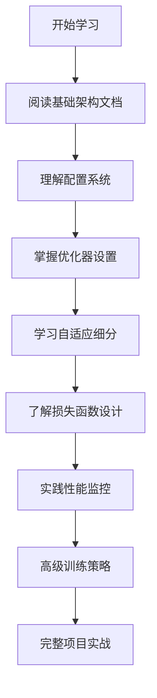

# SVRaster 训练机制文档总索引

## 概述

SVRaster（Sparse Voxel Rasterization）是一种高效的稀疏体素渲染技术，具有复杂而精密的训练机制。本文档系统提供完整的训练细节说明，帮助用户深入理解和有效使用 SVRaster 的训练功能。

## 📖 文档结构

### 核心训练文档

1. **[训练机制详解 - 第一部分：基础训练架构与配置](./TRAINING_DETAILS_PART1_cn.md)**
   - 🏗️ 核心训练框架（基于 PyTorch 的训练器）
   - ⚙️ 配置系统设计（模型配置、训练配置、数据配置）
   - 🔧 优化器与调度器设置
   - 📊 数据加载与预处理
   - 🎯 训练流程控制

2. **[训练机制详解 - 第二部分：自适应细分与渐进式训练](./TRAINING_DETAILS_PART2_cn.md)**
   - 🌳 自适应体素细分机制
   - ✂️ 智能剪枝策略
   - 📈 渐进式训练技术
   - ⚖️ 动态负载均衡
   - 🔄 多尺度训练策略

3. **[训练机制详解 - 第三部分：损失函数设计与性能监控](./TRAINING_DETAILS_PART3_cn.md)**
   - 🎯 多重损失函数设计
   - 📏 正则化技术
   - 📊 性能监控与调试
   - 📈 模型评估指标
   - 🔧 训练故障诊断

### 实现细节文档

4. **[训练与推理渲染机制对比](./TRAINING_VS_INFERENCE_RENDERING_cn.md)** ⭐ **重要**
   - 🔄 训练时与推理时的关键差异
   - 🚀 **推理时光栅化渲染机制**详解
   - 📊 性能对比与最佳实践
   - 🔧 模式切换与内存管理

5. **[SVRaster 光栅化实现详解](./SVRaster_Rasterization_Implementation_cn.md)** ⭐ **推理核心**
   - 🎨 **推理时光栅化算法**具体实现
   - ⚡ 高效稀疏体素投影到屏幕空间
   - � 推理阶段的性能优化技巧
   - � 与训练阶段体积渲染的区别

6. **[SVRaster 训练实现详解](./SVRaster_Training_Implementation_cn.md)**
   - 🧑‍💻 底层训练代码实现
   - 🔍 训练算法详细分析
   - � 代码注释与说明

### 渲染机制文档

7. **[渲染机制文档索引](./RENDERING_INDEX_cn.md)**
   - 🔗 完整的渲染机制文档导航
   - 📚 渲染算法详细说明
   - 💡 技术实现细节

### 推理机制文档

8. **[推理机制文档索引](./INFERENCE_INDEX_cn.md)** **新增**
   - 🚀 完整的推理机制文档导航
   - ⚡ 实时推理优化技术  
   - 🎯 批量处理与应用场景
   - 💡 **重要**：了解训练后的模型如何高效推理

## 🚀 快速开始指南

### 新用户推荐学习路径



#### 1. 基础学习（1-2 天）
- **第一步**：阅读 [训练机制详解 - 第一部分](./TRAINING_DETAILS_PART1_cn.md)
- **重点**：理解训练架构、配置系统和基础流程
- **实践**：配置简单的训练任务

#### 2. 进阶学习（2-3 天）
- **第二步**：阅读 [训练机制详解 - 第二部分](./TRAINING_DETAILS_PART2_cn.md)
- **重点**：掌握自适应细分和渐进式训练
- **实践**：使用高级训练策略

#### 3. 专业应用（3-5 天）
- **第三步**：阅读 [训练机制详解 - 第三部分](./TRAINING_DETAILS_PART3_cn.md)
- **重点**：优化损失函数和性能监控
- **实践**：完整的生产级训练流程

### 针对性学习指南

#### 🎯 快速入门用户
**目标**：快速上手 SVRaster 训练
**推荐路径**：
1. 训练机制详解 - 第一部分 → 2.1-2.3 节（配置系统）
2. 训练与推理渲染机制对比 → **推理光栅化部分** ⭐
3. 训练机制详解 - 第一部分 → 4.1-4.2 节（基础训练流程）
4. 实际代码示例运行

#### 🔧 算法研究用户
**目标**：深入理解训练算法
**推荐路径**：
1. 训练与推理渲染机制对比 → **完整阅读**（核心差异）
2. 训练机制详解 - 第二部分 → 完整阅读（自适应技术）
3. 训练机制详解 - 第三部分 → 1-2 节（损失函数设计）
4. SVRaster 训练实现详解 → 核心算法部分

#### ⚡ 性能优化用户
**目标**：优化训练性能和效果
**推荐路径**：
1. 训练与推理渲染机制对比 → **推理优化部分** ⭐
2. SVRaster 光栅化实现详解 → **推理性能优化**
3. 训练机制详解 - 第一部分 → 3-4 节（优化器与性能）
4. 训练机制详解 - 第二部分 → 4-5 节（负载均衡）
5. 训练机制详解 - 第三部分 → 3-5 节（监控与调试）

#### 🚀 生产部署用户
**目标**：部署稳定的训练系统
**推荐路径**：
1. 训练与推理渲染机制对比 → **推理部署优化** ⭐
2. SVRaster 光栅化实现详解 → **生产级推理**
3. 所有训练机制详解文档 → 完整学习
4. 重点关注：配置管理、错误处理、性能监控
5. 故障诊断和维护指南

## 📋 训练核心概念一览

### 🏗️ 训练架构
| 组件 | 功能 | 相关文档章节 |
|------|------|--------------|
| **传统训练器** | 灵活的训练流程控制 | 第一部分 → 1.1 节 |
| **PyTorch 训练器** | 完整的训练框架 | 第一部分 → 1.1 节 |
| **配置系统** | 统一的参数管理 | 第一部分 → 2 节 |
| **数据加载器** | 高效的数据预处理 | 第一部分 → 4 节 |

### 🌳 自适应技术
| 技术 | 作用 | 相关文档章节 |
|------|------|--------------|
| **自适应细分** | 动态调整体素分辨率 | 第二部分 → 1 节 |
| **智能剪枝** | 移除无效体素 | 第二部分 → 2 节 |
| **渐进式训练** | 逐步提升质量 | 第二部分 → 3 节 |
| **负载均衡** | 优化计算分布 | 第二部分 → 4 节 |

### 🎯 损失函数
| 损失类型 | 优化目标 | 相关文档章节 |
|----------|----------|--------------|
| **RGB 重建损失** | 颜色准确性 | 第三部分 → 1.2 节 |
| **深度一致性** | 几何准确性 | 第三部分 → 1.3 节 |
| **结构相似性** | 视觉质量 | 第三部分 → 1.4 节 |
| **感知损失** | 感知质量 | 第三部分 → 1.5 节 |
| **正则化** | 模型泛化 | 第三部分 → 2 节 |

### 📊 监控指标
| 指标类型 | 监控内容 | 相关文档章节 |
|----------|----------|--------------|
| **损失监控** | 训练收敛情况 | 第三部分 → 3.1 节 |
| **内存监控** | 资源使用情况 | 第三部分 → 3.2 节 |
| **性能指标** | 渲染质量评估 | 第三部分 → 4 节 |
| **调试工具** | 故障诊断 | 第三部分 → 5 节 |

## 🛠️ 实用工具和资源

### 配置模板
```python
# 基础训练配置模板
basic_config = {
    "model": {
        "voxel_resolution": 512,
        "feature_channels": 32,
        "max_subdivision_level": 8
    },
    "training": {
        "epochs": 1000,
        "learning_rate": 1e-3,
        "batch_size": 4
    },
    "loss": {
        "rgb_weight": 1.0,
        "ssim_weight": 0.1,
        "depth_weight": 0.1
    }
}
```

### 常用命令
```bash
# 启动基础训练
python train_svraster.py --config basic_config.yaml

# 启动带监控的训练
python train_svraster.py --config advanced_config.yaml --enable_monitoring

# 恢复训练
python train_svraster.py --config config.yaml --resume_from checkpoint.pth
```

### 调试技巧
1. **内存不足**：减少 batch_size 或 voxel_resolution
2. **训练不收敛**：调整学习率或损失函数权重
3. **质量不理想**：启用自适应细分或增加训练轮数

## 🔗 相关资源

### 代码示例
- **基础训练示例**：`demos/demo_svraster_advanced.py`
- **PyTorch 训练示例**：`demos/demo_classic_nerf.py`, `demos/demo_svraster_advanced.py`
- **配置示例**：各文档中的配置代码块

### 性能基准
- **训练速度**：RTX 4090 上约 2-3 小时（标准场景）
- **内存需求**：12-24GB GPU 内存（取决于分辨率）
- **存储需求**：模型约 50-200MB，日志约 1-5GB

### 社区支持
- **问题反馈**：通过 GitHub Issues
- **技术讨论**：查看 discussions 页面
- **文档改进**：欢迎提交 PR

## 📄 文档更新记录

| 版本 | 日期 | 更新内容 |
|------|------|----------|
| v1.0 | 2024-01 | 初始版本，完整的训练机制文档 |
| v1.1 | 2024-01 | 增加快速开始指南和学习路径 |
| v1.2 | 2024-01 | 添加实用工具和常见问题解答 |

---

**注意**：本文档系统为模块化设计，用户可根据需求选择性阅读相关章节。建议初学者按照推荐学习路径逐步学习，有经验的用户可直接查阅相关技术章节。

**下一步**：选择合适的文档开始您的 SVRaster 训练学习之旅！
